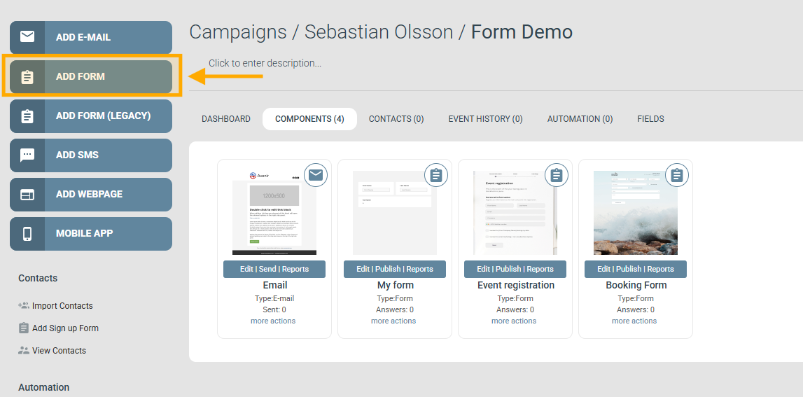
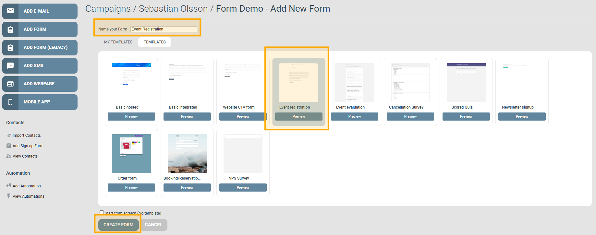
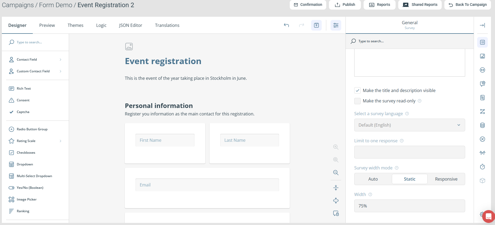
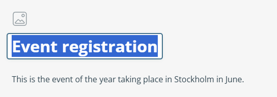
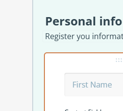
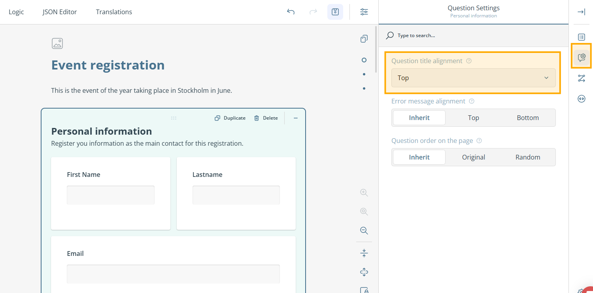
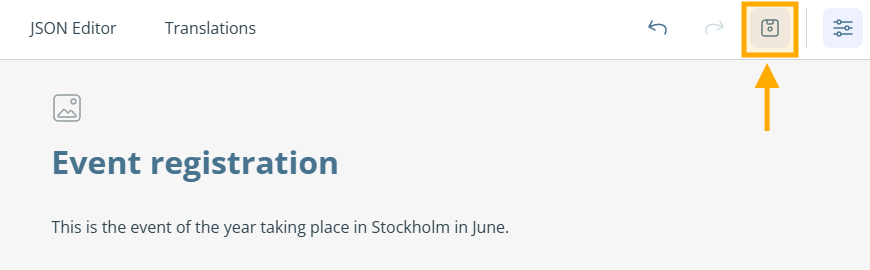
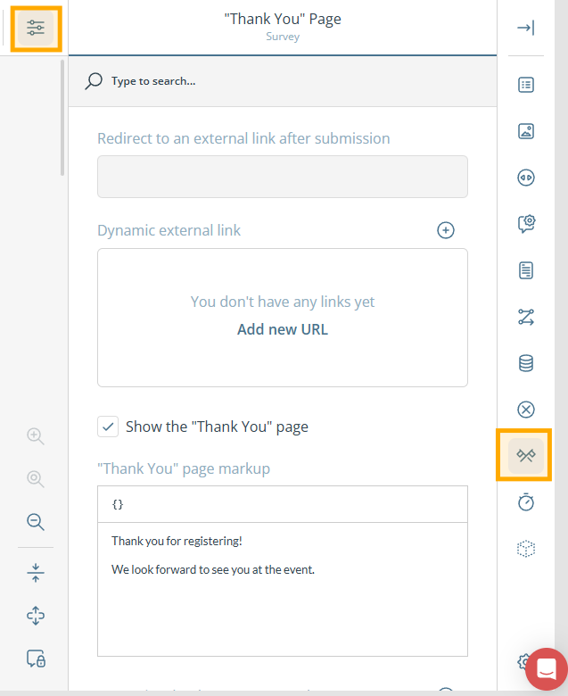
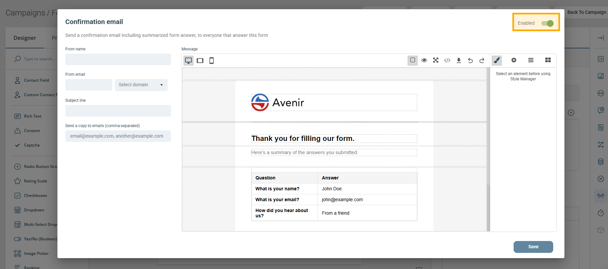

# Creating your first form


To create a new Form you need a campaign first. If you don't have one ready, see [How to create a new campaign](create-new-campaign.md).


This guide walks you through creating a Form in eMarketeer — for an event signup, newsletter signup, or any other use.

By the end you will have a working form with a thank-you page and an optional confirmation email.



### Add the form from the campaign page

From the campaign where you want to create the form, click **Add Form**.




### Fill in settings, choose a template, create the form

**Settings**

* **Name your form:** Give the form a unique name so you can find it later. Describe its purpose in the campaign — for example, "Registration" for a registration form. Only you see this name; it is not shown to visitors.

**Template**

Pick a template from one of the tabs as a starting point for the design. This guide uses **Event Registration** from the **Templates** tab. Custom templates saved on your account appear under **My Templates**.

**Create form component**

Once settings and template are set, click **Create Form** to create the component.



### The form editor

After you click **Create Form**, the editor opens with the Designer tab active. The left-side menu (Toolbox) lets you add form fields by dragging them onto the design surface — the centre area where you structure the form layout and add pages. The **Event Registration** template opens with three pages: **Personal information**, **Guests**, and **Last things**.

For a full reference of all tabs and options, see [Form editor: UI overview](../../documentation/forms/ui-overview.md).



### Change the title and description

Many templates open with a Survey title and Survey description at the top. Click either text in the design surface to edit it, or adjust it in the General Survey settings.




### Adjust the form fields

Contact fields are the most important fields in any form that collects identified responses. They save the visitor's contact information and match it against your eMarketeer contact database — updating an existing contact card or creating a new one if none exists.


To store submitted data as contact data, use **Contact Field** rather than **Single-Line Input** fields. This ensures a contact can be attributed to the form submission.


Adjust the fields on the **Personal information** page. The Event Registration template includes First Name, Last Name, Email, Company, and Mobile by default. Add more contact fields from the Toolbox or the **Add question** button at the bottom of each page.

To make a field required, click the **\* Required** button (shown as **\*** on smaller screens). To remove a field, hover it and click the delete button in the bottom-right corner. You can also delete entire pages — if you are using the Event Registration template you may want to remove the **Guests** page.

Many eMarketeer form templates use placeholder texts instead of question titles — the titles are hidden by default through field settings, so the label appears inside the input rather than above it.

If visible titles are preferred, they can be enabled in the form field **Layout** properties, under the **Question title alignment** dropdown for individual questions — or in bulk by updating the page's **Question Settings**.

To save your progress, click the floppy-disk icon above the design surface.




### The most commonly used form fields

This step covers the basic question types to get you started.

* **Radio Button Group:** A question with multiple pre-defined answers where the visitor picks _one_.
* **Checkboxes:** A question with multiple pre-defined answers where the visitor can pick _several_.
* **Long Text:** A question where the visitor can write any text answer. Use this for longer answers.
* **Consent:** A checkbox with text of your choosing. Selecting it updates the Consent setting on the visitor's contact card — useful when you need explicit consent to store contact information.

You can find these question types in the Toolbox in the left-side menu. For a full list of available question types, see [Form editor: UI overview](../../documentation/forms/ui-overview.md#question-types).



### Set up the thank-you page

After a visitor submits, they are shown the thank-you page to confirm their answer was saved. The default thank-you page contains a single text block, which you can edit to fit your form.

Open the thank-you page settings by clicking **Survey Settings** (next to the Save button) above the design surface, then click the **Thank You Page** (crossed flags icon) in the right-side Property Grid.

To change the text shown on the thank-you page, edit the **Thank You page markup** field. To redirect visitors to an external URL after submission, use the **Redirect to an external link after submission** option.


The thank-you page still shows briefly before redirecting unless **Show the "Thank You" page** is unchecked.




### Configure a confirmation email (optional)

Confirmation email settings let you send a copy of each submission to a specified email address, and send a copy of the answers back to the person who submitted them.

1. Click the **Confirmation** button, then enable the feature using the toggle in the top-right corner.
2. Fill in the sender information (required):
   * **From name:** The sender name shown in the recipient's email client.
   * **From email:** The sender address — choose a prefix and select a domain from the dropdown.
   * **Subject line:** The subject shown in the recipient's email client.
3. To send a copy to yourself or a colleague after each submission, fill in **Send a copy to emails**. Separate multiple addresses with commas.
4. Edit the email body as needed:
   * Double-click to edit a block. Drag and drop to move blocks.
   * Click **Open blocks** in the top-right corner to add more content blocks.
   * The **Form Answers** block displays the answers submitted by the respondent.



### Publish your form

Once your form is ready, click **Publish** in the editor top bar.

* **Hosted URL:** A shareable link to the form. The form displays as it appears in the Preview tab. Share it directly via social media, a chat message, or a link on your website.
* **Embed on your website:** Places the form on a web page using a script snippet. See [Embed forms on your website](../../documentation/forms/publish-a-form.md) for the full setup guide.
* **Email:** Link to the form from an email. See [How to publish a form](../forms/how-to-publish-a-form.md#link-to-a-form-from-an-email) for details.


