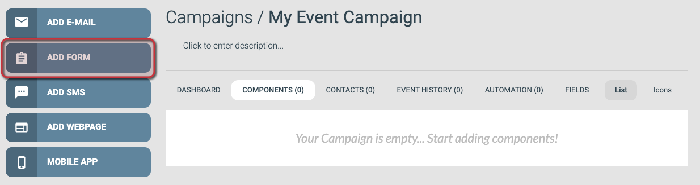
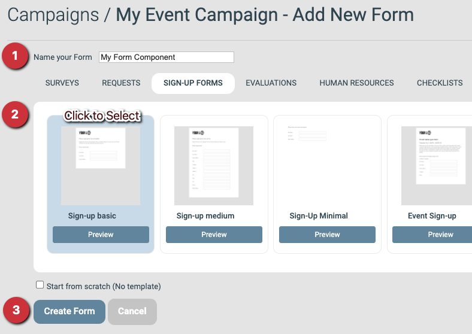
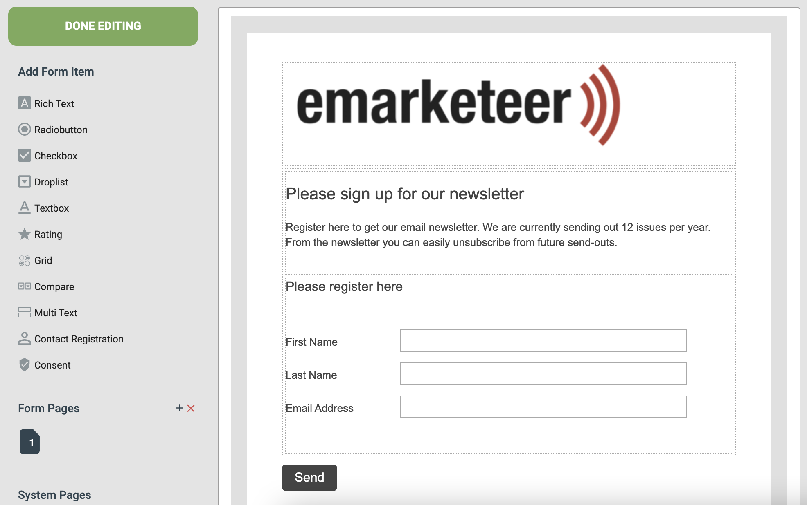
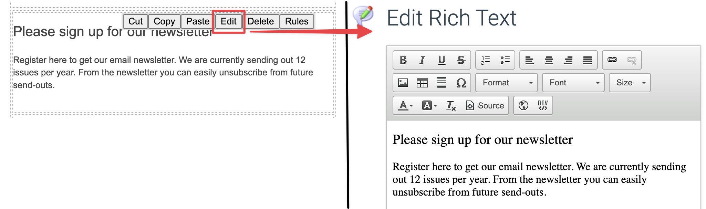
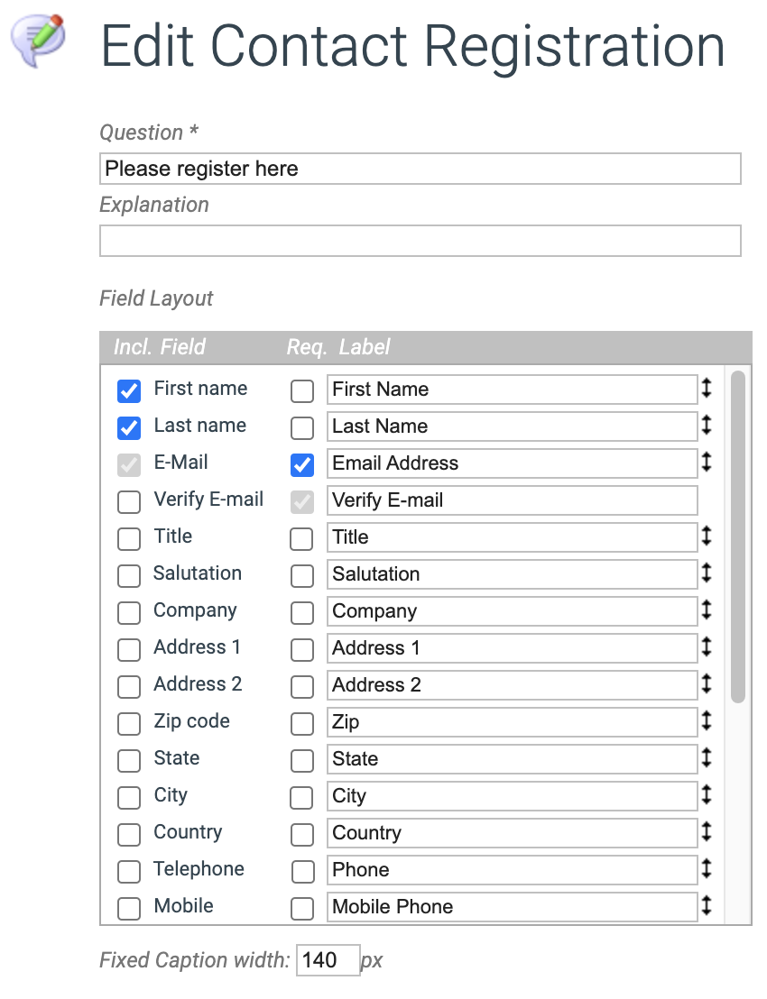
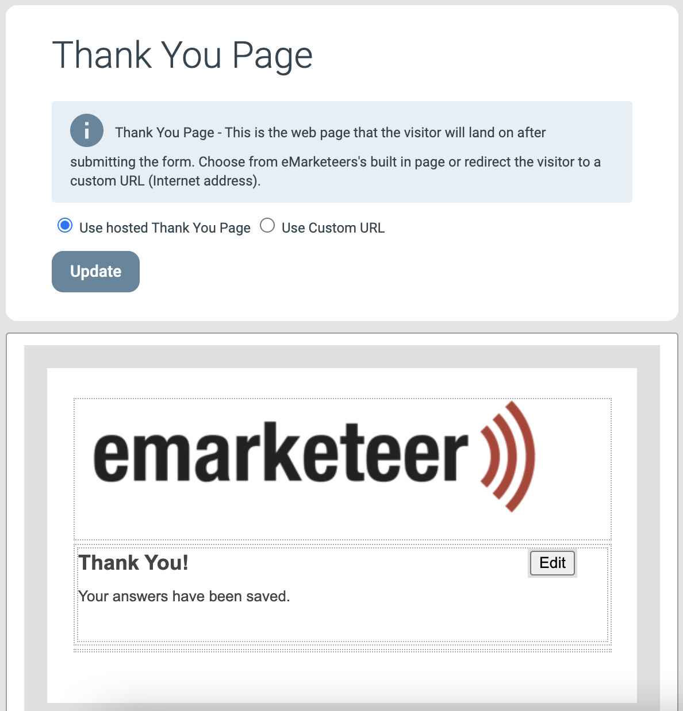
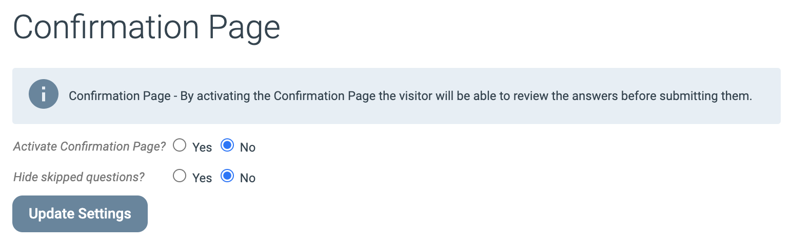
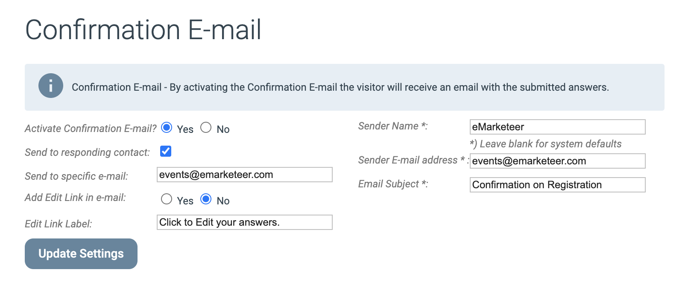
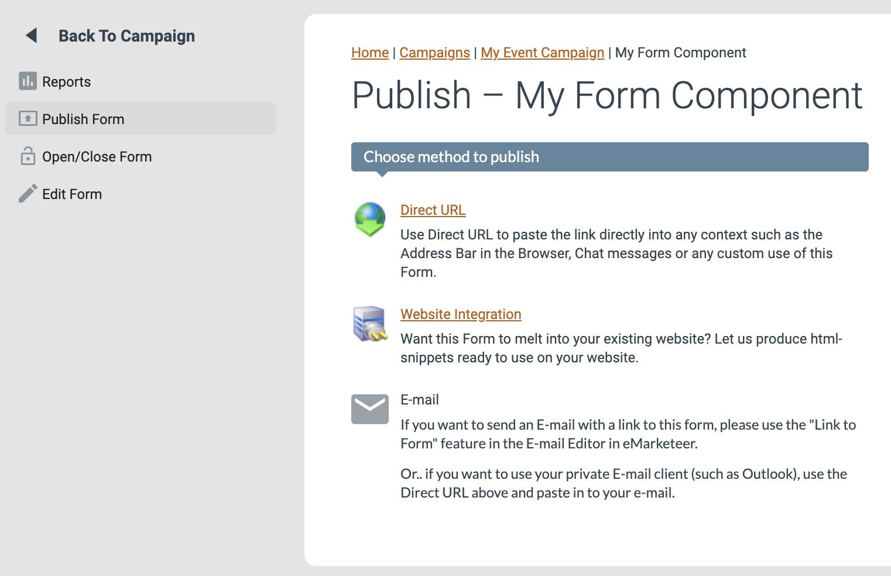

# Creating your first form (Legacy)

This guide walks you through creating a form in eMarketeer — for an event signup, newsletter signup, or any other use.

By the end you will have a working form with a thank-you page and an optional confirmation email.

* * *

### 1. Add the form from the campaign page

From the campaign where you want to create the form, click **Add Form**.

- If you need to create the campaign first, see [How to create a new campaign](https://support.emarketeer.com/knowledgebase/create-new-campaign/).

The Add Form button

### 2. Fill in settings, choose a template, create the form

Form settings

#### Settings

- **Name your form:** Give the form a unique name so you can find it later. Describe its purpose in the campaign — for example, "Registration" for a registration form. Only you see this name; it is not shown to visitors.

#### Template

Pick a template from one of the tabs as a starting point for the design. This guide uses **Sign-up Basic** from the **Sign-Up Forms** tab. Custom templates saved on your account appear under **My Templates**.

#### Create form component

Once settings and template are set, click **Create Form** to create the component.

### 3. The form editor

After you click **Create Form**, the editor opens. The left-side menu lets you add form items, access tools, and change settings. The rest of the page shows the form content, imported from the template.

The content is made up of content blocks called form items, which you edit individually in the following steps.

The form editing view

### 4. Change the introduction text

The first form item in most templates is a Rich Text block where you can introduce the form or add relevant information such as dates, times, and locations.

To edit any form item, either click its **Edit** button or double-click the block itself. A popup opens where you can change the text, questions, or answers.

Editing a Rich Text block

### 5. Adjust the Registration block

The Registration block is the most important block in any form that is not collecting anonymous answers. It saves the visitor's contact information with their submission and matches it against your eMarketeer contact database — updating an existing contact card or creating a new contact if none exists.

The Registration form item options

What you can ask for in the Registration block is tied to the fields on a contact card. You choose which fields to ask for and which are required. The Registration block always asks for the visitor's email address, because it is a required field on a contact card.

### 6. The most commonly used form items

This article covers the basic question types to get you started.

- **Radio button:** A question with multiple pre-defined answers where the visitor picks _one_.
- **Checkbox:** A question with multiple pre-defined answers where the visitor can pick _several_.
- **Textbox:** A question where the visitor can write any text answer. Use this for longer answers.
- **Multi Text:** A form item with several short text questions. Use this for short answers.
- **Consent:** A checkbox with text of your choosing. Selecting it updates the Consent setting on the visitor's contact card — useful when you need explicit consent to store contact information.

You can find these question types in the Add Form Item menu in the top-left of the form editor.

### 7. Set up the thank-you page

After a visitor submits, they are redirected to the thank-you page to confirm their answer was saved. The default thank-you page contains a single text block, which you can edit to fit your form. Open the thank-you page settings by clicking **Thank You Page** in the left-side menu.

The thank-you page options

You have two options: a hosted thank-you page or a custom URL. The hosted page is the default — change the text and you are done. Use a custom URL if you want to redirect visitors to a specific page, such as one on your own website.

To edit the text shown on the hosted page, click **Edit** as shown above.

### 8. Use a confirmation page (optional)

We do not recommend using this feature unless you need it, but for longer surveys you may want to let visitors review their answers before submitting. The confirmation page shows their answers and gives them a choice: **Edit** their answers or **Finish** to submit.

The confirmation page options

When active, the confirmation page appears after the visitor proceeds from the form. The visitor must click **Finish** to confirm. They are then redirected to the thank-you page and, if configured, sent a confirmation email.

### 9. Configure a confirmation email (optional)

Confirmation email settings let you send a copy of each submission to a specified email address, and send a copy of the answers back to the person who submitted them.

Confirmation email options

Options:

- **Activate Confirmation Email:** Turn the feature on for this form.
- **Send to responding contact:** Send the contact a confirmation with their answers.
- **Send to specific e-mail:** Send a copy of every submission to yourself or a colleague.
- **Add Edit Link in e-mail:** Let the contact go back and edit their answers later. Not recommended in most cases.
- **Sender Name:** The sender name shown in the recipient's email client.
- **Sender E-mail Address:** The sender address shown in the recipient's email client.
- **Email Subject:** The subject line shown in the recipient's email client.

### 10. Publish your form

Once your form is ready, you have a few options for sharing it.

The Publishing page for a form

- **Direct URL:** A direct link to the form. Share it with colleagues, post it on social media, or link it from your website. When you click this option, a popup shows the link — copy it from the popup. Do not visit the link and copy from your browser address bar: each visitor gets a unique URL meant only for them.
- **Website Integration:** HTML code and scripts to embed the form on your own website. Our support cannot always help with issues here because it is implemented outside eMarketeer. Skip this option unless you are comfortable with this kind of integration.
- **E-mail:** Link to the form from an email. See the linking section in [Creating your first email](https://support.emarketeer.com/knowledgebase/basics-creating-email/).
