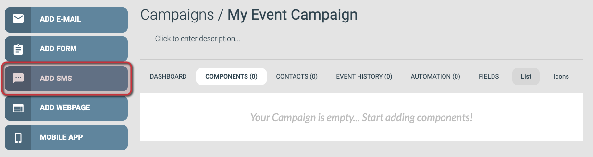
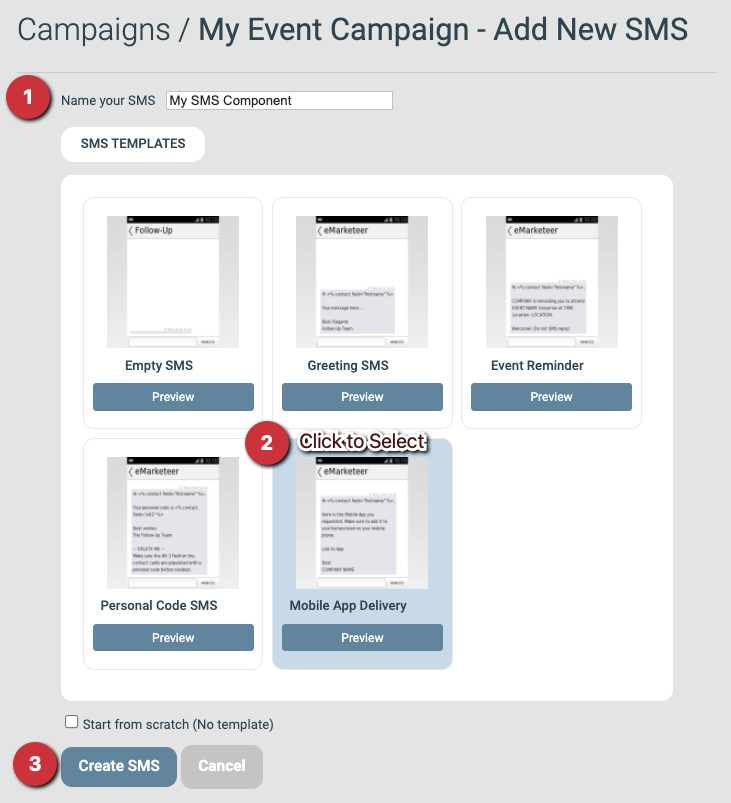
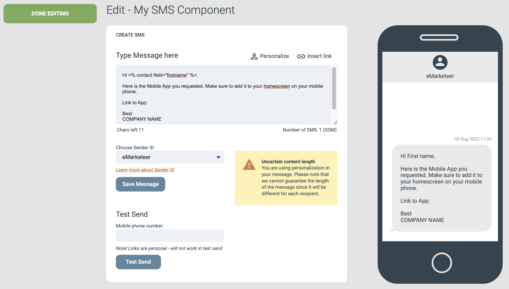

# Creating your first SMS


To create a new email it is required that you create a campaign first.


This guide walks you through creating an SMS in eMarketeer — for publishing an app, notifying about an event, or any other use.

Sending SMS is only a few steps once the message is set up. By the end of this guide you will have a message ready to send.

***

### 1. Add the SMS from the campaign page

From the campaign page, click **Add SMS**.

* If you need to create the campaign first, see [How to create a new campaign](create-new-campaign.md).

The Add SMS button

### 2. Fill in settings, choose a template, create the SMS

SMS settings

#### Settings

* **Name your SMS:** Give the SMS a unique name so you can find it later. Describe its purpose in the campaign — for example, "Invitation" for an event invitation. Only you see this name; it is not shown to your contacts.

#### Template

Pick a template from one of the tabs as a starting point. This guide uses **Mobile App Delivery**. Custom templates saved on your account appear under **My Templates**.

#### Create SMS component

Once settings and template are set, click **Create SMS** to create the component.

### 3. The SMS editor

After you click **Create SMS**, the editor opens. You see a text box where you edit the message and a Sender ID option below it.

The Sender ID is the name of the sender as shown on the recipient's phone. The default is `eMarketeer`. You can request a custom Sender ID — see [this article](../../documentation/email-sms/sender-id.md).

Below that you find the SMS testing feature, which lets you send the SMS to yourself to see how it looks on arrival. Links in test SMS messages do not work — send the SMS the normal way if you need to test links.

The SMS editor view

### 4. Edit the SMS content

Edit the message text in the text box. The buttons above the text box let you add links and personalized text such as the recipient's name.

Links to other eMarketeer components are personalized per contact. For example, if you send a link to a mobile app component for an event, it can include a unique QR code or badge the contact uses to identify themselves at the event.

Click **Save Message** after each change to save your work.

### 5. Send your SMS

Sending an SMS works much like sending an email and has many of the same options. See [How to send an email](basics-send-email.md) for the full walkthrough.

Phone numbers must include the country code and follow standard formatting before you send. For example: `+46701231231`.

For more advanced sending options, see our email sending guides.
