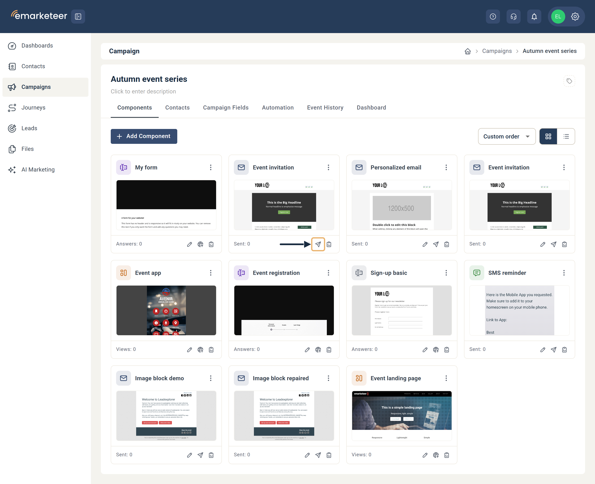
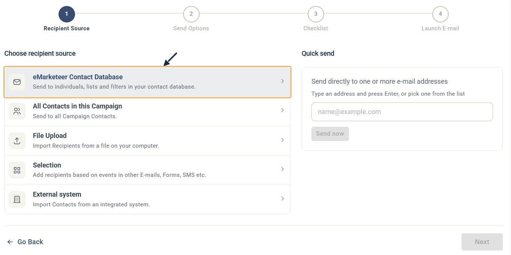
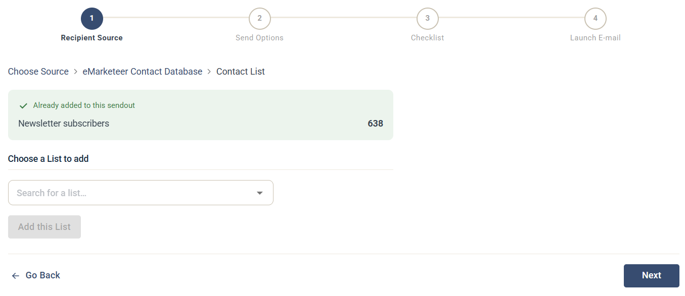
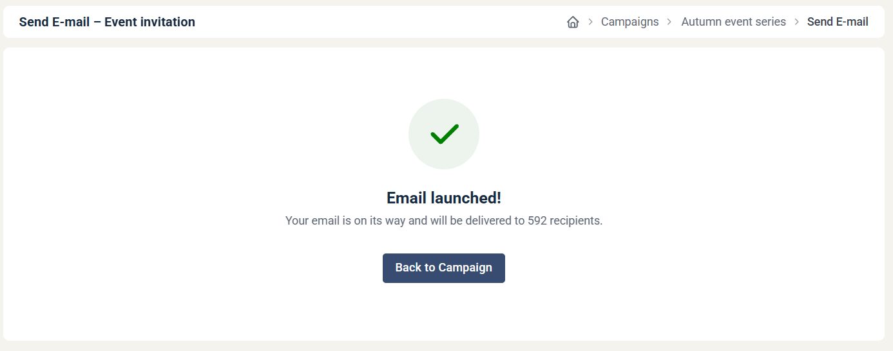

# How to send an email

This article walks through the simplest path to send an email in eMarketeer — from a finished email component to a list of contacts.

We skip the more advanced features here and focus on a straight-up send.


Before you start, you need a finished email component. See [Creating your first email](basics-creating-email.md) if you do not have one yet.




### Start the send-out

Go to the campaign that contains the email and click **Send**.




### Choose Send Now

This guide covers sending immediately. You also have the option to schedule the email for a later time.




### Send a test email or send to your contacts

**Option A — Send a test email to yourself (optional)**

To preview the email in your own email client, send yourself a quick test. Type your email address in the **Quick send** field and click **Send now**.

**Option B — Send the email to your contact list**

If you do not have a contact list yet, see:

* [How to create a new contact list](new-contact-list.md)
* [Importing contacts from Excel or a spreadsheet](../contacts-lists/import-contacts-from-excel.md)

First, select **eMarketeer Contact Database**.

Second, select **Contact List**.

Third, choose your contact list in the dropdown and click **Add this List**.

The list now shows as added to the send-out. To send to more lists, choose another list and click **Add this List** again. When you have added all the lists you want, click **Next**.




### Continue to the checklist

The next page, **2. Send Options**, shows the chosen list of recipients and offers options for more complex send-outs. For a simple send, you can skip the details here.

Click **Next** to proceed.




### Review the checklist and launch

The checklist shows whether any contacts from your list will be excluded from the send. eMarketeer automatically blocks contacts who are unsubscribed or otherwise should not receive the email. You do not usually need to worry about the numbers here — they are handled for you.

If you want the details, see [Understanding the email checklist](../reports/checklist-explained.md).

Click **Launch E-mail** to address and send the email to the contacts in the list.




### The send-out is complete

After launch, the email is handed to the email servers, which usually finish addressing and sending within a few minutes.




### What to do next

You can track the send-out and see detailed stats in the email report. See [Email report explained](../reports/email-report-explained.md).
