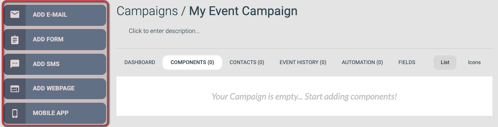

# How to create a new campaign

Create a campaign as the container for the emails, forms, and webpages you want to send and publish.

A campaign groups related components, so creating one is usually the first step for a new piece of work in eMarketeer.

Creating a campaign

### 1. Open the Campaigns page from the navigation bar

If you want the new campaign to live inside an existing folder, navigate to that folder first.

### 2. Click [Create Campaign] at the top-left

### 3. Give the campaign a unique name

The name identifies the campaign inside eMarketeer and is never shown to your contacts. You can also add an optional description, which is also internal-only.

### 4. Click [Create Campaign] at the bottom of the page

This creates the campaign and opens its empty Components page.

---

## What to do next

Add your first component to the campaign. This might be an email invitation, a registration form, or a landing page.

Add new component buttons

The following articles cover each component type from start to finish:

- [Creating your first email](https://support.emarketeer.com/knowledgebase/basics-creating-email/)
- [Creating your first form (Legacy)](https://support.emarketeer.com/knowledgebase/basics-creating-form/)
- [Creating your first SMS](https://support.emarketeer.com/knowledgebase/basics-creating-sms/)
- [Creating your first webpage](https://support.emarketeer.com/knowledgebase/creating-first-webpage/)
