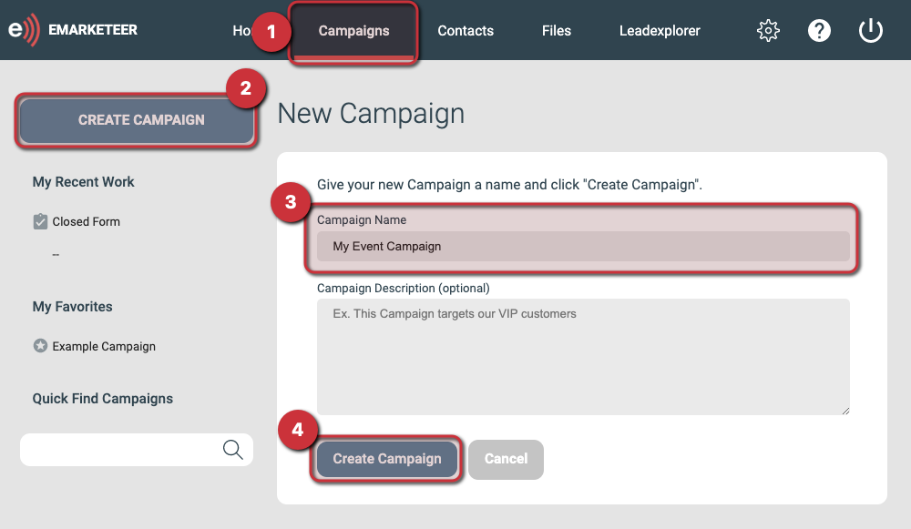

# How to create a new campaign

Create a campaign as the container for the emails, forms, and webpages you want to send and publish.

A campaign groups related components, so creating one is usually the first step for a new piece of work in eMarketeer.



### Open the Campaigns page from the navigation bar

If you want the new campaign to live inside an existing folder, navigate to that folder first.



### Click \[Create Campaign] at the top-left



### Give the campaign a unique name

The name identifies the campaign inside eMarketeer and is never shown to your contacts. You can also add an optional description, which is also internal-only.


**Note:** The Campaign name is also used by the [web tracker](../../documentation/web-tracker/) to identify which campaign email traffic to your website originates from.




### Click \[Create Campaign] at the bottom of the page

This creates the campaign and opens its empty Components page.



## What to do next

Add your first component to the campaign. This might be an email invitation, a registration form, or a landing page.

The following articles cover each component type from start to finish:

* [Creating your first email](basics-creating-email.md)
* [Creating your first form (Legacy)](basics-creating-form.md)
* [Creating your first SMS](basics-creating-sms.md)
* [Creating your first webpage](../developer-advanced/creating-first-webpage.md)


Mobile apps are essentially webpage components but with a specialized template.


