# How lead scoring works in eMarketeer and tutorial

Lead scoring shows how sales-ready your contacts are by awarding points based on persona fit and engagement.

In this article, you learn how to set up lead score rules step by step, where to see each contact's lead score, and how to filter contacts by their score.

## Introduction: what is lead scoring?

With lead scoring, you see how sales-ready your contacts are and identify marketing qualified leads (MQLs). You award points based on how well a contact fits your buyer persona and how engaged they are with your marketing. You decide which criteria matter and set up score rules around them. The higher the score, the more sales-ready the contact, and the more confidently you can hand them to sales.

## Lead scoring 1.0 in eMarketeer

This first version of lead scoring helps you identify MQLs and bring sales and marketing together. More capabilities — such as automations — are planned for future releases.

With lead scoring today you can:

- Set up your own rules based on marketing engagement, contact card fields, and contact lists. You also choose when points expire.
- See each contact's lead score on every contact list and on the contact card.
- Filter contacts by score, for example all contacts above 50.
- Export contacts as a text file and share them with sales.

## Key terminology

- **Lead score:** the number of points a contact has.
- **Score rules:** the criteria a contact must fulfill to gain or lose points.
- **Score set:** a container for one or more score rules. Use score sets to group rules — for example, one set for engagement rules and one for buyer persona criteria. If you sell more than one product, you can use a score set per product.
- **Explicit scoring:** rules based on persona attributes, such as demographics or company profile.
- **Implicit scoring:** rules based on behavior, such as clicks.

## How to use lead scoring in eMarketeer

Before you head into eMarketeer, decide on your lead scoring model. eMarketeer ships with some default score rules to give you a head start, but no model fits every business. Tailor the rules to your sales process, and build the model together with your sales team.

[Guide: how to build a lead scoring model and common lead scoring mistakes](https://support.emarketeer.com/knowledgebase/how-to-set-up-your-lead-scoring-model-and-lead-scoring-mistakes/)

### You can score on the following in eMarketeer

Marketing engagement:

- Any engagement
- Email — opened or clicked a link
- Form — visited, submitted, or answered in a specific way
- Landing page — visited or clicked a link
- SMS — clicked
- Website — visits. To score web visits, [add the tracking code to your website](https://support.emarketeer.com/knowledgebase/web-monitor/).

Information on the contact card:

- Any field on the contact card. You can score on whether the field has any value or matches a specific value — for example, job title is set or job title equals CEO.

Contact lists:

- Whether the contact is in a specific contact list.

## How to set up score rules in eMarketeer

### 1. Set up score rules step by step

1. Click "contacts" in the top navigation and then "lead scoring" in the left-hand menu. This view shows all your score sets and their active status.

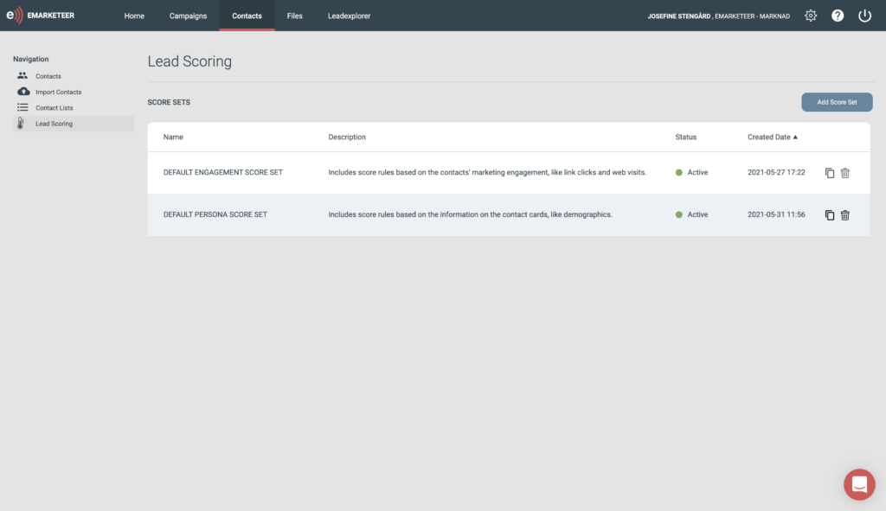

2. To add your own rules, click "add score set." Name the score set after the kind of rules it contains — for example one set per product, or a set for engagement rules.

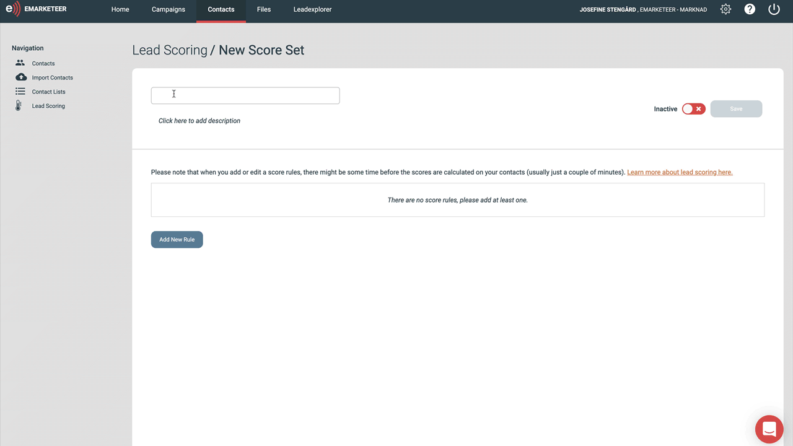

3. Click "add a new rule" and give it a clear name.

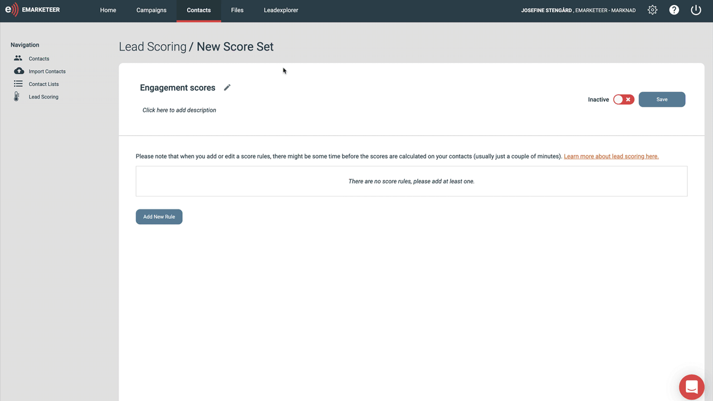

4. Rules are built the same way as filters in eMarketeer. The first drop-down chooses the category: engagement, contact card fields, or contact list membership.

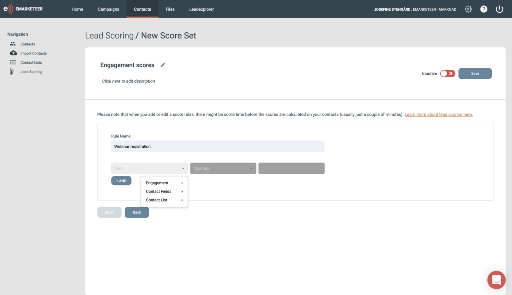

For a webinar registration, choose engagement -> form -> the specific form -> submitted.

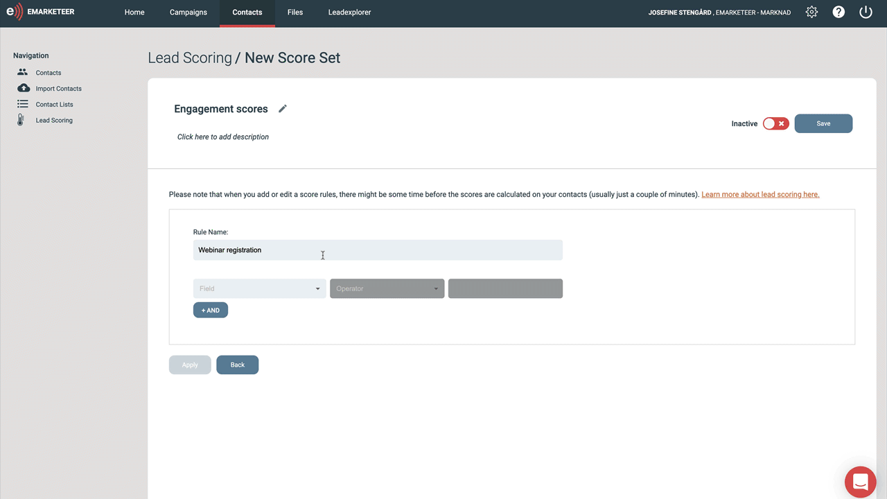

Next, consider occurrence — how many times the contact must do the action to get the points. Then consider time frame — for example, only the past 30 days.

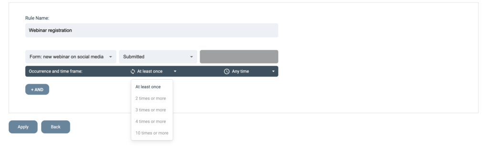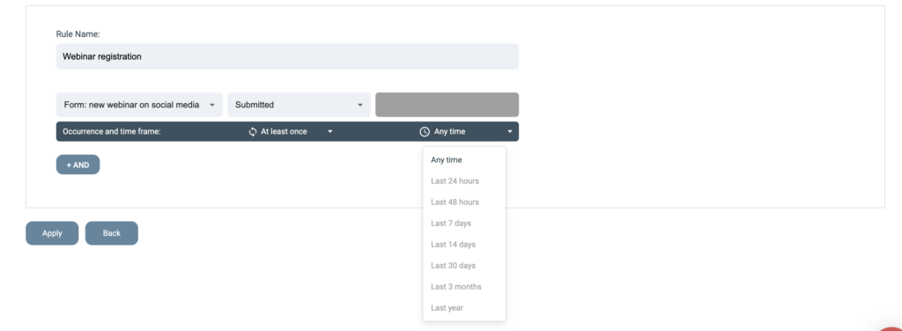

To narrow a rule further, add another criterion. For example, the contact signed up for the webinar AND visited a landing page three times. Click "AND" and repeat the steps for the second criterion.

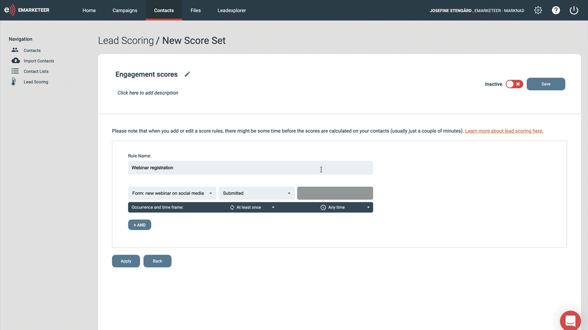

5. Click "Apply."

6. Set how many points the rule is worth. You can also remove points instead of adding them. Use negative points for behavior that is unlikely to lead to a sale — for example, "student" as job title, a visit to your careers page, or a country you cannot ship to.

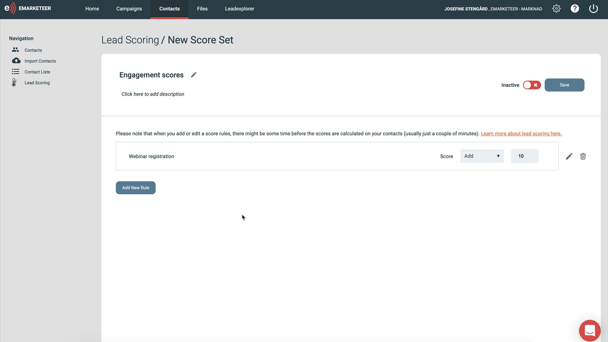

7. When the score set has all the rules you want, set it to active and click save. Scores are calculated for each contact. After adding or editing a rule, there can be a short delay before scores update — usually a few minutes, depending on database size.

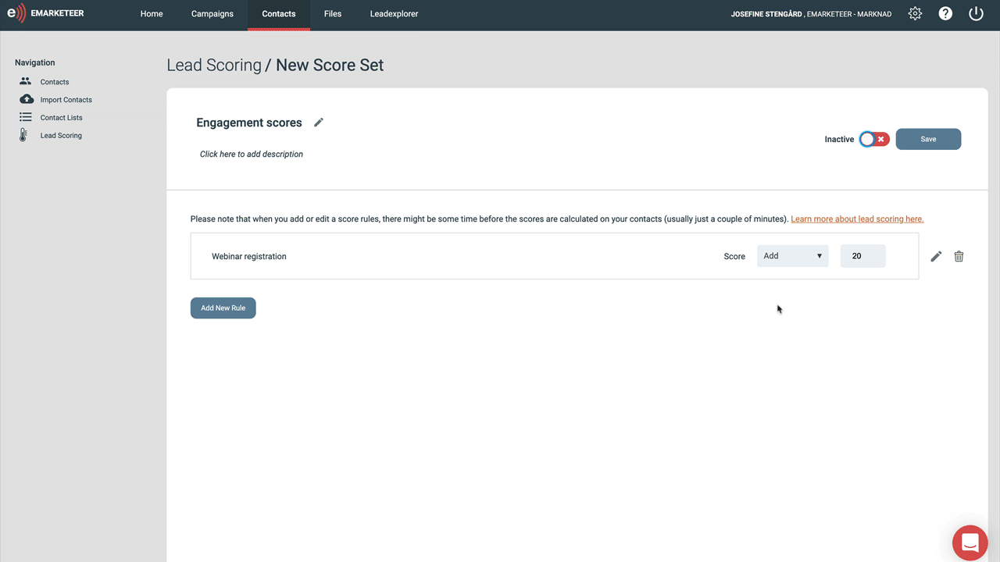

### 2. See each contact's lead score and score summary

Contacts are scored when they fulfill any of your rules. You see the score on every contact list and on the contact card. On the contact card, the "score summary" tab shows how the contact earned their points. The graph shows the score over time. Below the graph, a breakdown lists every fulfilled rule and when those points expire.

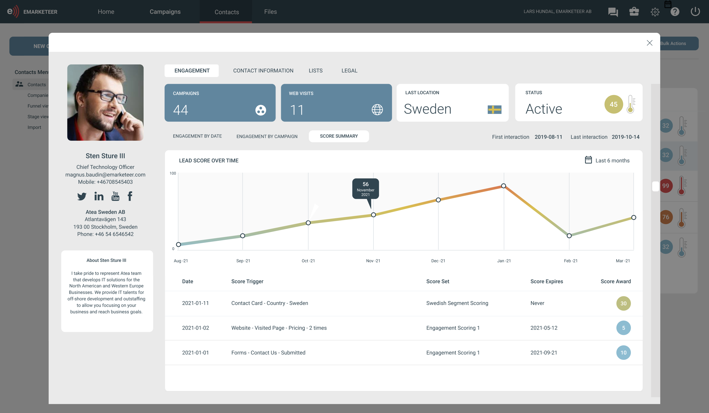

### 3. Filter out your MQLs and hand them to sales

To find contacts that reached a specific score — say 80 or higher — use filters. Go to contacts -> filter and choose "score" in the drop-down. You can then list contacts above or below your sales threshold.

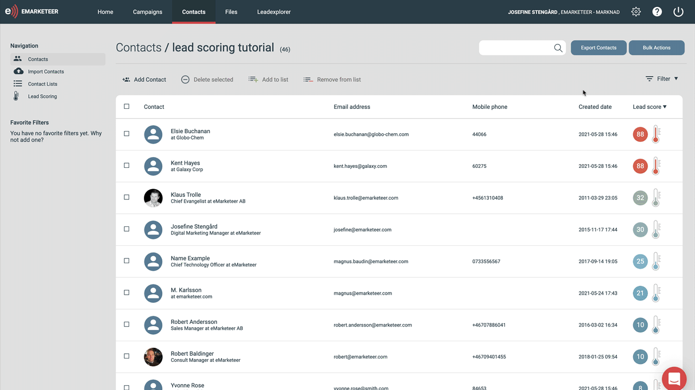

With a selection, you have two buttons on the right: bulk actions and export contacts. Use bulk actions to update the selection — for example, add the contacts to a list. Use export to download the contacts as a text file or send them to a selection or project in SuperOffice. For SuperOffice export, the contacts must already be known in SuperOffice.

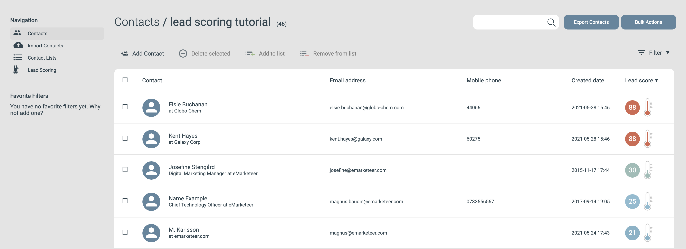
