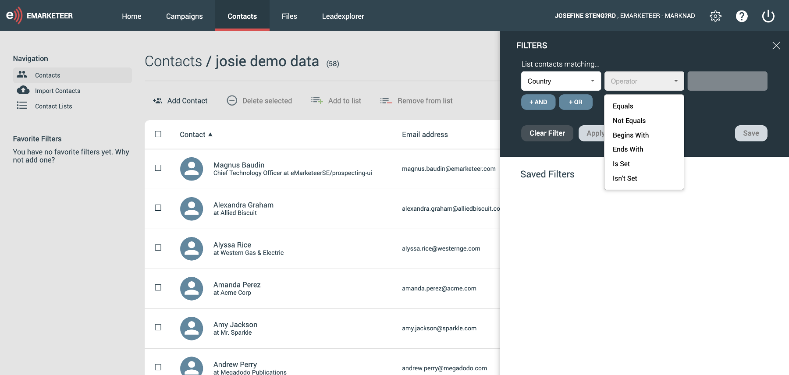
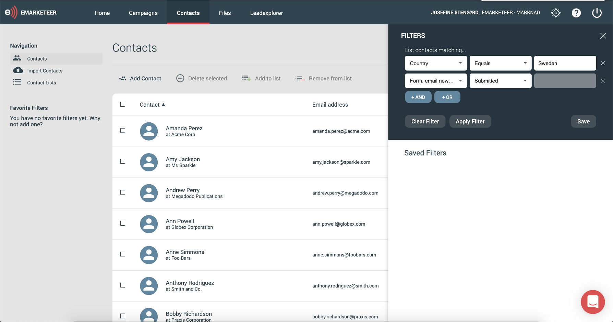
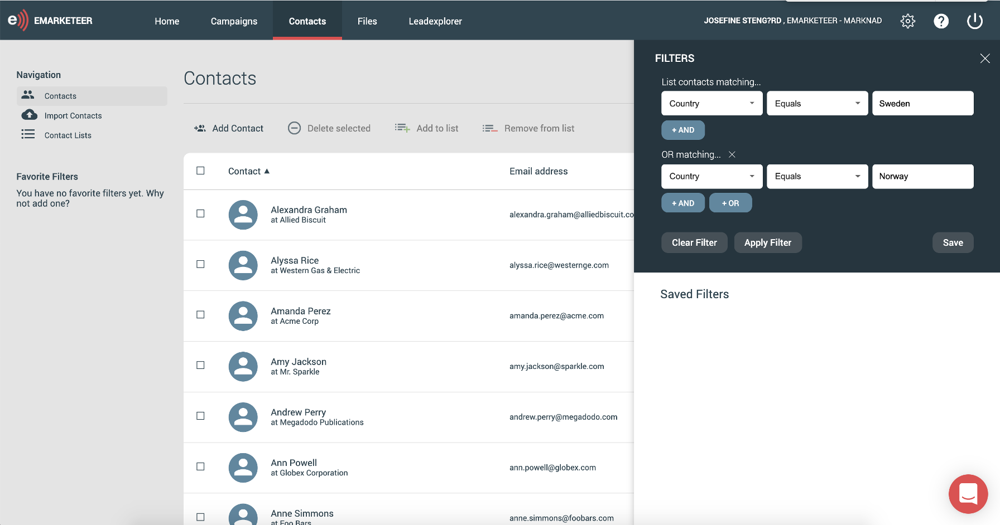

# How to build and use Contact Filters

With filters, you can segment your contacts based on different criteria you set up. A filter could be just as broad or specific as you’d like depending on how many criteria you add to your filter. In this article, you get to know the filter builder, some examples of filters you can build, and what actions you can take on your selection of contacts.

### Get to know the filter builder

When you’re in eMarketeer, click the tab for “contacts.” This is the heart of eMarketeer and where you work with and get to know your contacts. Now, if you’d like to segment or build different selections of your contacts, click the tab that says “filter.” It’s on the right-hand side right above the list of contacts.

A web panel will open and this is where you build and also find your saved filters.

When you click the drop-down list, you see all categories you can base your filter on. These categories are:

Contact fields (any information you have on the contact card)  
Marketing engagement  
Delivery  
Dates  
Consent  
Subscription categories  
Contact lists

### Let’s build a filter

Basically, the steps to set up a filter are to choose the category you want to base your filter on and choose the suitable operator, for example, “equals” or “doesn’t equal.” The operators differ depending on the category you choose.

Let’s look at an example where we start off simple with just one criterion. Let’s say you want to segment your contacts according to a specific country. You would then do these steps:

1\. In the first drop-down list choose Contact fields -> country.

2\. In the next drop-down list (the operator), choose the suitable option for what you’re looking for. In this example, we know which country we want so we put “equals.”

3\. In the third field, type the country.

4\. Click “apply” and you will now se all contacts that fit into this filter.

### Make filter more specific by adding more criteria

You could make a filter more specific by adding multiple criteria to the same filter. After setting up the first criteria, just click “and” or “or” to add another one. The difference between “and” or “or” is:

AND: the contact has to fulfill both criteria you set

OR: the contact has to fulfill one of the criteria you set

With these operators,  you can add as many criteria as you’d like, and you can mix both “AND”/”OR” in the same filter.

### Filter on engagement

One of the categories worth highlighting is the engagement category. This means that you can filter out contacts based on how they engaged in your marketing content. For example, if they filled out a specific form, clicked a link in an email, or visited a certain page on your website. This is useful in a couple of ways; for example, you can group contacts that’s shown enough interest to be sent to sales or make sure they receive the right content from you based on their activities.

### Save filters

Don’t forget to save your filter if you’d like to go back to it and have quick access to it. The saved filters aren’t personal, but accessible to all users on your account. You find the saved filters in the same place as the filter builder. You can also add them as favorites so they’re listed on your left-hand side menu.

### What you can do with your selection of contacts

**Bulk actions**

There are several bulk actions to choose from to update all contacts in the filter at once. You could update their legal basis, subscriptions, add them to a campaign or to an email list, etc.

**Set filter as a recipient**

If you’d like to communicate with the contacts in your filter, you could add the filter as a recipient to your email.  
To do so:

1.  Go to the send-out options for your email, where you add recipients.
2.  Choose “eMarketeer contact data base.”
3.  Click “contact filter.”
4.  In the drop-down list, choose the filter you’d like to send to. Note that the filter must be saved for it to show up in this list.

Now every contact that fit into this filter at the time of send-out will get your email.
