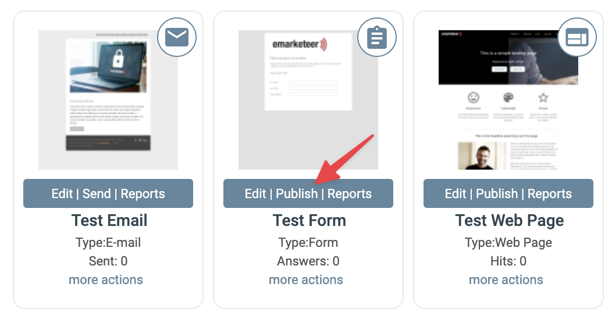
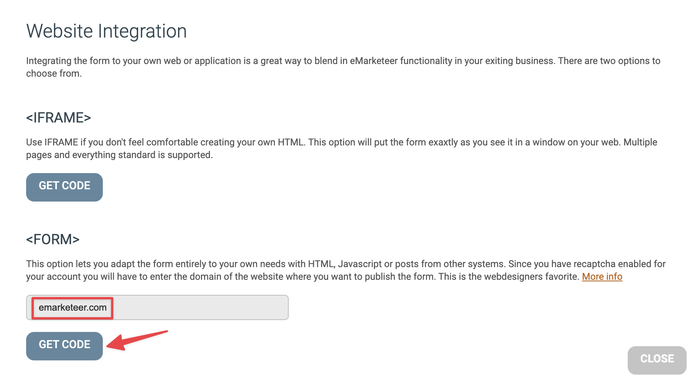

# How to post data to a form

**Using the hosted version of a form is great in many cases, but sometimes you want to put the form on your website or use other methods to get the answers into the form. A form is a great way to trigger automations from other systems. In this “how-to”, we’ll look closer on how to use other methods to post data to a form.**

In any case we always need to create a Form in eMarketeer. This is where you define which questions you need answered. So go ahead and create your form.

Now that you have a form, you can post answers to this form in several ways.

-   Get the direct URL and let visitors answer the hosted form. (not covered in this document)
-   Iframe the hosted form on to your site. (not covered in this document)
-   Put the html of the form on your website
-   Use scripts to post data to the form programmatically

All forms have these important properties.

-   A URL to post the data to
-   Input fields with name and value

Thats it! If you just POST (or even GET) the answers to the right URL with the right name=value, your answers are saved in eMarketeer.

**Lets do this!**

**1\. Create the form**

In eMarketeer create a form with a contact registration and some other questions.

****

**2\. Get form HTML code**

Click “publish” on the form.

Then “Website integration”.

Then click “GET CODE” under the “<FORM>” section to get to the form code. If you have reCAPTCHA active on your account then you will need to add a domain to the domain field before you can access the code.

Now you get the form code for this form.

Now, this form code you can put directly on your website and it will post the answers to eMarketeer and then show the “Thank you page”.

The form code can be designed and altered as much as you want as long as you keep the **action URL and input names intact.** There is also an important hidden input field with the name “m” and a value which must be kept since it identifies which form to post to.

**cUrl and other methods to post**

SO now you have the URL and the input fields, and you are free to use any method to get the answers to your form. Instead of using the web browser to post, you can also use cUrl and similar to post programmatically in the background. Just remember to keep the input names intact.

Even “GET” is a valid method to send data to the form. In this case you load the URL with all parameters in the query string.

**Custom thank you page**

If you put the form on your web site you may not want to redirect the visitor to eMarketeer hosted thank you page after answering the form. In this case, you can redirect the visitor to any URL after answering. You could create your own thank you page on your site and redirect there.

To change the redirect, go into edit mode on the form in eMarketeer and click “Thank you page”. There choose “Use custom URL” and enter the URL you want to redirect to after answering.

