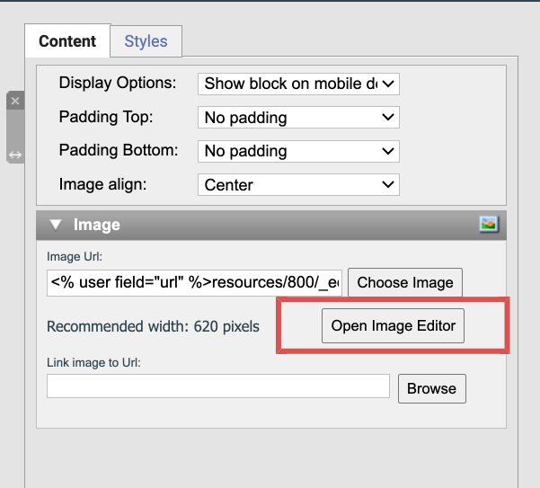

# How to use the image editor in eMarketeer

The image editor lets you edit your own images and gives you a built-in stock library to draw from.

The library includes more than two million photos, 900 fonts, and 700 icons. All are free to use.

## How to use the image editor

### Where to find the image editor

In the eMarketeer editor — where you build emails or landing pages — add an image block. In the right-hand panel for the image block, click "open image editor."

### The four main features

The left-hand menu in the editor has four main features:

- **Background:** add the image itself. Search the stock library, upload your own photo, or pick a background color to start from scratch.
- **Shapes:** add a square, circle, or other shape and customize the colors. Use shapes as a layer over your image or as a backdrop for text.
- **Graphics:** add an extra element — another image from the library, an upload of your own, or one of hundreds of icons.
- **Text:** add a headline or other text. The editor remembers the fonts you use and saves them as favorites.

Every image you edit or create is saved. You find them in your image files under the folder called "edited images."
