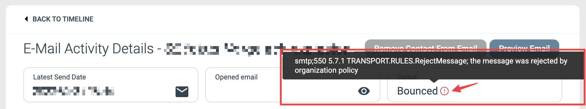
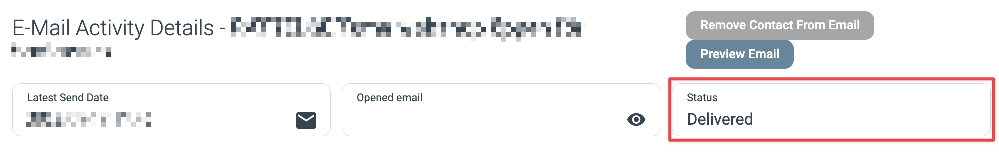

# Identifying why an Email wasn’t recieved

_“Why did my contact not receive my email?”_

There are several possible reasons for this and this article will endeavour to explain how to identify the most common causes and what you can do about it.  
Note that not all causes can be remedied by you as the sender of the email, specifically those caused by issues relating to the recipients email service.

* * *

#### Common Causes

1.  The email was Rejected before being sent.
2.  The email Bounced after being sent.
3.  The final delivery was stopped by the contact’s email service.
4.  The email was never addressed or sent.

#### Identify the reason

**Was the email Rejected or Bounced?**

Finding out if an email was Rejected or Bounced is the easiest as this information can be found in the Email Component’s Report page. To find out if the email addressed to the contact was Rejected or Bounced you open the corresponding Selections in the Email Report and check if the contact is in either of those lists.

Event Selections in the Report

If an email is Rejected then the email service found a problem with the sender address or recipient address during its last check before sendout. A recipient is usually Rejected because of a known issue with the specific recipient address or domain, such as a domain that doesn’t exists. However, if all of your recipients are counted as “Rejected” then the problem is most likely the sender address or reply-to address of the Email Component being an invalid email address.

If a contact has bounced then you can open their contact card from the Selection list and under the Email information in the Engagement History you can check the Bounce message that was sent by the recipients email service. This message can often be used to identify why the email was bounced. In the example image below we can see an email that was bounced because of a strict email policy by the organisation which disallows this type of email from being received by them.

Bounced error message on a contact’s contact card

**The final delivery was stopped by the contact’s email service.**

If the contact can be found in the Email Report’s Selection of contacts to whom the email has been Delivered, then it has been received by the recipients email service without any email delivery issues. Same if you open the recipients Contact Card and the Details page for the Email as shown in their Engagement History states that the email has been delivered. Since the email has been received by the recipient’s email service, any reason for why the email never reached the contact’s inbox is due to an action taken by their email service after successful delivery by eMarketeer.

Email information on Contact Card showing Delivery

**The email was never addressed or sent.**

Usually this means that the contact was removed from the list of recipients during the checklist stage of the email sendout process. You can read more about this stage of the process in [this article](https://support.emarketeer.com/knowledgebase/checklist-explained/).

If the email was never addressed to the contact then you can usually find the reason for why on their Contact Card in eMarketeer. First off you can check the Lead Status widget shown in the top right of the Contact Card when you open it; if it displays the status “Bounced” then the cause is that the Contact’s email address is marked as Undeliverable due to a Bounce error message that eMarketeer has received from the Contact’s email service at an earlier date.

Bounced status on a contact card

Another possibility is that the contact’s email address is wrong or contains faulty formatting such as symbols not supported by email. To verify if this is the case you check the contact’s Email Address contact information field.

It could also be the case that the contact has unsubscribed from future sendouts and Withdrawn their Marketing Sendouts Consent or if you are using subscription lists for your sendouts then the contact may have unsubscribed from the relevant subscription list. Their Marketing Sendouts consent and subscription status for each list can be seen on the Contact Information tab of their contact card.
