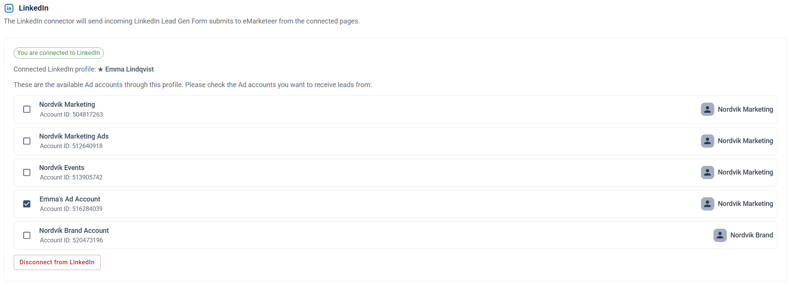
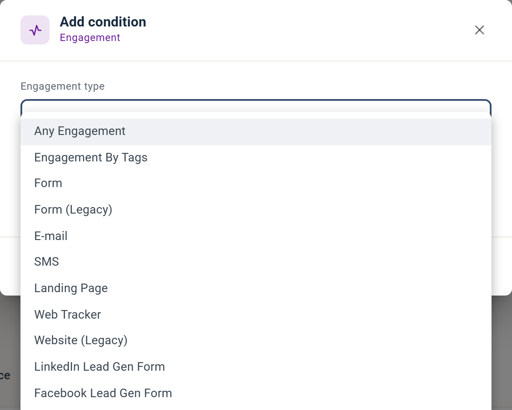

# LinkedIn Lead Gen Forms

Send LinkedIn Lead Gen Form submissions directly to eMarketeer so you can act on them without exporting CSV files.

When you advertise on LinkedIn you can add a call to action to your ads to collect registrations, leads, and sign-ups. [Read more about Lead Gen Forms on LinkedIn](https://business.linkedin.com/marketing-solutions/native-advertising/lead-gen-ads).

By default LinkedIn lets you download submitted leads as a CSV that you must process manually. With the eMarketeer LinkedIn connector, submissions flow into eMarketeer automatically so you can:

* Create and update contacts.
* Set lead score.
* Trigger journeys.
* Send leads to sales.

### Get started with LinkedIn Lead Gen Forms

#### Connect eMarketeer to LinkedIn

As an admin in eMarketeer, click the gear icon at the top right, choose "Account Settings", open "Integrations", and click "Manage" on the LinkedIn card. Click "Connect to LinkedIn" to initiate the connection.

_Note: you connect with your personal LinkedIn profile, which gives eMarketeer access to the Ad Accounts that profile has access to. Connect with a profile that has access to the Ad Accounts you want to receive submissions from._

Once connected, you see the list of available Ad Accounts.

Check the Ad Accounts you want to receive leads from. Any Lead Gen Form submission on a checked account will be sent to eMarketeer.

#### What is sent to eMarketeer when a Lead Gen Form is submitted

When you create a Lead Gen Form on LinkedIn, you choose up to 12 profile data fields to include with the lead. You can also add custom questions such as checkboxes, droplists, and text fields.

All submitted data is sent to eMarketeer and visible in the timeline event.

#### New contacts created from LinkedIn

When eMarketeer receives a lead from LinkedIn, the contact is matched on email address. If the email already exists, the contact is updated with the new information. Otherwise, a new contact is created.

_Note: make sure your account is not at its contact limit. If it is, no new contacts can be created._

These fields from LinkedIn (when submitted) are used to create or update contacts:

* Email
* FirstName
* LastName
* Phone
* City
* ZipCode
* Country
* State
* Title
* Company

Any other submitted information appears in the timeline event on the contact card.

#### How to test a Lead Gen Form

LinkedIn forms can only be used in a paid, published ad — but you can test before publishing. Create the form and ad in LinkedIn, then click "Preview" on the ad. In the preview you can submit a test lead, and it will be sent to eMarketeer. This lets you prepare and test scores, journeys, and lead qualification before launching. [Read more about testing leads on LinkedIn](https://www.linkedin.com/help/lms/answer/a420737).

#### Processing the incoming leads

Once leads are in eMarketeer you can access them using the Filter contacts dialog, under the Engagement category.

Use the filter to retrieve all contacts who:

* Submitted any LinkedIn Lead Gen Form.
* Submitted a specific Lead Gen Form.
* Answered the form in a specific way.

Because this engagement is part of the Contact Filter, you can use the same selections in:

* Contact lead score.
* Journeys, as a starting point or as an if/else condition.
* Qualifying leads for the Lead Board.
