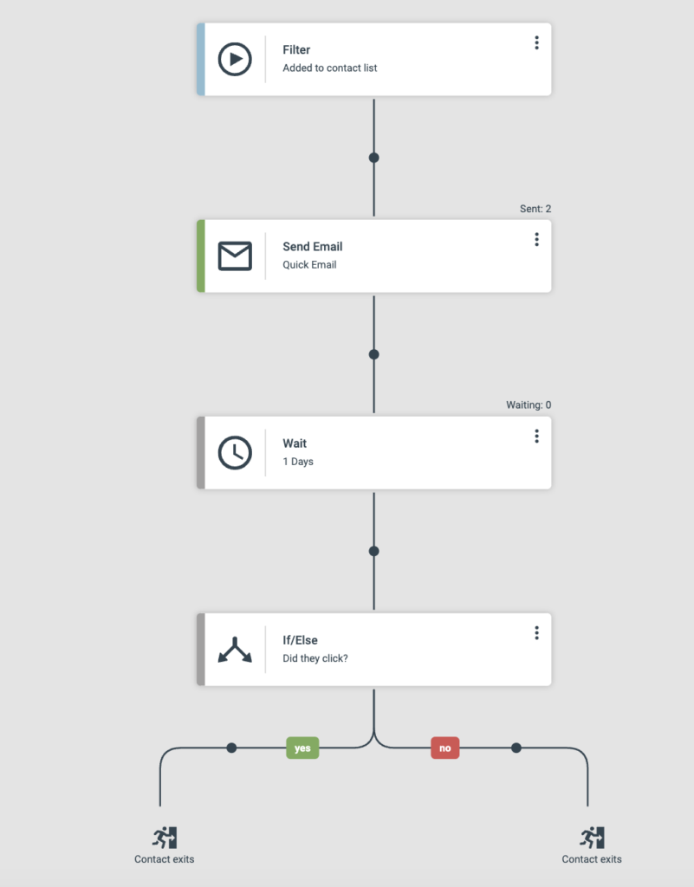

# Journeys

Journeys are the automation engine in eMarketeer. They let you nurture contacts, update your CRM, and drive other processes without manual work.

## Introduction to journeys

When a new contact matches the criteria (filter) for a journey, the contact enters the journey and moves through the steps in order.

## Key benefits

Journeys can be used to:

* Nurture leads from your website
* Automate tasks in eMarketeer
* Create and update tasks in your CRM
* Automate your lead board

And more. Using the filter as a starting point, combined with the logic and steps available, gives you a powerful tool for automating any process.

## System requirements

You can use journeys even without purchasing the add-on. In trial mode you can create as many journeys as you like, but only one journey can be active at a time.

## What to do next

[Learn how to create your first journey.](../../documentation/journeys/creating-your-first-journey.md)
