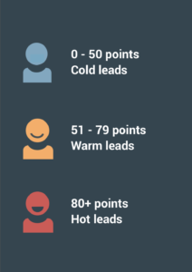

# How to set up your lead scoring model and lead scoring mistakes

This article shows how to build a lead scoring model that fits your business and lists the mistakes to avoid.

To get started with lead scoring, decide what to score your contacts on. eMarketeer ships with [default score rules](https://support.emarketeer.com/knowledgebase/default-score-rules-in-emarketeer/) to give you a head start, but lead scoring works best when it is tailored to your business and sales process. Build the model together with your sales team — their insights matter here.

If you already know what you want to score on, use the [tutorial on how to set up score rules in eMarketeer](https://support.emarketeer.com/knowledgebase/how-lead-scoring-works-in-emarketeer/).

## A few notes about lead scoring

### What is lead scoring?

Lead scoring identifies marketing qualified leads (MQLs) and shows how ready a contact is to buy. You assign points based on a contact's interest in you and how well they fit your buyer persona. When the score reaches a defined threshold, the contact is an MQL and marketing can hand them to sales. The higher the score, the more sales-ready the contact.

### Why use lead scoring?

* **Sales and marketing alignment.** Lead scoring is a joint activity. When the model reflects insights from both teams, fewer contacts fall through the cracks and both teams agree on what qualifies a lead.
* **Focus on the most relevant contacts.** Lead scoring identifies MQLs so the sales team can spend time on contacts most likely to buy.
* **Find the right timing for sales.** A contact who just visited your site or liked a social post is not ready to be sold to. A scoring model aligned with the buyer's journey helps sales reach out at the right moment.

## 3 steps to build your lead scoring model

A lead scoring model defines what to score on, how many points qualify a contact as an MQL, and how many points each rule is worth.

### 1. What should you score on? Your customers have the answer

First, decide which rules to score on — the actions and attributes that matter for qualifying a contact. There are two types of rules:

* **Explicit scoring** is based on how well the contact matches your buyer persona — demographics and company profile.
* **Implicit scoring** is based on marketing engagement and behavior.

Explicit scoring is based on profile, implicit on behavior. Both matter.

To decide what to score on, look at your customers. Start with demographics and company profile — country, job title, industry, company size, and so on. Then analyze behavior. Map the marketing content they consumed and how they engaged with it before becoming a customer. Which emails did they click? Which web pages did they visit? What did they download? Did they attend webinars or events? Also consider activities and campaigns you have planned.

Look at sales conversions for each data point too. Some are closer to a sale than others — a request for a product demo usually converts more often than a newsletter sign-up.

To sum up, look at:

* Customer company profile and demographics
* Previous marketing engagement
* Sales conversions for the actions and attributes

Use this data to build your buyer personas. Your personas might look like this:

The data points in your personas become the basis for your score rules. The more a future contact matches your personas, the more points they earn. This step takes analysis, but the better you understand your customers, the better you score future contacts.

### 2. When is a contact marketing qualified (MQL)?

Many lead scoring models use a 1–100 range, which is the range the default score sets in eMarketeer assume. A 1–10 range also works, but 1–100 gives you more precision. Pick a range and set your sales threshold — the score at which a contact is an MQL and ready for sales. For example, 80 or more.

Marketing and sales should agree on this threshold. To make a contact's "hotness" easier to read, set thresholds across the full range:

### 3. Set points for each rule

Now decide how many points each rule is worth. A few things to keep in mind:

* **Set different points for different rules.** Rules closer to a sale should be worth more. Use the sales conversion data you gathered earlier as a guide.
* **Combine several rules into one.** An email open on its own may not be worth much. Combined with a click and several landing page visits, it shows real interest. Combine criteria so the contact must fulfill all of them to earn the points.
* **Don't be afraid of negative scores.** Lead scoring can also surface contacts that are not a fit. Use negative rules for behavior that is unlikely to lead to a sale — for example, "student" as job title or a country you cannot ship to. When a contact fulfills a negative rule, points are removed.
* **Consider time frame and occurrence for engagement rules.** A click from three months ago is less meaningful than one from yesterday. Set a time frame so points only apply within a recent window. You can also set how many times a contact must do an action before they earn the points — for example, three landing page visits instead of one.
* **You can score just for having information on the contact.** The more you know about a contact, the more qualified they may be. A contact with a phone number on their card may be closer to a sale than one with only an email address. You can award points for the presence of a field.

List your rules, how many points each is worth, and when they expire. The list might look like this:

### 4. Put your lead score into action

It is now time to put your rules into action. [Follow this guide on how to set up score rules in eMarketeer.](https://support.emarketeer.com/knowledgebase/how-lead-scoring-works-in-emarketeer/)

## Common lead scoring mistakes

* **Leaving your model untouched.** A lead scoring model needs constant tweaking as you learn more about your customers. Watch whether your MQLs convert to customers. If conversion drops, the model probably needs an update. Sync with sales regularly and accept that the model is never finished.
* **Forgetting negative scores.** Lead scoring finds the contacts most likely to buy — and filters out the ones who are not. Add rules for undesired behavior, such as "student" as job title, the wrong company size, or visits to your job listings.
* **Awarding the same points to every rule.** Some engagement is closer to a sale than others. A product demo request beats a newsletter sign-up. Reflect that in the points.
* **Not considering a time frame.** A visit to your pricing page yesterday is meaningful. The same visit a year ago, with no activity since, is not. Without a time frame, scores stop reflecting current intent. Treat the time frame as an expiry date on the points.

Good luck building your model. [You can also use this guide for help implementing it in eMarketeer.](https://support.emarketeer.com/knowledgebase/how-lead-scoring-works-in-emarketeer/)
