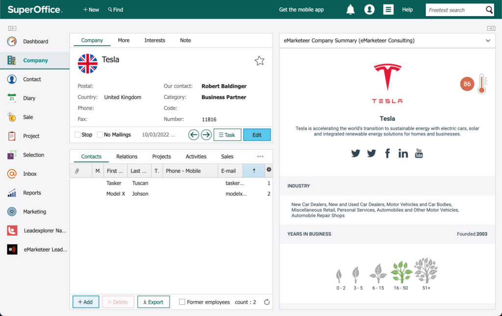

# Lead Board and SuperOffice

The eMarketeer Lead Board can be used entirely through SuperOffice, so Sales can manage leads from within SuperOffice while still using the eMarketeer web panels for insights on contacts and companies.

New leads are automatically matched with SuperOffice contacts and auto-assigned to the responsible sales user.

## Panels

When you integrate with SuperOffice Online, you get four main panels:

* The Lead Board — the main web panel where leads are delivered and managed.
* Company Summary — side panel on a company view that shows a summary of the company from eMarketeer.
* Contact Summary — side panel on a contact view that shows data on the contact from eMarketeer.
* Automation Queue — shows all automations waiting for the corresponding contact to be matched or created in SuperOffice.

## Integration

When the integration is initialised in eMarketeer, the new panels are set up by the integration script.

## Logging in to the web panels (automatically)

When viewing a side panel or the Lead Board, you need an eMarketeer user. When a SuperOffice user loads an eMarketeer web panel, a check runs to see if the SuperOffice username (email address) matches an eMarketeer user. If the email matches, the user is logged in to eMarketeer and the panel automatically.

If the SuperOffice user's email is not found in eMarketeer, they see an option to request access. This sends an email to the admin users on your eMarketeer account.

## The Lead Board

You will find the Lead Board on the main web panel under the SuperOffice logo. There is also a shortcut in the navigation.

## SuperOffice matching and auto-assign

When a contact in eMarketeer becomes an MQL and reaches the Lead Board, it is automatically checked against SuperOffice to see if the contact already exists there. The search uses the contact's email address.

If a match is found, eMarketeer picks the first contact in the result and saves the ContactID to eMarketeer. A match is shown by the SuperOffice (owl) icon on the lead card.

A successful match also releases any waiting automations on the contact.

eMarketeer then assigns the new lead to the correct sales user in eMarketeer. The assignment only happens if the responsible SuperOffice user is also a member of the Sales Team in eMarketeer.

## The contact summary web panel

On the contact view in SuperOffice you can show the eMarketeer contact summary panel. It shows enriched data from eMarketeer for the contact. Matching is done on email address, and data is shown only if the contact exists in eMarketeer.

## The company summary web panel

On the company view in SuperOffice you can use the eMarketeer Company Summary, which shows enriched data and an overview of all known contacts and their interactions in eMarketeer. The company is identified by the domain from its web address.

> TODO: verify — original text ends mid-sentence ("identified on domain from their web").

## Automation Queue

The Automation Queue shows all eMarketeer contacts with automations pending entry to SuperOffice. They are pending because no ContactID is defined on the eMarketeer contact (External ID). The contact first needs to be created in SuperOffice using the "Share to CRM" button.
