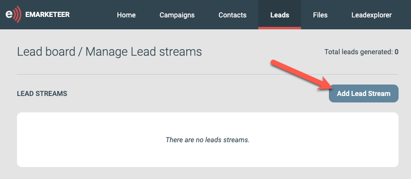
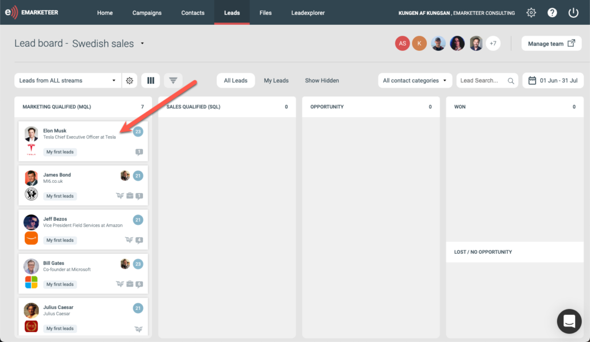

# Lead streams

A lead stream is a set of rules that generates Marketing Qualified Leads (MQL) for Sales to process.

Whenever a contact matches the rules of a lead stream, the contact becomes a lead and is delivered to a chosen sales team. Once set up, a lead stream delivers leads continuously.

## Create a lead stream

Open the lead board by clicking Leads in the top menu.

To set up a new lead stream, click the settings cog wheel in the lead streams box.

This opens the lead stream page, where you can create or manage lead streams.

Click Add lead stream to create a new one.

A lead stream needs three things:

* A name and an optional description
* A set of filter rules
* One or more sales teams to deliver leads to

### Add a new rule

Click Add new rule to add the first criterion for becoming a lead.

In this scenario we want to find contacts with high lead scores.

Click Apply to add the rule. Add other rules to expand or narrow which contacts qualify as leads.

### Choose a sales team

Check one or more sales teams that should have access to this lead stream.

### Enable the new lead stream

You have the following options on a new lead stream:

* Enabled / Disabled — a new lead stream starts inactive. Toggle the switch to Active to set it live. From that moment, any new matches to your rules generate leads.
* Clear leads — you can clear the lead stream of all leads at any time. This removes the leads from the lead board that match this stream. The stream must be inactive for this option to be available.
* Fetch history — a lead stream only generates leads from new matches. For example, if you want to make leads from contacts who answer a form, the stream generates leads only from form submits that come in while the stream is active. To make leads from past matches, click "Fetch ALL leads from history" to generate the historical leads once. The stream must be active for this option to be available.

## Check the results

Head back to the lead board to see the new leads.

