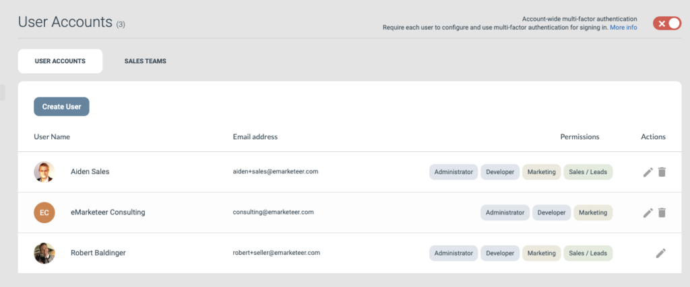

# Sales users

A user in eMarketeer can have access to both marketing and sales features. With sales access, the user can work in a sales team on the lead board.

Managing users requires admin privileges.

Open Settings and choose User Accounts to see the current users and their privileges.

## Create a new sales user

1. Click Create User.
2. Enter the email address of the new user.
3.  Enable Sales leads with the checkbox, then tick one or more sales teams the user should belong to. A user can belong to one or more sales teams.

    

4. Click Create user and send login email.

The user is notified by email to set a password and complete the profile.
