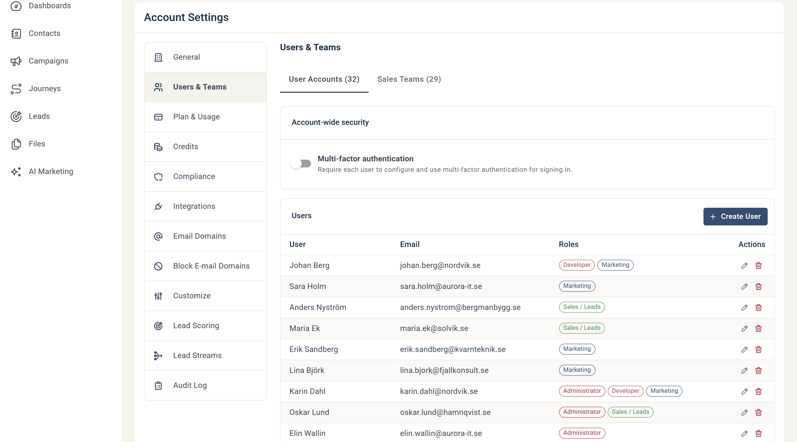
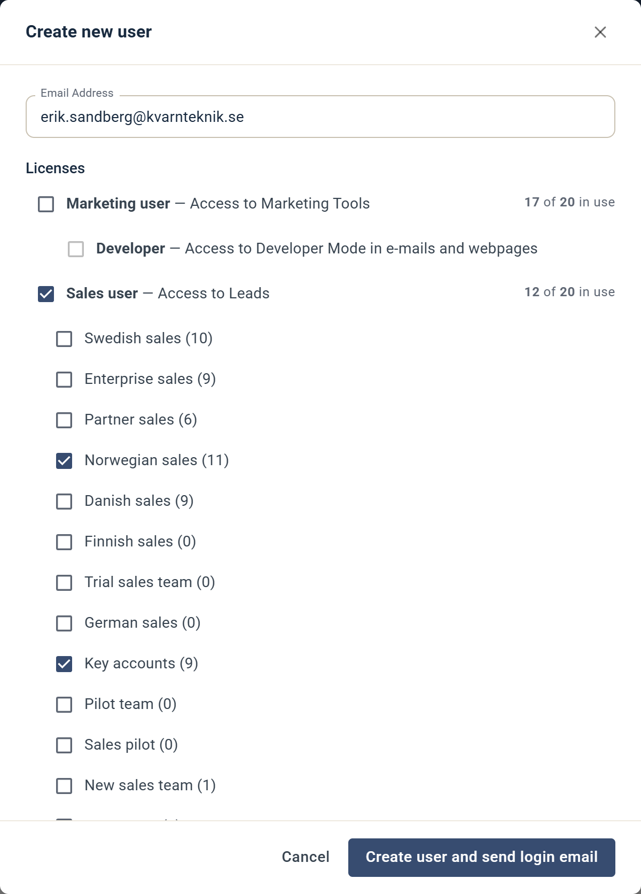

# Sales users

A user in eMarketeer can have access to both marketing and sales features. With sales access, the user can work in a sales team on the lead board.

Managing users requires admin privileges.

Click the gear icon at the top right, choose Account Settings, and open Users & Teams to see the current users and their privileges.

## Create a new sales user

1. Click Create User. This opens the Create new user dialog.
2. Enter the email address of the new user.
3.  Under Licenses, check Sales user — Access to Leads, then tick one or more sales teams the user should belong to. A user can belong to one or more sales teams.

    

4. Click Create user and send login email.

The user is notified by email to set a password and complete the profile.
