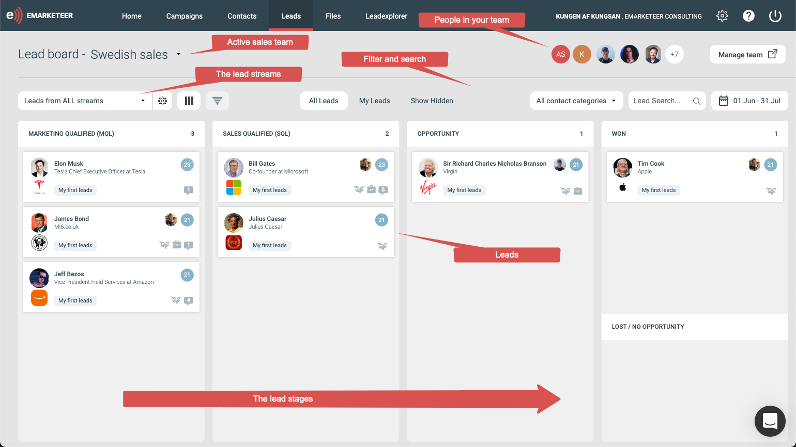
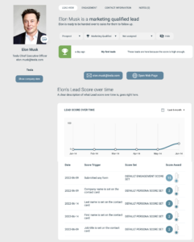
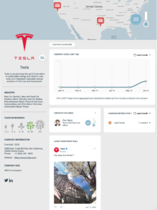

# The lead board

The lead board is where contacts qualified by marketing as leads are delivered to your sales team.

The purpose of the board is to let sales evaluate leads and move them down the funnel to a sale.

### The process

A fresh lead lands in the MQL stage. Your job is to validate MQLs and move them down the funnel. If a lead is interesting, move it to the next stage. If it disqualifies at any point, move it to "Lost / No opportunity" — this also gives important feedback to your marketing team.

### The features

Several features help you work the sales process.

#### Filtering

To narrow the leads on your board, use these filters:

* **Lead streams.** By default the board shows all leads regardless of source. Click a specific lead stream to show only leads from that stream.
* **Date range.** Show only leads generated in a specific date range. If you don't find what you're looking for, expand the date range.
* **Filters.** Above the stages, filter to show all leads, only leads assigned to you, or hidden leads.
* **Contact category.** Show leads from all categories or only one, such as prospects, customers, or others.
* **Search.** Search by email, name, or company to find a specific lead.

### The contact card

Click a lead on the board to open the contact card. The first tab is the lead tab, which shows everything relevant for managing the lead.

From here you can:

* See which lead streams the contact has matched and the description.
* Change the category of the lead to prospect, customer, or other.
* Change the lead stage.
* Assign the lead to yourself or someone else.
* Hide the lead from the board.

You also have direct links to the contact's email and corporate website.

The other tabs on the contact card let you:

* Review the full engagement timeline.
* Edit the contact information.
* Make notes.

There is also a link to the company card.

### The company card

From the lead board or the contact card, open the company card to see a summary of the company. The company is identified by the domain in the lead's email address.

