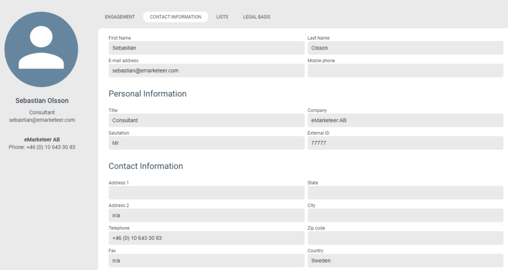
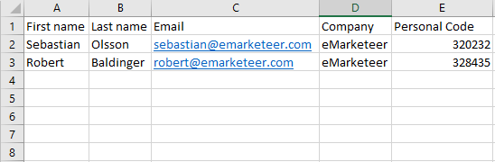
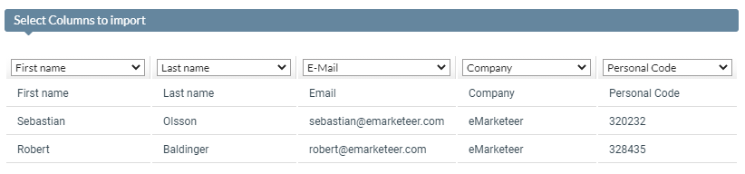
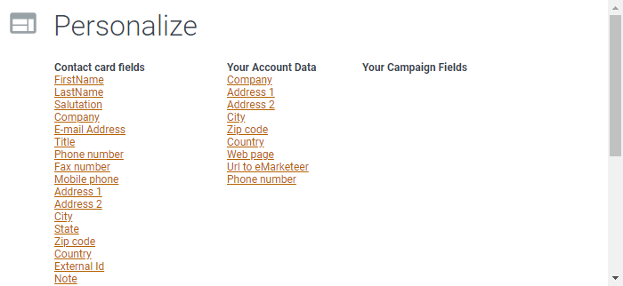
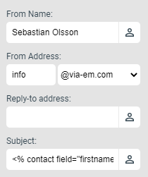
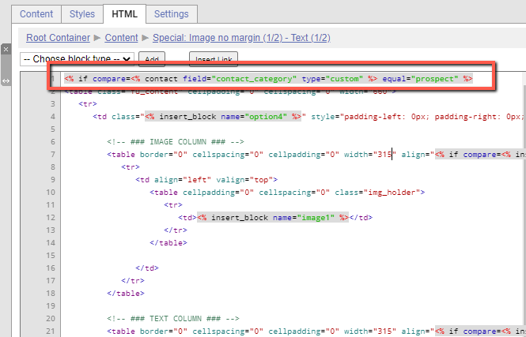

# Personalize content

### What is personalized content?

Personalzied content is content that is displayed in a specific manner for a specific contact based on the contact’s data. The most common example is personalized greetings in emails, greeting the recipient (contact) by name.

A personalized greeting in an email.

### How does personalized content work?

If a contact is identified in the eMarketeer component (this is always the case for eMarketeer Emails and SMS as these type of components are targeted to specific eMarketeer contacts when sending), that component (email, sms, form or webpage) can tap into the contact database and display contact data from the identified contact, _specifically contact field data_.

eMarketeer contact card with data

If we use the contact of Sebastian Olsson as an example; Any data that is stored on a contact card field can be used in the eMarketeer component’s content (text, url or html content). A practical example could be to informally greet this contact by the first name “Hi Sebastian” as the first name is available. And since Last name and Salutation are available, a more formal greeting can also be used (such as “Dear Mr. Olsson”). An email is however seldom sent to a single recipient, so the important part will be  that all recipients of the email have the same type of data available for a consistant message across all contacts. Though if certain contacts are missing necessary data, a fallback value can be used (but more on that later).

### How to store contact data to use with personalized content

There are multiple ways to gather contact data, the most common of which are to import contact data directly via CRM or Excel, or by letting contacts themselves provide data through various web forms (Form component).

##### Importing via Excel

Importing contacts with Excel lets you specify which contact data should exist on each indiviudal contact. You can do so by carefully managing the Excel sheet prior to import. In this example, First name, Last name, Email, Company and Personal Code will be imported for two contacts:

Excel file ready for import

An Excel file can be imported as a part of sending an email or sms component, or prior to sending by either importing the contacts to a campaign or contact list. No matter when and where you choose to make your import. The below step i crucial in order to match the column data to a corresponding contact card field. Do note that in this example “Personal Code” is a “Custom Field”, which is a non-standardized contact card field. You can add Custom Fields by customizing your Contact Card in the “Account Settings -> Customize eMarketeer -> Customize Contact Card” menu (Requires Adminstrator User role).

Importing contacts with Excel, matching data with available fields

### Using contact data to personalize a component

So how do we make use of the contact data? It is fairly easy to add personalized contact data into any text field by using the tool bar “Personalize” option.

The Personalize icon in the toolbar.

Opening this menu you will see all available Contact Card fields, and also Company Account data fields, and [Campaign fields](https://support.emarketeer.com/knowledgebase/how-to-use-campaign-fields-in-emarketeer/).

Personalize menu, showing all available fields

Clicking any of these field names will add a code snippet on your text marker that corresponds to the field you chose. The code snippet for “First name” will look like this:

<% contact field=”firstname” fallback=”” %>

_Do note that a fallback value can be specified in case the contact lacks the specific data. This value can be manually input into the code snippet between the fallback=”” quotation marks._

Adding the following code text snippet “_Hello <% contact field=”firstname” fallback=”valued customer” %>_” to your email will display:

Hello Sebastian (if the First name of the recipient is Sebastian)  
Hello valued customer (if the First name of the recipient is not available)

##### Custom field syntax

All standard Contact card fields will follow the above syntax. However, Custom contact card fields will have one additional attribute, _type=”custom”_ like the below example:

<% contact field=”personal\_code” fallback=”” type=”custom” %>

If you write the code snippet by hand, it is a common mistake to forget this additional attribute (as it is not necessary for the default fields).

### Where can I add personalization?

##### Email sender info:

Email sender info fields can be personalized

##### Text content:

Personalization in text content

##### Links and urls (yes this can also apply to image urls):

A link url with a personal code

##### HTML:

Personalization in html with a conditioanl statement. Making the entire block visible only to contacts with the “prospect” value for the field contact category.

##### Other places:

-   In forms. The fields will only be displayed if the contact is identified such as on the thank you page, or on confirmation email or if a personal link was used.
-   In certain automations, such as the Lead Description text for SuperOffice automations
-   In SMS
