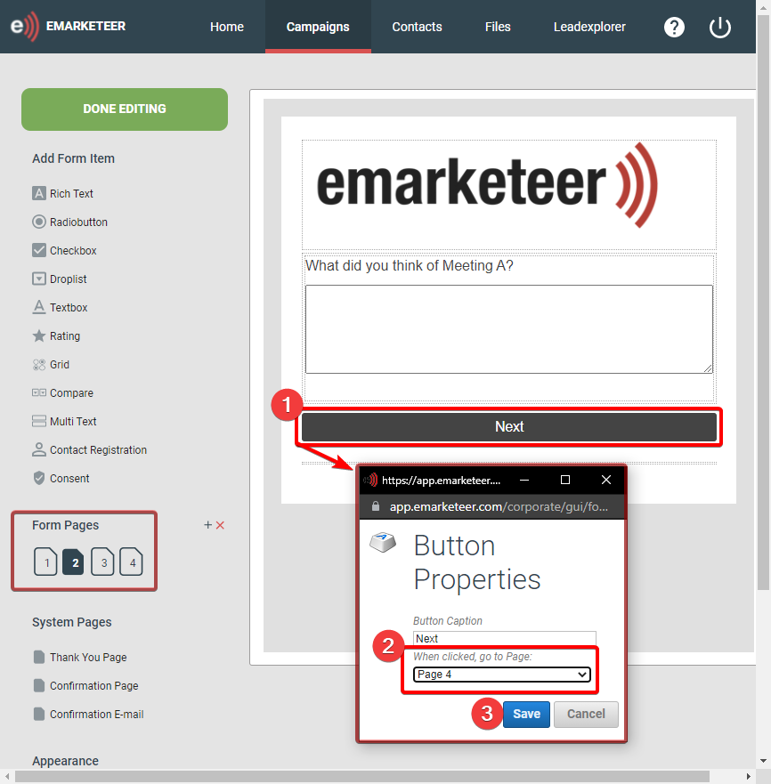

# Creating Branching Question Paths and using Question Display Rules in Forms

Branching of questions is something you can do in eMarketeer Forms and there are 2 ways primary ways of creating Branching Question Paths or otherwise hide questions until relevant in an eMarketeer Form and it’s by using Form Question “Rules”.

1.  Branch off to different pages with questions depending on an answer by skipping to a specific page.
2.  Hide or Show questions on the same page depending on an answer using Display Options.

* * *

## Skip to Page

This alternative is easier to use if there are many questions for each branch.

What the Skip to Page Rule does is change what page the visitor will land on when clicking the “Next Page” button at the bottom of the page.

In the following hypothetical scenario, we have a Form with questions about 2 Meetings where the visitors have attended one of them, and the questions should differ (or the answers should be separated) depending on which meeting they attended.

To do this we can use a Radio Button Question where each answer has a “Skip to Page” Rule. Questions about Meeting A is on Page 2, while questions about Meeting B are on Page 3.

The selected answer will move the visitor to that page, but what about those that are sent to Page 2 for questions about Meeting A, how do you skip Page 3 with Meeting B questions? For this, we can double-click the”Next Page” button on Page 2 and change it to move the visitor to Page 4.

* * *

## **Question Display Rules**

The other alternative, which is good for when you only have a few branching questions (or only want the Form to be a single page), is to use the Display Option Rules to Show or Hide questions depending on the visitor’s answer on a previous question.

In the following hypothetical scenario, we have a Form with questions about 2 Meetings where the visitors could have attended one or both of them, and the questions concerning each Meeting should only be shown to the visitors that attended that Meeting and show all questions if they attended both.

To do this we can use a Checkbox Question where the visitor can select if they attended Meeting A, Meeting B, or both. Following this question, we then add the Meeting Specific questions and go into their Rules to change the Display Settings of the questions. Here we have a Question about Meeting A where we set the question to only show if that option is selected on the preceding Checkbox question.

The Display Rules are set up individually for each Question, and allow multiple different answers (or combination of answers) on a preceding question to Show the Question. In the image displaying this rule, you can see that the checkbox answers are not mutually exclusive and if you have more than 2 answer options, you can have questions that only show if a combination is selected.

Note: A question cannot be both required to answer and hidden so the required setting is ignored if there are active display rules for the question.
