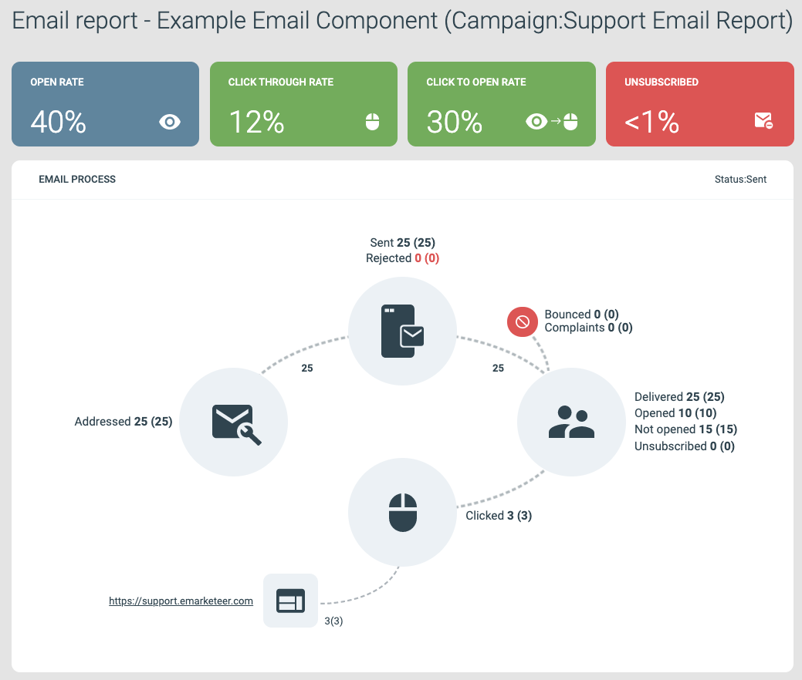
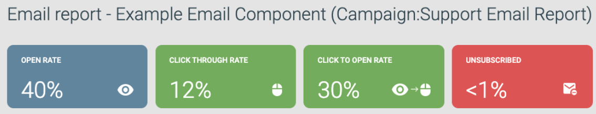

# Email report explained

This article explains the event tags in the eMarketeer email report, the numbers next to them, and how the widget percentages are calculated.

Example of an email report page.

## Email events

Each event tag shows two numbers, like "Event **10 (20)**." The number before the parentheses is the number of unique contacts counted for the event. The number in parentheses is the total, including duplicates. A duplicate Sent event is counted when the same email has been sent to a contact more than once, and a duplicate Click event is counted when the same recipient clicks the same link more than once.

**Addressed:** the number of recipient addresses included in the sendout after the checklist stage, then sent to the email servers for addressing.

**Sent:** the number of recipient addresses the email component was sent to after the email server's final check of the sender and recipient addresses.

**Rejected:** the email service found a problem with the sender or recipient address during the final check before sendout. A rejection usually points to a known issue with that specific recipient address or domain, such as a domain that does not exist. If every recipient is rejected, the cause is almost always an invalid sender or reply-to address on the email component.

**Bounced:** the recipient's email service accepted the message but could not deliver it. Common reasons include an address that no longer exists, a misspelled address, a spam filter, or a security policy at the receiving end. For more on bounces and bounce rates, read [About email bounces](../email-deliverability/about-email-bounces.md).

**Complaints:** the recipient clicked "Report this email and Unsubscribe" in their email client and the client reported it back to eMarketeer. This also unsubscribes the contact from future sendouts by setting the Marketing Sendouts legal basis to _Withdrawn_, visible on the Legal Basis tab of the contact card. Your eMarketeer account is allowed an average complaint rate of up to 0.3% before we must pause it for audit.

**Delivered:** the recipient's email service confirmed it received the email, that the address exists, and that it will deliver the message to the inbox. A delivered email can still be filtered as spam before reaching the inbox, and that is usually not reported back.

**Opened / Not opened:** the number of recipients who opened the email, or did not open it. For more on how an open is registered, read [When is an email registered as opened?](email-open.md).

**Unsubscribed:** the recipient clicked the unsubscribe link in the email and then completed the unsubscribe on the eMarketeer Subscription Center page. A contact who clicks the link but does not finish the unsubscribe is not counted here.

**Clicked:** the number of recipients who followed any URL in the email. This is usually a link click, but copying the URL into a browser manually also counts.

## Widget percentage calculations

The widget values are based on how many delivered contacts interacted in a given way. In the example below, the email component was sent and delivered to 25 contacts. 10 opened it, and 3 clicked a link.

Example of email report widget values.

The calculations use unique contacts, not the total number of events. If a single contact received the same email four times but only opened one of them, they count as Opened once for the open rate. The three unopened copies do not change the calculation.

**Open rate:** the percentage of delivered emails that were opened. In the example, 10 of 25 delivered contacts opened the email — 40%.

**Click-through rate:** the percentage of delivered emails where a link was clicked. In the example, 3 of 25 — 12%.

**Click-to-open rate:** the percentage of opens that also produced a click. In the example, 3 of 10 — 30%.

**Unsubscribed:** the percentage of delivered emails where the contact clicked the unsubscribe link and unsubscribed in the Subscription Center. In the example, 0 of 25 — less than 1%.

## Sendout health widget

.png>)

Sendout health widget example.

This widget gives you a quick view of the bounce rate and complaint rate for the email component. The limits indicate the percentage of bounces or complaints that service providers may accept before flagging your sendouts as fraudulent. To uphold our security standards, your account may be paused for audit if a limit is reached.

For more on bounce rate, complaint rate, and keeping your bounce rate low, read [About email bounces](../email-deliverability/about-email-bounces.md).
