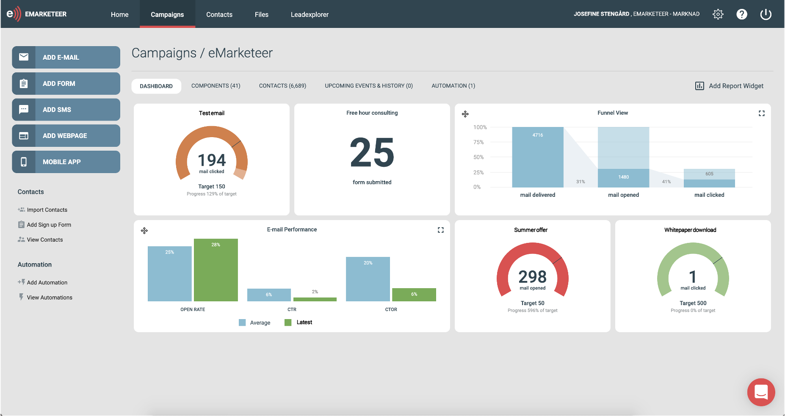
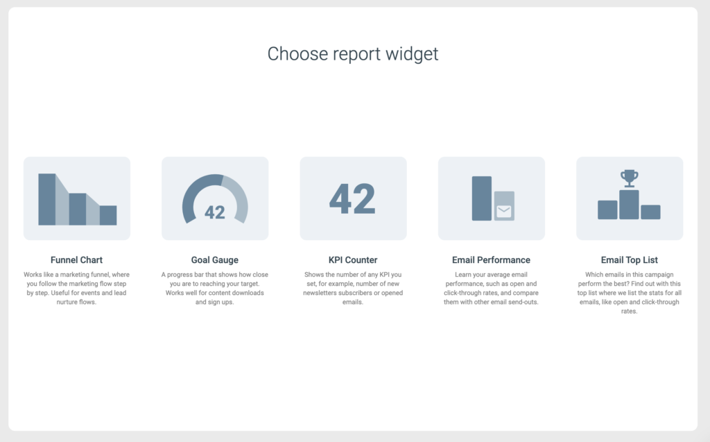
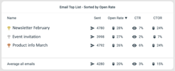
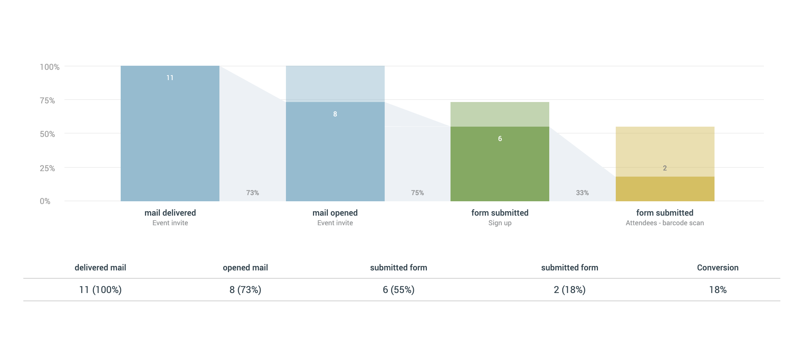
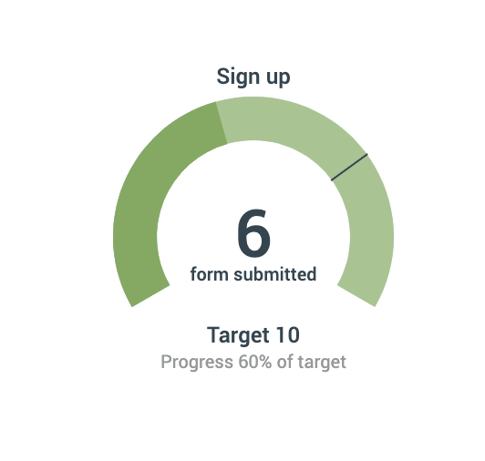
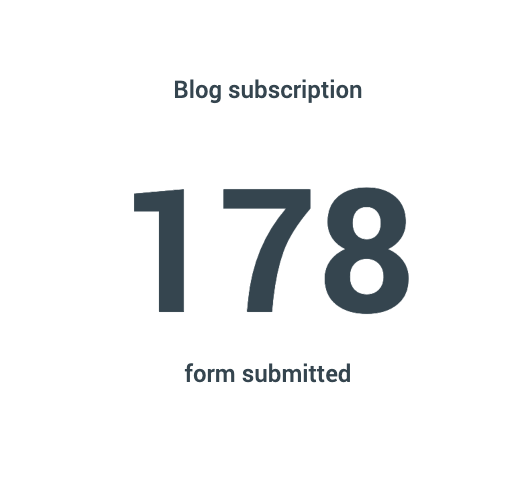

# How to use eMarketeer campaign reports

The campaign dashboard lets you build real-time reports for any campaign using drag-and-drop widgets.

Update as of February 2021: the reporting widgets now live on their own tab called "dashboard" inside a campaign. Setting up widgets works the same as in the older tutorial.

In this article, you learn how the campaign report dashboard works and what each reporting widget does.

## Campaign dashboard

The campaign dashboard builds reports from a set of widgets you choose. Reports update in real time, and you arrange them with drag-and-drop.

### To build a campaign report

Go to the campaign you want to report on. Click the "dashboard" tab and then "add reporting widget." Pick any widgets you want to track the campaign with. Rearrange them by dragging.

## Reporting widgets

The available widgets are email top list, email performance, funnel chart, KPI counter, and goal gauge.

### Email top list

Find out which of your campaigns performs best.

The email top list widget ranks your campaigns by open rate, click-through rate, or click-to-open rate. It gives you an overview of how each campaign performed and which type your contacts prefer.

To add the widget:

1. Choose the time frame — all time or this year.
2. Choose how to sort — open rate, click-through rate, or click-to-open rate. The list generates automatically with the top 10 campaigns.

### Email performance report

Suited for your email marketing.

See your average campaign performance — open rate, click-through rate, click-to-open rate, and unsubscribes. You can also compare averages with another campaign. After adding the widget, choose the campaign to compare against and the report generates automatically.

### Funnel chart

Works well for lead nurture campaigns and events.

Track your marketing flow step by step. The funnel chart visualizes each step you build — for example, event invitation, event sign-up, and attendee form. Each step is a bar with the conversion rate to the next, and the chart shows the overall conversion from the first step to the last.

To set it up:

1. Click "add campaign reports."
2. Choose "funnel chart."
3. Choose the component that is the first step in the flow. Depending on the component, you pick from a few actions — for emails: addressed, delivered, opened, clicked. For forms: submissions.
4. Add the remaining steps in the order they happen in your flow.

Click a bar to see which contacts did or did not complete that step. Click the component name under a bar to open the report for that component.

Important: for a contact to be counted in a step, they must also be counted in the previous step.

You can resize the funnel chart. Open it, find the "size" drop-down, and pick a smaller value to make room for another chart next to it — for example a goal gauge.

### Goal gauge

Works well for downloads or sign-ups.

Set a target and watch progress toward it. The goal gauge works as a progress bar and shows the percentage to target.

1. Click "add campaign reports."
2. Choose "goal gauge."
3. Choose the component to track — for example, form submissions.
4. Set the target.

### KPI counter

A quick count of form submissions, email clicks, or whatever you want to track. Like the goal gauge, but without a target.

1. Click "add campaign reports."
2. Choose "KPI counter."
3. Choose the component to track — for example, form submissions.
4. The KPI calculates immediately.
