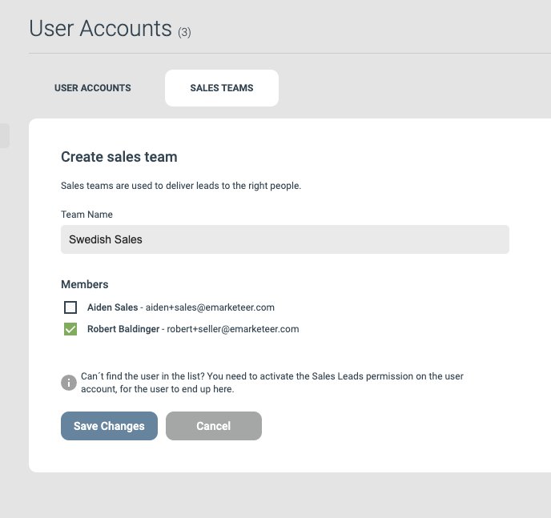

# Sales teams

**Leads in eMarketeer are always delivered to a sales team. This means that all sales users who are members of the same team share the incoming qualified leads. If your marketing activities span over many markets, brands or categories, you can create multiple sales teams to deliver the leads to. This way sales will always get relevant leads.**

### Create a sales team

This action requires admin privileges.

Navigate to Settings in the top menu of emarketeer and click “User accounts”. There you will find the tab “Sales teams”.

To create a new sales team, click “Create new team”.

Give your team a name. If you already have sales users, you can check the names of the users you want to be part of the new team.

Finish by clicking “Save changes”.
