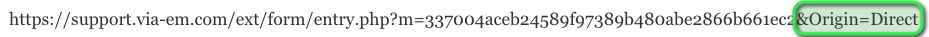
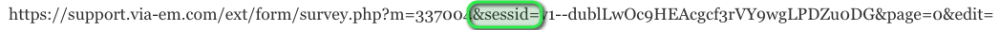
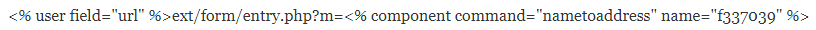
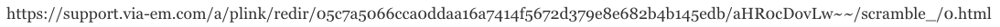

# Understanding eMarketeer URLs

eMarketeer makes use of a few different types of URLs which can be useful to understand and this article covers the most common ones that you might encounter when using the service. These relate mostly to how Form Components are accessed, so the explanations are written from that perspective.

### Publishing URL

This URL is the one that eMarketeer gives you when you endeavour to Publish a Form and is the URL that allows anyone to reach the form at any time as long as the Form Component is Live and Open for answers. You can in most cases Identify this URL by the **_&Origin_** part of the URL that by default is set to _&Origin=Direct_ .

A Publishing URL with Origin Direct

This URL is to be used for almost all situations and is recommended for cases where many people should be able to click the link to reach the Component, such as a link in a Social Media post or on your Website.

When someone accesses a Form using a Direct URL they are redirected to a unique Session URL.

### Session URL

A Session URL is temporary and is unique for each visitor. It is generated when someone wants to access a form and is used as an anonymous identifier if the visitor answers the form. A Session URL only accepts one answer and has a lifetime of 24 hours, and will stop working once either condition is met. You can Identify this URL by the _**&sessid=**_ part of the URL.

A Session URL

This URL shouldn’t be used to link to a Form due to the 24 hour lifetime and One Answer limit.

### Internal URL

Internal URLs are dynamic and are used to link to other components and files on eMarketeer using id numbers instead of file paths or permanent URLs. These allow you to move components without breaking links or even copy a Campaign and have the duplicated Component’s URLs change to link to the new duplicates of the destination components.

Internal eMarketeer URL

### Personalised URL

Personalised URLs can be used when sending a link to a Form via an eMarketeer Email Component to known Contacts. Answers to a Form from a Personalised URL will be linked to the Contact automatically and do not require the visitor to identify themselves in the Form. A Personalised URL isn’t as easy to identify since all eMarketeer links generated for Emails look similar, but below is an example:

A Personalised URL

This URL can be used when a Form is for well-known recipients and want their Form submission to be automatically identified as them, such as an Invitation to a meeting or an event. However, be aware that any answer to the form through the link will be made in the original recipient’s name, and forwards of the Email might lead to unexpected situations.

### Anonymous URL

Anonymous URLs are an option to Personalised URLs in Emails and allow multiple people to answer a Form and each answer is recorded separately. This URL acts as a Direct URL, but is specific to Emails and is what we call “Forward Friendly”. Anonymous and Personalised URLs look the same which makes them difficult to identify by sight.
