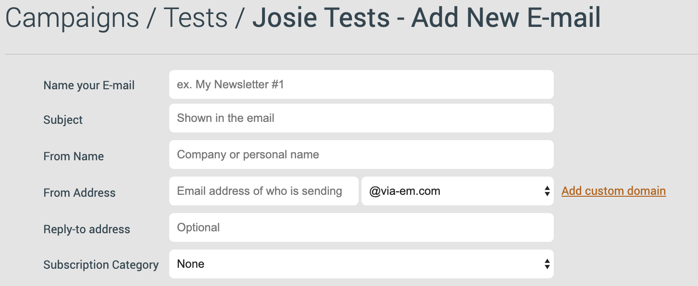

# Faster send-out and better deliverability — eMarketeer's new email service

eMarketeer is switching the technology used to send your emails, bringing faster send-out, better deliverability, and a new domain authentication flow.

The new service improves delivery, gives you more detailed bounce reports, and replaces a couple of older features. Here is what the change means for you.

## What's new

- Greatly improved and faster deliverability. Send-out is faster, and all eMarketeer accounts get technologies in place to prove your emails are legitimate and not fraudulent. This includes [SPF](https://en.wikipedia.org/wiki/Sender_Policy_Framework) and [DKIM](https://en.wikipedia.org/wiki/DomainKeys_Identified_Mail), which increase your chances of reaching the inbox.
- More detailed bounce report. Bounced addresses now return an error message such as "no such recipient" instead of just an error code. Contacts who report your email as spam are also unsubscribed automatically.
- Secure Email Domain disappears. Enter Authenticated Domain. The Secure Email Domain service is no longer available. It is replaced by the improved service "authenticated domain," which is free of charge. See below for more details.
- Email warm-up disappears. The warm-up function (which divided the send-out into smaller batches when you sent to a large number of contacts for the first time) is no longer needed.

## Why should you authenticate your domain?

You must authenticate a domain in order to send emails with eMarketeer. This requirement exists to ensure email security and strong deliverability.

When you authenticate your domain, you let eMarketeer use your domain name to send emails, and your from-address uses your company domain. To do this, you make a couple of changes to your DNS. [Follow this guide on how to authenticate your domain when the email service is available](https://support.emarketeer.com/knowledgebase/authorize-email-domain/).

You can do this for multiple domains.

This is what the email settings look like when you build an email and have authenticated a domain. The drop-down menu lets you choose from the list of domains you've authenticated.

## Important dates and roll-out routine

The new email service is available now. Go ahead and [authenticate your domain](https://support.emarketeer.com/knowledgebase/authorize-email-domain/), then let us know and we will activate the new email service for you. Reach us at [support@emarketeer.com](mailto:support@emarketeer.com) or in the chat when you're logged in to eMarketeer.
