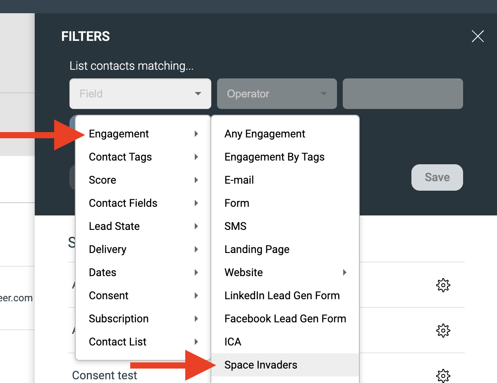

# Custom Signals API

Den här tutorialen förklarar hur du använder Signals API för att skicka kontakthändelser till eMarketeer.

API-referens: [https://api-doc.emarketeer.com/?urls.primaryName=Engagement](https://api-doc.emarketeer.com/?urls.primaryName=Engagement)

***

Kontakter i eMarketeer består av tre huvuddelar:

* Kontaktfält
* Engagemang
* Rättslig grund (samtycke)

Engagemang registrerar varje interaktion en kontakt gör med kampanjkomponenter som e-postmeddelanden, formulär och landningssidor. Dessa interaktioner visas i kontaktens tidslinje och kan användas för att sätta lead score, trigga Journeys och mer. De ger en 360-graders bild av vad kontakten har interagerat med över tid.

<div align="left" data-with-frame="true"></div>

### Custom Signals

Med Custom Signals API kan du skicka kontakthändelser från vilket annat system som helst in i eMarketeer, så länge du har kontaktens e-postadress. Dessa signaler läggs till som tidslinjehändelser på kontakten och kan användas i filter, scoring, Journeys och leadgenerering.

I följande scenario har du ett arkadspel som heter "Space Invaders". Varje gång någon spelar spelet vill du registrera händelsen i eMarketeer. Du kan sedan trigga Journeys baserat på olika kriterier — till exempel skicka ett e-postmeddelande till alla som får över 100 poäng.

<div align="left" data-with-frame="true"></div>

<div align="left" data-with-frame="true"></div>

### Strukturen för custom signals

För att skicka exemplet ovan som en signal genom API:et skulle du använda denna payload. Parametrarna förklaras nedan.

```
{
  "adapter": "Space Invaders",
  "category": "Game Played",
  "eventData": {
    "Player Name": "Parzival",
    "Reached Level": "8",
    "Score": "10"
  },
    "contact": {
        "firstName": "Tye",
        "lastName": "Sheridan",
        "email": "tye@playerone.com",
        "company": "Oasis"
  },
  "eventTime": "2023-12-13T10:06:42.375Z",
    "consent": {
    "marketing": {
      "allowed": true,
      "text": "I agree to emails"
    }
  }
}
```

En custom signal har följande huvuddelar.

**Adapter**

Toppnivånamnet för signalen. Det listas direkt under "Engagement" i filtret.

<div align="left" data-with-frame="true"></div>

Håll antalet distinkta adapternamn till ett minimum, eftersom alla distinkta adapternamn visas direkt under Engagement. En bra praxis är att använda tjänstens namn för de signaler du skickar. En adapter kan sedan skicka flera typer av händelser.

I det här exemplet är adapternamnet "Space Invaders".

**Category**

"Verbet" för signalen. I Space Invaders-exemplet inkluderar möjliga kategorier:

* Game played
* Inserted coins
* Got high score

<div align="left" data-with-frame="true"></div>

I filtret, när du väljer adapternamnet "Space Invaders", ser du kategorierna av signaler du har skickat för den adaptern.

**Event data**

Du kan skicka all information du behöver med signalen. I det här fallet bär "Game played"-signalen Player Name, Reached Level och Score. Alla dessa kan användas i kontaktfiltret för att hitta kontakter som spelade spelet och nådde en viss poäng eller nivå.

<div align="left" data-with-frame="true"></div>

**Contact data**

Alla signaler måste tilldelas en kontakt. Som minimum behöver du en e-postadress, men du kan skicka vilket standard- eller anpassat fält som helst till kontaktkortet för att skapa eller uppdatera kontakten.

**Consent (valfritt)**

Du kan också skicka rättslig grunddata för marknadsföringsmejl tillsammans med signalen.

**Event Time**

Tidsstämpeln du vill ha för händelsen i tidslinjen. Skicka den som Zulu-tid (UTC).
