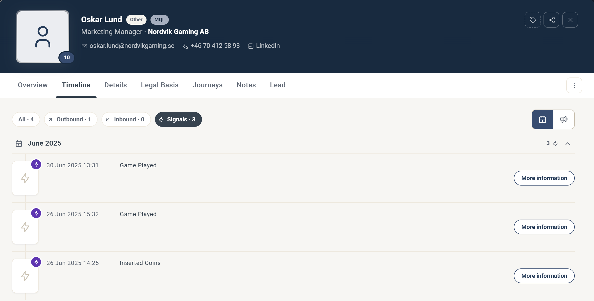

# Custom Signals API

Den här tutorialen förklarar hur du använder Signals API för att skicka kontakthändelser till eMarketeer.

API-referens: [https://api-doc.emarketeer.com/?urls.primaryName=Engagement](https://api-doc.emarketeer.com/?urls.primaryName=Engagement)

***

Kontakter i eMarketeer består av tre huvuddelar:

* Kontaktfält
* Engagemang
* Rättslig grund (samtycke)

Engagemang registrerar varje interaktion en kontakt gör med kampanjkomponenter som e-postmeddelanden, formulär och landningssidor. Dessa interaktioner visas i kontaktens tidslinje och kan användas för att sätta lead score, trigga Journeys och mer. De ger en 360-graders bild av vad kontakten har interagerat med över tid.

<div align="left" data-with-frame="true"></div>

### Custom Signals

Med Custom Signals API kan du skicka kontakthändelser från vilket annat system som helst in i eMarketeer, så länge du har kontaktens e-postadress. Dessa signaler läggs till som tidslinjehändelser på kontakten och kan användas i filter, scoring, Journeys och leadgenerering.

I följande scenario har du ett arkadspel som heter "Space Invaders". Varje gång någon spelar spelet vill du registrera händelsen i eMarketeer. Du kan sedan trigga Journeys baserat på olika kriterier — till exempel skicka ett e-postmeddelande till alla som får över 100 poäng.

<div align="left" data-with-frame="true"></div>

<div align="left" data-with-frame="true"></div>

### Strukturen för custom signals

För att skicka exemplet ovan som en signal genom API:et skulle du använda denna payload. Parametrarna förklaras nedan.

```
{
  "adapter": "Space Invaders",
  "category": "Game Played",
  "eventData": {
    "Player Name": "Parzival",
    "Reached Level": "8",
    "Score": "10"
  },
    "contact": {
        "firstName": "Tye",
        "lastName": "Sheridan",
        "email": "tye@playerone.com",
        "company": "Oasis"
  },
  "eventTime": "2023-12-13T10:06:42.375Z",
    "consent": {
    "marketing": {
      "allowed": true,
      "text": "I agree to emails"
    }
  }
}
```

En custom signal har följande huvuddelar.

**Adapter**

Toppnivånamnet för signalen. I kontaktfiltret listas det i listan Engagement type när du lägger till ett Engagement-villkor.

<div align="left" data-with-frame="true"></div>

Håll antalet distinkta adapternamn till ett minimum, eftersom alla distinkta adapternamn visas i listan Engagement type. En bra praxis är att använda tjänstens namn för de signaler du skickar. En adapter kan sedan skicka flera typer av händelser.

I det här exemplet är adapternamnet "Space Invaders".

**Category**

"Verbet" för signalen. I Space Invaders-exemplet inkluderar möjliga kategorier:

* Game played
* Inserted coins
* Got high score

<div align="left" data-with-frame="true"></div>

I filtret, när du väljer adapternamnet "Space Invaders" som engagemangstyp, klickar du på Signal för att se kategorierna av signaler du har skickat för den adaptern.

**Event data**

Du kan skicka all information du behöver med signalen. I det här fallet bär "Game played"-signalen Player Name, Reached Level och Score. Alla dessa kan användas i kontaktfiltret för att hitta kontakter som spelade spelet och nådde en viss poäng eller nivå.

<div align="left" data-with-frame="true"></div>

**Contact data**

Alla signaler måste tilldelas en kontakt. Som minimum behöver du en e-postadress, men du kan skicka vilket standard- eller anpassat fält som helst till kontaktkortet för att skapa eller uppdatera kontakten.

**Consent (valfritt)**

Du kan också skicka rättslig grunddata för marknadsföringsmejl tillsammans med signalen.

**Event Time**

Tidsstämpeln du vill ha för händelsen i tidslinjen. Skicka den som Zulu-tid (UTC).
