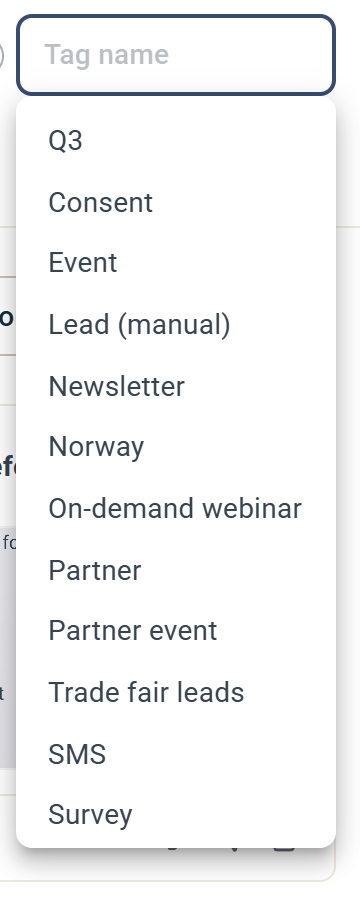
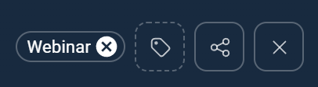

# Taggar

Taggar låter dig märka kampanjer och kontakter så att du kan gruppera, filtrera och segmentera dem. Den här artikeln förklarar vad taggar är och hur du använder dem i eMarketeer.

## Vad är en tagg?

En tagg är en informationsbit som beskriver datan eller innehållet den är tilldelad. Taggar är icke-hierarkiska nyckelord som används för att klassificera och beskriva innehåll. En tagg bär ingen information eller semantik på egen hand.

Taggning fyller många syften, inklusive:

* Klassificering
* Markering av ägarskap
* Beskrivning av innehållstyp
* Online-identitet

## Hur taggar används i eMarketeer

Du kan använda taggar på kampanjer och kontakter för många syften.

### Kampanjer

Att sätta taggar på kampanjer låter dig definiera vad varje kampanj handlar om. Till exempel kan du tagga dina nyhetsbrevskampanjer med "Newsletters" och "Sweden", och tagga andra med "Events" och ett specifikt produktområde.

När de är taggade kan du separera engagemang i filtret per tagg. Till exempel hämta alla kontakter som svarade på något formulär i events, eller alla kontakter som öppnade något svenskt nyhetsbrev.

### Kontakter

Att tagga kontakter låter dig segmentera dem mer exakt. Du kan sätta taggar manuellt på en kontakt, eller använda en bulkåtgärd för att tagga en lista med kontakter. Du kan också använda Journeys för att lägga till eller ta bort taggar när kontakter utför vissa åtgärder.

## Taggwidgeten

Du hittar taggwidgeten i en kampanj (övre högra hörnet) eller på kontaktkortet (övre högra hörnet). Klicka på tagg-ikonen för att öppna den.

Widgeten visar ett sökfält och en lista över dina befintliga taggar. Börja skriva för att begränsa listan.

### Skapa en ny tagg

Om taggen du vill ha inte finns, skriv dess namn i taggwidgeten och välj **Create new "<name>" tag**.

Du kan också skapa taggar under **Contacts** > **Tags**. Klicka på **Create tag** i **Manage tags**, skriv ett taggnamn och klicka på **Create**.

### Byt namn på eller ta bort en tagg

För att byta namn på en tagg eller ta bort den helt från systemet, gå till **Contacts** > **Tags**. Klicka på redigeringsikonen i **Manage tags** för att byta namn, eller på ta bort-ikonen för att ta bort taggen. Att ta bort en tagg tar bort den från eMarketeer och från alla kontakter och kampanjer som använde den.

## Lägg till taggar på kontakter eller kampanjer

Öppna taggwidgeten och välj den tagg du vill tilldela kontakten eller kampanjen. Taggen visas bredvid tagg-ikonen.

## Ta bort taggar från en kontakt eller kampanj

I kampanjen eller på kontaktkortet, klicka på "x" på taggen för att ta bort den.

