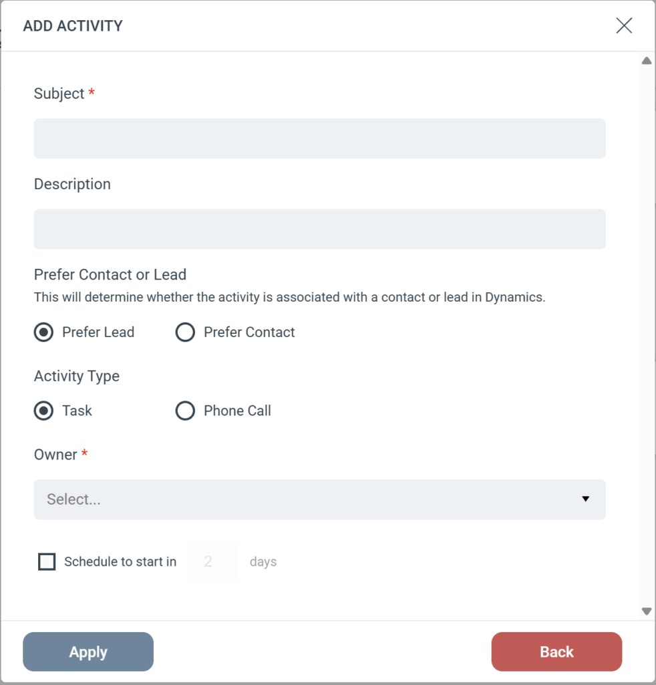

# Dynamics - Add activity

Steget Add Activity skapar en Task eller ett Phone Call i din Microsoft Dynamics CRM. Eftersom en person kan finnas som antingen Lead eller Contact i Dynamics frågar steget efter din preferens och använder en inbyggd fallback för att säkerställa att aktiviteten loggas.

### Stegkonfiguration

När du lägger till detta steg i en Journey, konfigurera följande fält:

- **Subject (obligatoriskt):** Sätter titeln på aktiviteten i Dynamics (till exempel "Follow-up Call" eller "Send Pricing Guide").
- **Description:** Ger ytterligare detaljer eller anteckningar till personen som ska utföra uppgiften.
- **Activity Type:** Välj om aktiviteten ska loggas som en **Task** eller ett **Phone Call**.
- **Owner (obligatoriskt):** Välj den Dynamics-användare som ska tilldelas aktiviteten.
- **Schedule:** Sätt eventuellt en fördröjning för aktiviteten (till exempel "Schedule to start in 2 days").

### Inställningen "Prefer Contact or Lead"

Denna inställning styr vilken posttyp eMarketeer prioriterar vid sökning i Dynamics. Om den föredragna posttypen inte hittas söker eMarketeer automatiskt efter alternativet så att aktiviteten inte går förlorad.

**Om du väljer "Prefer Lead"**

- eMarketeer söker först i Dynamics efter en matchande Lead.
- Om en Lead hittas kopplas aktiviteten till Leaden.
- **Fallback:** Om ingen aktiv Lead hittas söker eMarketeer automatiskt efter en matchande Contact. Om en hittas kopplas aktiviteten till Contacten.

**Om du väljer "Prefer Contact"**

- eMarketeer söker först i Dynamics efter en matchande Contact.
- Om en Contact hittas kopplas aktiviteten till Contacten.
- **Fallback:** Om ingen Contact hittas söker eMarketeer automatiskt efter en matchande Lead. Om en hittas kopplas aktiviteten till Leaden.

_Obs: Om eMarketeer inte hittar varken Lead eller Contact i Dynamics hoppas steget över och ingen aktivitet skapas._
