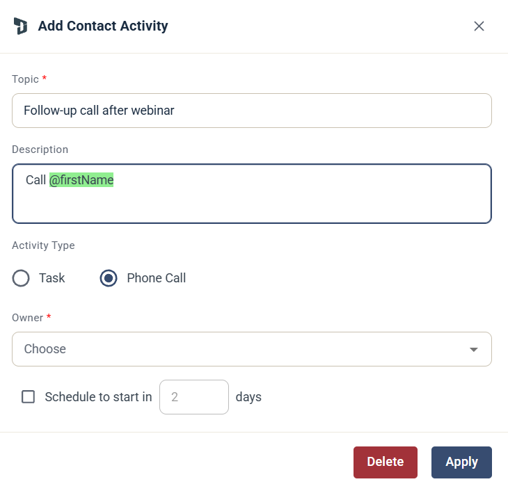

# Dynamics - Add contact activity

### Stegkonfiguration

När du lägger till detta steg i en Journey, konfigurera följande fält:

* **Topic (obligatoriskt):** Sätter titeln på aktiviteten i Dynamics.
* **Description:** Ger ytterligare detaljer eller anteckningar till personen som ska utföra uppgiften.
* **Activity Type:** Välj om aktiviteten ska loggas som en **Task** eller ett **Phone Call**.
* **Owner (obligatoriskt):** Välj den Dynamics-användare som ska tilldelas aktiviteten.
* **Schedule:** Sätt eventuellt en fördröjning för aktiviteten (till exempel "Schedule to start in 2 days").

### Strikt Contact-matchning

Eftersom detta steg är utformat specifikt för Contacts använder eMarketeer en strikt sökprocess:

* eMarketeer söker i Dynamics uteslutande efter en matchande Contact.
* Om en Contact hittas skapas aktiviteten och kopplas till den Contact-posten.
* **Om ingen Contact hittas:** Steget hoppas över och ingen aktivitet skapas. eMarketeer försöker **inte** att hitta eller uppdatera en Lead-post.
