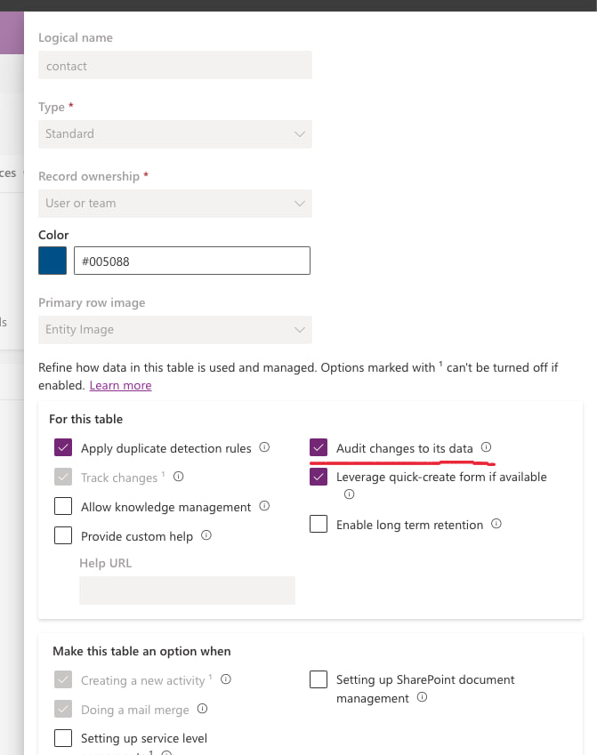
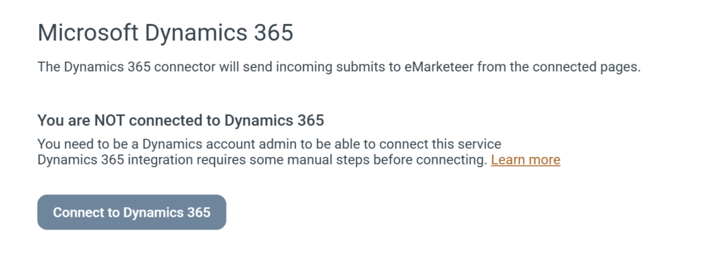
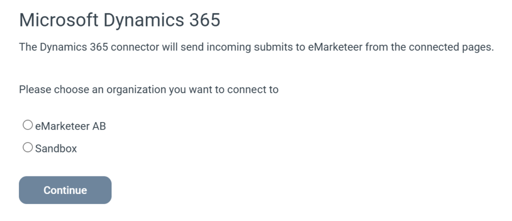

# Dynamics - Installationsprocess

Konfigurera integrationen med Microsoft Dynamics 365 Sales. Några manuella steg krävs innan du slutför konfigurationen i eMarketeer-gränssnittet.

## Manuella förutsättningar

### Steg 1: Skapa en app-användare i kundens Power Platform-miljö

Som **System Administrator**, följ dessa steg:

1. Navigera till en consent-URL och lägg till appen:
   `https://login.microsoftonline.com/<your tenant id>/adminconsent?client_id=a2a5e177-5102-4792-b0eb-52f4539f3cf7`
2. Öppna **Power Platform Admin Center** på `https://admin.powerplatform.microsoft.com`.
3. Gå till **Manage > Environments** och välj den miljö du konfigurerar.
4. Öppna **Settings → Users + permissions → Application users**.
5. Klicka på **+ New app user**.
6. På skärmen för appval, välj **eMarketeer Marketing Cloud**. Om den inte syns, sök med App ID `a2a5e177-5102-4792-b0eb-52f4539f3cf7`.
7. Tilldela säkerhetsrollen **System Administrator** till app-användaren.
8. Klicka på **Save**.

### Steg 2: Aktivera granskning för synkronisering av samtycke

För att säkerställa att samtyckesdata synkroniseras korrekt, aktivera granskning för Contact-tabellen.

1. Gå till Power Apps på `https://make.powerapps.com`.
2. Navigera till **Tables → Contact**.
3. Klicka på **Properties**, sedan **Advanced options**.
4. Markera **Audit changes to its data**.
5. Klicka på **Save**.

## Steg 3: Aktivera integrationen i eMarketeer

Denna åtgärd kräver rollen Administrator.

I eMarketeer, gå till [Account → Plugins & Integration → Microsoft Dynamics 365](https://app.emarketeer.com/corporate/gui/account/integrations/dynamics.php).

Klicka på **Connect to Dynamics 365**.

[

](https://support.emarketeer.com/wp-content/uploads/2026/02/dynamics_1.png)

Logga in med ett Microsoft-konto som har åtkomst till den Dynamics-miljö du vill integrera.

[

](https://support.emarketeer.com/wp-content/uploads/2026/02/dynamics_2.png)

Välj den organisation (miljö) du vill integrera med och klicka på **Continue**.
