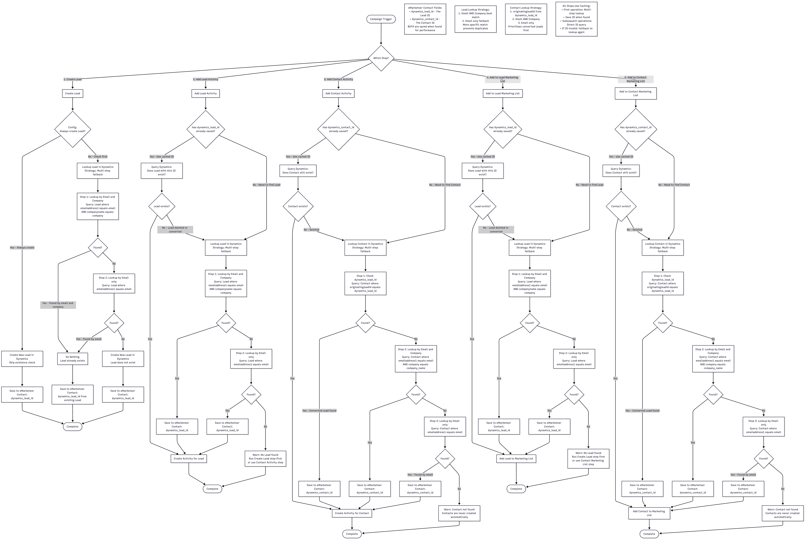

# Dynamics - Journey-steg

## Skapa eller uppdatera poster

- **Create/Update Lead:** skickar en person från eMarketeer till Dynamics som en Lead. Om en Lead med en matchande e-postadress redan finns uppdaterar eMarketeer den. Ett "Always create a lead"-alternativ tvingar fram skapandet av en ny Lead även om personen redan finns som Contact i Dynamics. [Läs mer](../../../integrations/dynamics/dynamics-journey-steps/create-update-lead.md)

## Lägg till aktiviteter (Tasks och Phone Calls)

För att logga en Task eller ett Phone Call i Dynamics, välj ett av tre lägen beroende på hur strikt din säljprocess behöver vara:

- **Add Activity (smart mode):** det mest flexibla alternativet. Eftersom en person kan vara en Lead eller en Contact i ditt CRM frågar detta steg efter din preferens. Om du föredrar att rikta dig mot en Lead letar eMarketeer efter en sådan först. Om den inte hittar en Lead faller den tillbaka till Contact-posten (och vice versa), så att säljaktiviteter aldrig går förlorade. [Läs mer](../../../integrations/dynamics/dynamics-journey-steps/dynamics-add-activity.md)
- **Add Lead Activity (strict):** loggar en aktivitet explicit på en Lead-post. Om eMarketeer inte hittar en matchande Lead hoppas åtgärden över. Den faller inte tillbaka till en Contact. [Läs mer](../../../integrations/dynamics/dynamics-journey-steps/dynamics-add-lead-activity.md)
- **Add Contact Activity (strict):** loggar en aktivitet explicit på en Contact-post. Om eMarketeer inte hittar en matchande Contact hoppas åtgärden över. Den faller inte tillbaka till en Lead. [Läs mer](dynamics-add-contact-activity.md)

## Marketing List-åtgärder

- **Add Lead to Marketing List:** söker efter personens Lead-post i Dynamics och lägger till dem i en Marketing List du väljer. [Läs mer](../../../integrations/dynamics/dynamics-journey-steps/dynamics-add-lead-to-marketing-list.md)
- **Add Contact to Marketing List:** söker efter personens Contact-post i Dynamics och lägger till dem i en Marketing List du väljer. [Läs mer](../../../integrations/dynamics/dynamics-journey-steps/dynamics-add-contact-to-marketing-list.md)

## Så synkroniseras poster

I eMarketeer är alla i din databas en Kontakt. Microsoft Dynamics delar upp personer i två separata entiteter: Lead och Contact.

För att brygga detta gap använder varje steg en inbyggd söklogik. När en Journey utlöser ett steg söker eMarketeer i Dynamics för att hitta rätt Lead eller Contact att uppdatera, vilket håller ditt CRM rent och fritt från dubbletter.

## Kontaktmatchningslogik

Varje steg löser upp rätt Dynamics-post innan det utförs. Eftersom samma person kan finnas som Lead, Contact eller båda i Dynamics kör varje steg en trestegs-sökning i ordning från mest till minst specifik:

1. **Direkt ID** — om eMarketeer redan har sparat ett `dynamics_lead_id` eller `dynamics_contact_id` på kontakten söks Dynamics direkt med det ID:t.
2. **E-post och företag** — om inget ID är sparat söker eMarketeer efter e-postadress och företagsnamn tillsammans.
3. **Enbart e-post** — om den kombinerade sökningen inte ger något resultat faller eMarketeer tillbaka på enbart e-postadress.

När en matchning hittas sparar eMarketeer både `dynamics_lead_id` och `dynamics_contact_id` på kontaktposten. Nästa gång ett steg körs för samma person hoppar eMarketeer direkt till ID-sökningen — vilket gör efterföljande operationer snabbare. Om ett sparat ID inte längre är giltigt i Dynamics faller eMarketeer tillbaka på den fullständiga sökningen.

Contact-sökningar kontrollerar konverterade Leads först. En person som började som Lead och senare konverterades till Contact i Dynamics matchas korrekt den vägen.

Flödesschemat nedan visar hela beslutsträdet för var och en av de fem stegtyperna.

