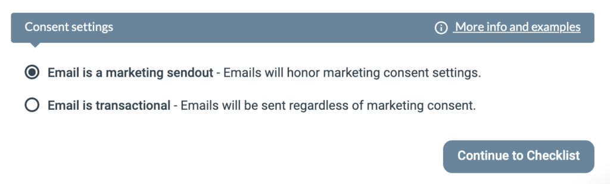

# Transaktionella utskick

Ett transaktionellt utskick låter dig leverera ett icke-marknadsförande e-postmeddelande till en kontakt oavsett deras marknadsföringssamtycke. Den här artikeln förklarar när du ska använda det och hur du aktiverar det.

eMarketeer har ett inbyggt system för samtyckeshantering som spårar vilka du får skicka marknadsföringsmeddelanden till. Om en kontakt har dragit tillbaka sitt samtycke för marknadsföringsmeddelanden stoppas meddelandet och skickas inte.

I vissa fall är meddelandet du vill skicka inte ett marknadsföringsmeddelande, och du behöver att kontakten tar emot det oavsett samtyckesinställningar. Exempel:

- Viktig serviceinformation till kunder
- Bekräftelsemeddelanden
- Leverans av efterfrågad information

För att skicka ett meddelande som åsidosätter samtyckesinställningarna, markera utskicket som ett "transaktionellt meddelande".

Att skicka marknadsföringsmeddelanden utan samtycke är olagligt. Använd endast den här inställningen om kontakten verkligen behöver informationen eller väntar på den.

## Skicka ett meddelande manuellt från en kampanj

Du ser den här inställningen när du adresserar ditt meddelande på standardskärmen för utskick.

## Skicka ett meddelande i en Journey

När du lägger till steget "Send email" i en Journey har du också möjlighet att ignorera samtycke genom att välja "transactional email".

För att avgöra om du ska använda transaktionellt meddelande i en Journey, fråga dig själv: förväntar sig eller väntar kontakten på det här meddelandet? Om ja, kan du använda ett transaktionellt meddelande.

Vanliga scenarier:

- Leverans av efterfrågat material, till exempel en e-boksnedladdning
- Bekräftelse av en prenumeration eller registrering
- Tack-meddelanden

När du inte ska använda ett transaktionellt meddelande:

- Drip-kampanjer som skickar flera meddelanden över tid
- Nurture-kampanjer
- Typiska marknadsföringsmeddelanden som är oönskade
