# Styla ditt formulär

Styla ditt formulär så att det matchar ditt varumärke via **Themes**-fliken i formuläreditorn. Du ändrar färger, typsnitt, storlekar, hörnavrundning, skuggor med mera — utan att skriva någon kod.

Den här guiden går igenom alternativen för tema, från att applicera ett färdigt tema till att finjustera sidhuvudet och bakgrunden. För en rundtur i hela editorn, se [Formuläreditor: UI-översikt](ui-overview.md).

## Om formulärteman

Ett tema är en samling visuella inställningar som gäller för hela ditt formulär — färger, typsnitt, mellanrum och form. Themes-fliken ger dig ett kodfritt gränssnitt för att justera de inställningarna, utgå från en förinställning och spara resultatet.

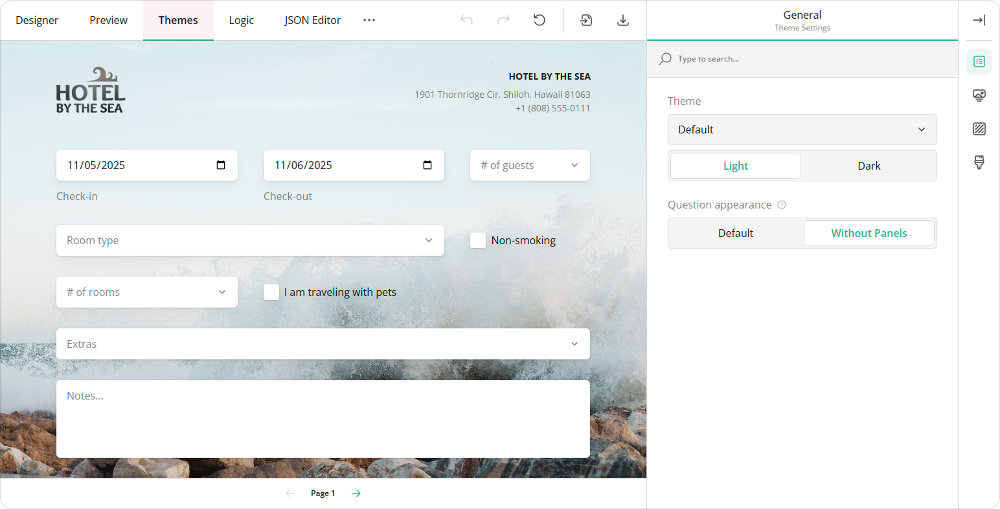

Du kan exportera ett anpassat tema som en JSON-fil och importera det till ett annat formulär för att återanvända samma stil. Det håller utseendet konsekvent över alla formulär du bygger.

## Välj och applicera ett tema

Det snabbaste sättet att ge formuläret ny stil är att välja ett annat tema.

Öppna listan **Theme** under kategorin **General** och välj en av förinställningarna. Varje förinställning finns i flera varianter, inklusive kompakta och mörka versioner, så du har en bred uppsättning utgångspunkter.

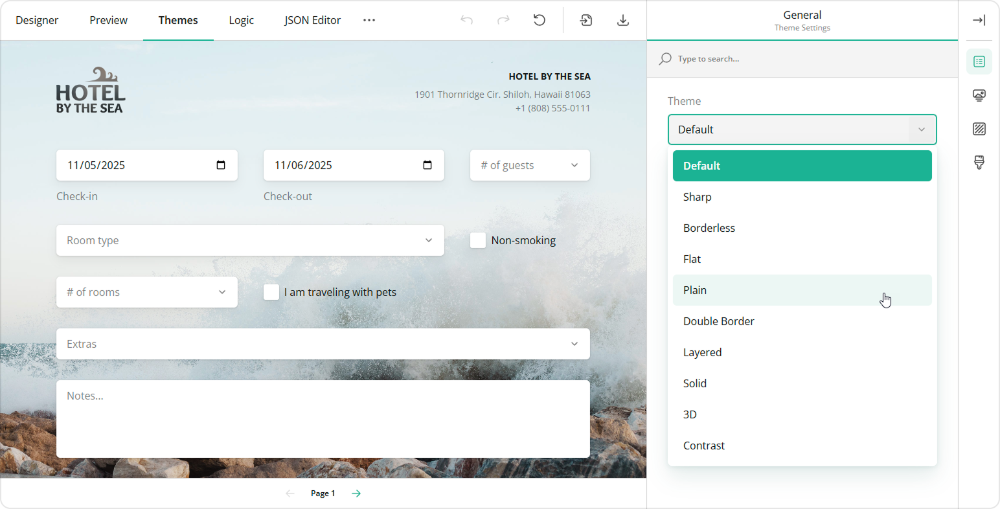

Att applicera ett tema är en utgångspunkt, inte ett slutgiltigt val — du kan justera varje enskild inställning efteråt.

## Aktivera mörkt läge

Mörkt läge passar för visning i svagt ljus och fungerar bra ihop med mörkare varumärkesfärger.

Ställ in reglaget **Light / Dark** på **Dark** för att växla formuläret till ett mörkt färgschema.

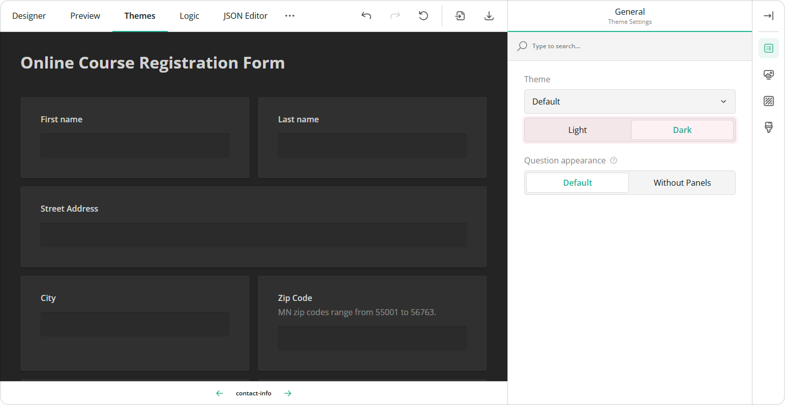

## Visa frågor utan rutor

Som standard ligger varje fråga i sin egen ruta. Du kan ta bort rutorna för ett lättare och mer öppet utseende.

Under kategorin **General**, ställ in **Question appearance** på **Without Panels**. Rutorna runt enskilda frågor försvinner.

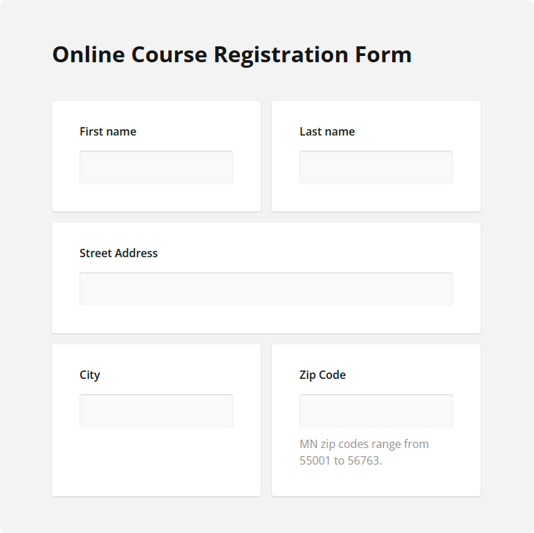

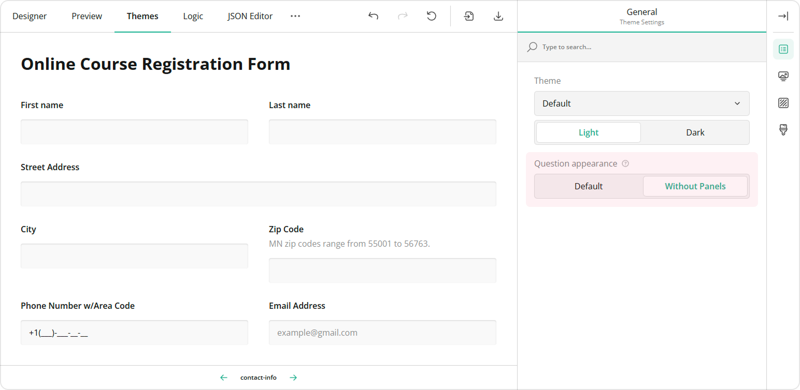

Paneler (grupper av frågor) behåller sina egna kanter, så grupperade frågor hålls visuellt samman även när enskilda rutor är avstängda.

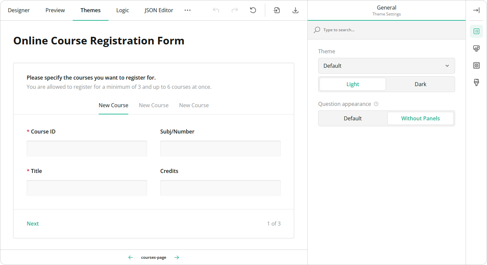

## Styla formulärets sidhuvud

Sidhuvudet är området högst upp i formuläret som rymmer din logotyp, titel och beskrivning. Du kan styla varje del.

### Lägg till en logotyp

Så lägger du till din logotyp i sidhuvudet:

1. Växla till fliken **Designer**.
2. Öppna **Logo** i kategorin **Survey Header**.
3. Klistra in en bildlänk i fältet **Survey logo**, eller klicka på mappikonen för att ladda upp en fil.
4. Ange eventuellt **Logo width** och **Logo height** (i CSS-enheter) för att ändra storlek.
5. Välj ett alternativ för **Logo fit**: None, Contain, Cover eller Fill.

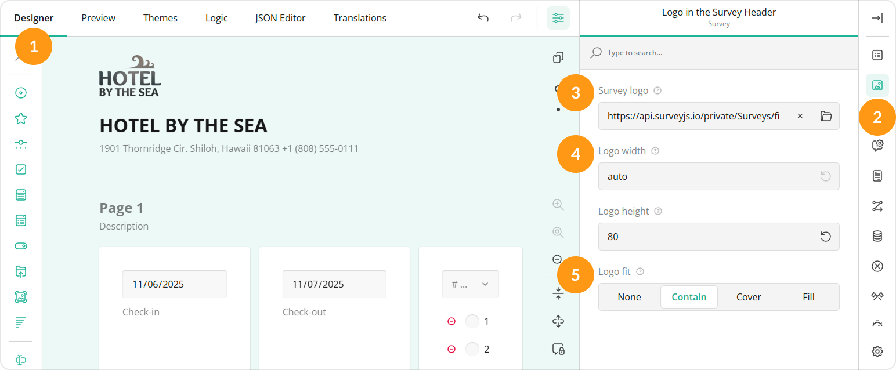

För att placera logotypen, växla till **Themes**-fliken, öppna kategorin **Header** och ställ in egenskapen **Logo alignment**.

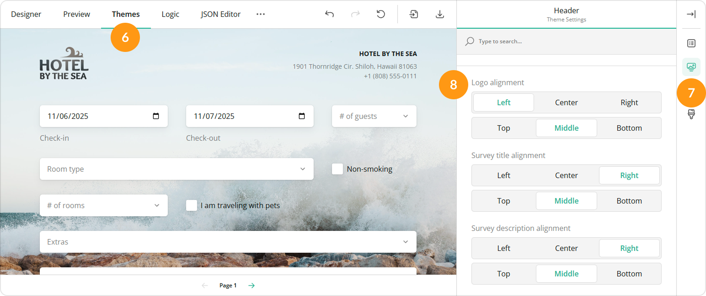

### Titel och beskrivning

Titeln och beskrivningen ligger bredvid logotypen i sidhuvudet. Följande inställningar finns under kategorin **Header** i **Themes**-fliken.

#### Justera textbredd

Använd egenskapen **Text width** för att ange hur stor del av sidhuvudet som titeln och beskrivningen upptar.

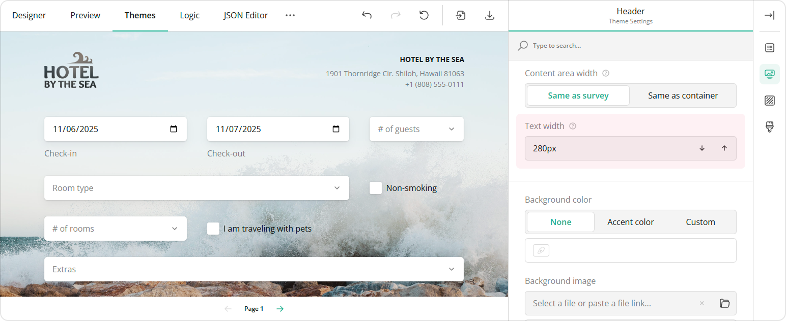

#### Anpassa typsnitt

Hitta sektionerna **Survey title font** och **Survey description font**. För var och en kan du ange:

* **Font family** — välj i listan.
* **Font weight** — Regular, Semi-bold, Bold eller Heavy.
* **Color** — välj en färg eller ange ett RGB-, HEX- eller HSL-värde.
* **Opacity** — ange procentvärdet bredvid färgen.
* **Font size** — ange storleken i pixlar.

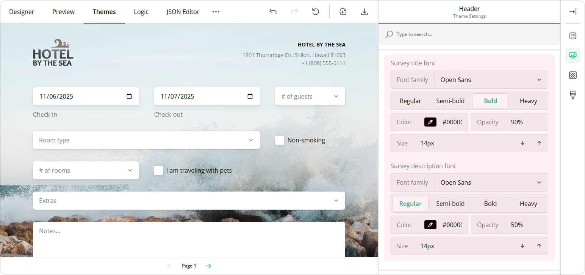

#### Justera textjustering

Använd egenskaperna **Survey title alignment** och **Survey description alignment** för att ange den horisontella och vertikala positionen för var och en.

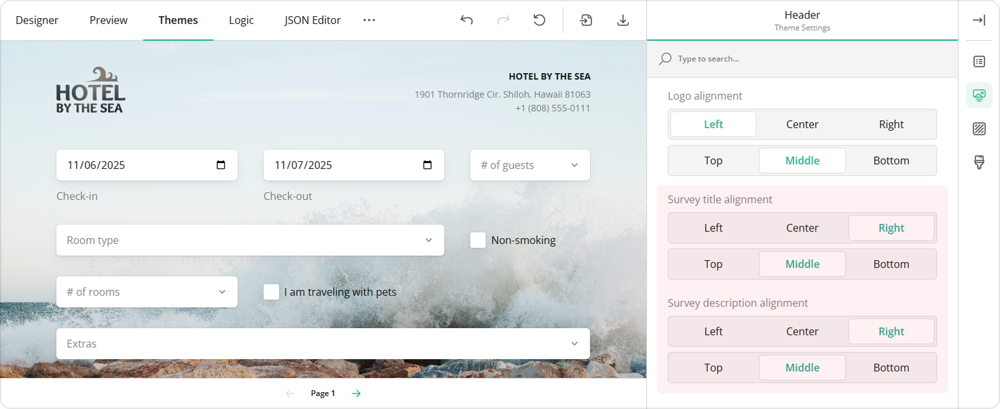

### Anpassa sidhuvudsområdet

Växla reglaget **View** till **Advanced** för att visa hela uppsättningen inställningar för sidhuvudsområdet.

* **Height** — ange sidhuvudets höjd på dator.
* **Height on smartphones** — ange sidhuvudets höjd på mobil.
* **Background color** — välj None, Accent eller Custom (med en färgväljare).
* **Background image** — klistra in en länk eller ladda upp en fil, och ange sedan visningsstil (Cover, Stretch, Contain eller Tile), opacitet och om sidhuvudets innehåll ska överlappa bilden.

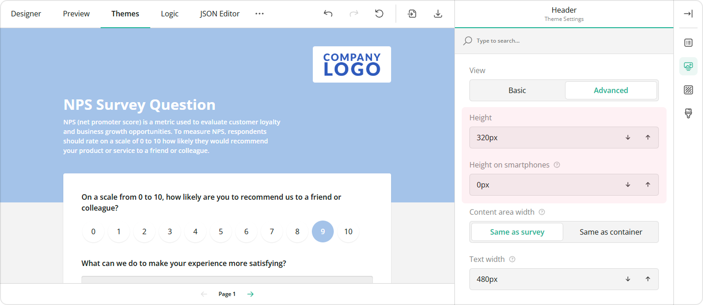

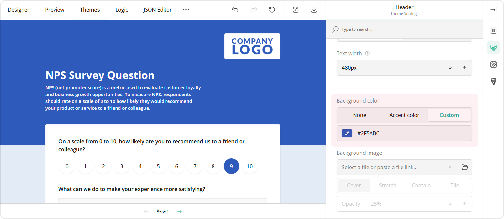

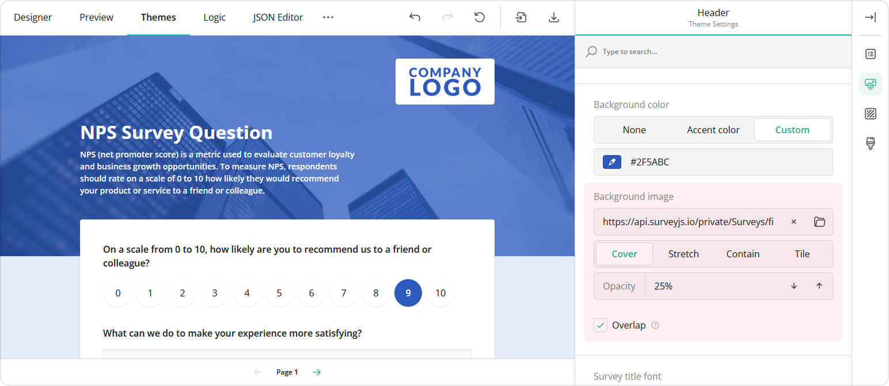

### Justera sidhuvudets innehållsområde

Med reglaget **View** inställt på **Advanced**, använd egenskapen **Content area width** för att välja om sidhuvudets innehåll ska matcha formulärets bredd eller behållarens bredd.

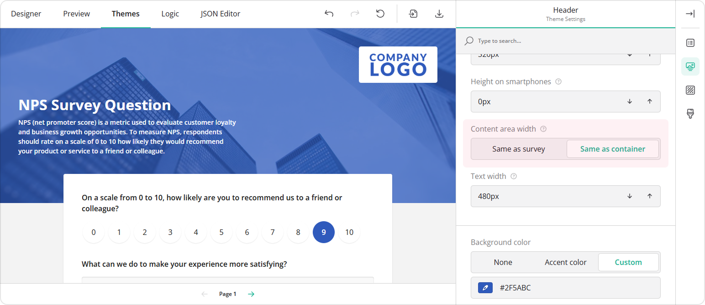

## Bakgrundsalternativ

Du kan styla bakgrunden bakom hela formuläret, inte bara sidhuvudet.

Under kategorin **Background**:

* **Background color** — välj en färg, eller ange ett RGB-, HEX- eller HSL-värde.
* **Background image** — klistra in en länk eller klicka på mappikonen för att ladda upp en fil.
* **Image display** — välj Auto, Contain eller Cover.
* **Image position** — växla mellan Fixed och Scroll.
* **Opacity** — ange hur genomskinlig bakgrunden ska visas.

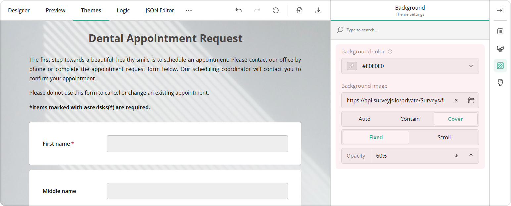

## Nästa steg

För en rundtur i de andra editorflikarna, se [Formuläreditor: UI-översikt](ui-overview.md).

För att styla ett formulär som är inbäddat på din webbplats med din egen CSS, se **Style the form** i [Bädda in formulär på din webbplats](publish-a-form.md).
