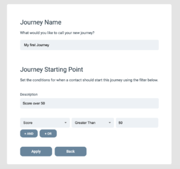
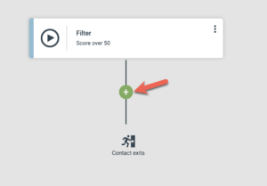
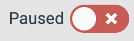

# Skapa din första Journey

Den här artikeln går igenom hur du bygger din första Journey, från startpunkt till aktivering.

En Journey är en automatiserad sekvens som kör en serie steg för varje kontakt som går in i den. Med Journey-byggaren kan du kombinera triggers, väntesteg, förgreningar och åtgärder.

### Öppna Journey-byggaren

Klicka på "Journeys" i den övre navigationsraden. Klicka sedan på "Create new Journey" för att skapa din första Journey.

### Lägg till en startpunkt eller trigger

När du skapar en ny Journey är första uppgiften att ange startpunkten.

En startpunkt är en uppsättning filterregler. Varje kontakt som matchar filtret startar Journey.

**Observera:** Startpunkten utlöses endast för kontakter som matchar filtret från och med aktiveringstillfället. Den inkluderar inte kontakter som historiskt matchat filtret.

När din startpunkt är inställd klickar du på "Apply" för att gå vidare till Journey-redigeraren.

Din Journey startar inte förrän du aktiverar den.

För närvarande är detta allt du behöver veta om startpunkter. För en djupare genomgång, se [denna detaljerade översikt över Journeys utlösande händelser](journeys-triggering-events.md), som förklarar exakt när startpunkter utvärderas.

### Bygg din Journey

När du har angett startpunkten kommer du in i Journey-byggaren. Det är här du lägger till de steg (åtgärder) du vill köra för varje kontakt som går in i din Journey.

Klicka på de svarta prickarna för att lägga till steg i sekvens.

### Ställ in väntevillkor

Med Journey-byggaren kan du dela upp din Journey i förgreningar baserat på kriterier som du väljer.

Till exempel kan din Journey skicka ett e-postmeddelande, vänta en dag och sedan utföra olika åtgärder beroende på om e-postmeddelandet öppnades.

Lägg till väntesteget först, lägg sedan till If/Else-steget för att dela vägen i förgreningar.

> Lägg alltid till ett väntesteg före ett If/Else-steg, annars utvärderas det omedelbart.

If/Else-steget är också ett filter där du kan ange valfria kriterier. När du lägger till If/Else-steget delas förgreningen i två: en för kontakter som uppfyller kriterierna och en för dem som inte gör det. Att lägga till ett väntesteg före If/Else-steget är särskilt viktigt när du utvärderar interaktioner från ett tidigare steg.

Nu kan du fortsätta att bygga ut var och en av de två förgreningarna.

### Skicka e-post och SMS

Journey-stegen inkluderar att skicka e-post och textmeddelanden (SMS). För att använda dem i en Journey måste du först skapa dem i en kampanj.

Rapporterna för de skickade komponenterna finns också i den kampanj där du byggde dem. Du kan gå direkt till rapporten för ett e-postmeddelande eller SMS genom att öppna inställningsmenyn för steget.

### Spara din Journey

Alla ändringar i en Journey måste sparas innan de träder i kraft. Tryck på "Save"-knappen i det övre högra hörnet för att spara din Journey.

### Aktivera en Journey

När din första Journey har skapats (genom att klicka på "Save") är den pausad. När den är pausad är din Journey inaktiv och inga kontakter går in i den.

När du är redo att aktivera din Journey klickar du på reglaget i det övre högra hörnet.

När din Journey är aktiv går alla nya kontakter som matchar startpunktsfiltret in i den.

### Redigera en Journey

Du kan redigera en Journey när som helst. Däremot måste din Journey vara pausad innan du kan göra några ändringar.

När redigeringen är klar sparar du ändringarna och aktiverar din Journey igen.

## Journey-inställningar

### Återinträde i en Journey

Som standard kan en kontakt endast gå in i en Journey en gång. Om en kontakt matchar startpunkten igen efter att ha gått in hoppas den över.

För att tillåta att en kontakt går in i en Journey flera gånger, kryssa i alternativet "Contact can re-enter Journey".

När inställningen sparas kan kontakter återinträda om de matchar startpunktsfiltret igen. De behöver inte ha slutfört sin Journey.

## Övervakning och analys

### Spåra prestanda för en Journey

Kontakter i en Journey kan ha tre statusar:

* Contacts started – antalet kontakter som matchade startpunktsfiltret och gick in i din Journey.
* Contacts in progress – varje kontakt som har startat din Journey men inte slutfört den. Utan väntesteg passerar kontakter pågående-statusen mycket snabbt. Med väntesteg kan många kontakter samtidigt vara pågående.
* Completed Journeys – antalet kontakter som har slutfört alla steg i din Journey.

### Stegräknare

Varje steg i en Journey har en stegräknare som visar hur många kontakter som har nått det steget.

Klicka på siffran för att visa en lista över kontakterna för det steget. Därifrån kan du exportera dem eller massuppdatera dem.

Väntesteget har en extra räknare som visar hur många kontakter som för närvarande väntar i det steget.

## Journeys och SuperOffice

Stegsamlingen innehåller flera åtgärder som utför uppgifter i SuperOffice. Alla uppgifter gäller kontakter i SuperOffice.

### Kontaktmatchning

När en uppgift utförs i SuperOffice kontrollerar eMarketeer först om kontakten finns där. Det görs genom att matcha kontaktens external-id och e-postadress.

Om ingen matchande kontakt hittas hoppas Journey-steget över som standard.

### Skapa saknade kontakter i SuperOffice

När du lägger till ett Journey-steg som involverar SuperOffice visas en inställningspanel i det vänstra sidofältet.

Som standard hoppas kontakter som inte hittas i SuperOffice över. Du kan också konfigurera steget så att det automatiskt skapar de saknade kontakterna i SuperOffice.

För att skapa kontakterna i SuperOffice måste du också ange en ansvarig säljare och en kategori för de nya kontakterna och företagen.

När kontakter och företag skapas automatiskt försöker eMarketeer hitta ett befintligt företag som passar den nya kontakten, eller skapar kontakten utan företag om det är tillåtet.

Inställningen för att skapa kontakter gäller alla SuperOffice-steg i din Journey.

För ett flödesschema som beskriver logiken, [klicka här](https://support.emarketeer.com/wp-content/uploads/2023/05/Skarmavbild-2023-05-25-kl.-12.31.12.png).

**Tips:** När du aktiverar automatiskt skapande av kontakter är det bra praxis att även lägga till de nya kontakterna i ett urval i SuperOffice. På så sätt hittar du dem enkelt senare.
