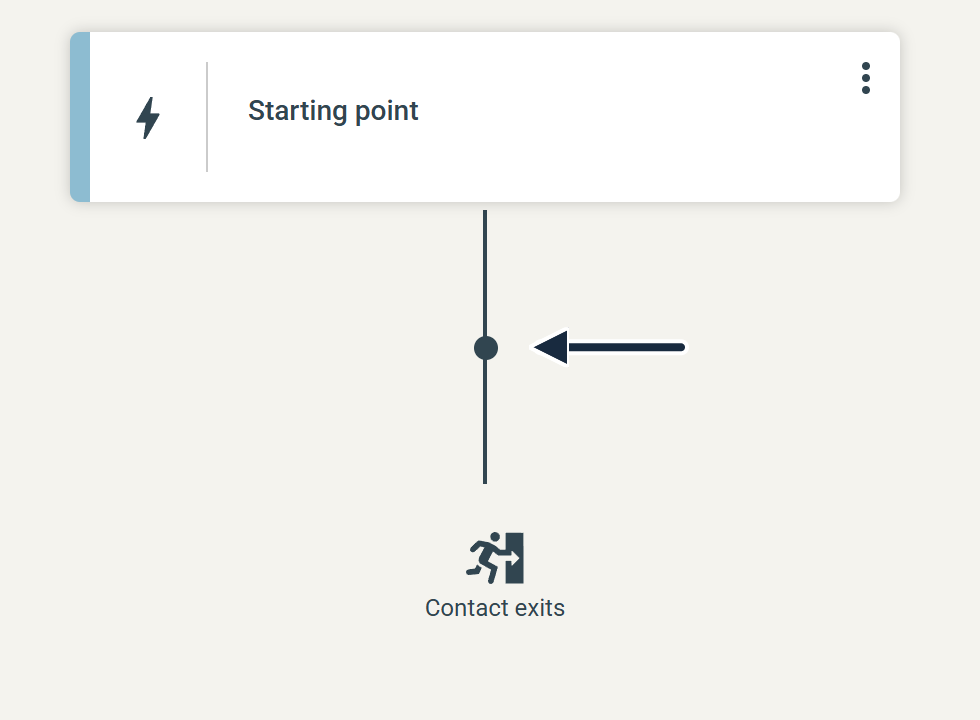

# Skapa din första Journey

Den här artikeln går igenom hur du bygger din första Journey, från startpunkt till aktivering.

En Journey är en automatiserad sekvens som kör en serie steg för varje kontakt som går in i den. Med Journey-byggaren kan du kombinera triggers, väntesteg, förgreningar och åtgärder.

### Öppna Journey-byggaren

Klicka på "Journeys" i vänstermenyn. Klicka sedan på "New Journey" för att skapa din första Journey.

### Lägg till en startpunkt eller trigger

När du skapar en ny Journey är första uppgiften att namnge den och välja en startpunkt. Välj "Automatic trigger" för att lägga till kontakter när de matchar villkor, eller "Manual trigger" för att lägga till kontakter manuellt, till exempel från ett kontaktkort.

Med en automatisk trigger är startpunkten en uppsättning triggervillkor. Klicka på "Set conditions", välj en kategori som Score och klicka på "Add condition". Varje kontakt som matchar villkoren startar Journey.

**Observera:** Startpunkten utlöses endast för kontakter som matchar filtret från och med aktiveringstillfället. Den inkluderar inte kontakter som historiskt matchat filtret.

När dina villkor är inställda klickar du på "Apply conditions". Klicka sedan på "Create Journey" för att öppna Journey-redigeraren.

Din Journey startar inte förrän du aktiverar den.

För närvarande är detta allt du behöver veta om startpunkter. För en djupare genomgång, se [denna detaljerade översikt över Journeys utlösande händelser](journeys-triggering-events.md), som förklarar exakt när startpunkter utvärderas.

### Bygg din Journey

När du har angett startpunkten kommer du in i Journey-byggaren. Det är här du lägger till de steg (åtgärder) du vill köra för varje kontakt som går in i din Journey.

Klicka på en prick på linjen mellan två steg för att öppna panelen "Add Journey step" och klicka sedan på det steg du vill ha. Stegen är grupperade som Campaign Component, Logic, Lead, Contact och CRM.

### Ställ in väntevillkor

Med Journey-byggaren kan du dela upp din Journey i förgreningar baserat på kriterier som du väljer.

Till exempel kan din Journey skicka ett e-postmeddelande, vänta en dag och sedan utföra olika åtgärder beroende på om e-postmeddelandet öppnades.

Lägg till väntesteget först, lägg sedan till If/Else-steget för att dela vägen i förgreningar.

> Lägg alltid till ett väntesteg före ett If/Else-steg, annars utvärderas det omedelbart.

If/Else-steget har egna villkor. Klicka på "Set conditions" för att välja kriterier. När du lägger till If/Else-steget delas förgreningen i två: en för kontakter som uppfyller kriterierna och en för dem som inte gör det. Att lägga till ett väntesteg före If/Else-steget är särskilt viktigt när du utvärderar interaktioner från ett tidigare steg.

Nu kan du fortsätta att bygga ut var och en av de två förgreningarna.

### Skicka e-post och SMS

Journey-stegen inkluderar att skicka e-post och textmeddelanden (SMS). För att använda dem i en Journey måste du först skapa dem i en kampanj.

Du kan inte skapa ett nytt e-postmeddelande eller SMS inifrån en Journey. Du kan däremot lägga till ett steg som inte är färdigkonfigurerat som platshållare. En Journey med ofärdiga steg kan sparas men inte aktiveras.

Rapporterna för de skickade komponenterna finns också i den kampanj där du byggde dem. Du kan gå direkt till rapporten för ett e-postmeddelande eller SMS genom att öppna inställningsmenyn för steget.

### Spara din Journey

Alla ändringar i en Journey måste sparas innan de träder i kraft. Klicka på "Save" högst upp i den vänstra panelen för att spara din Journey.

### Aktivera en Journey

När du skapar en Journey är den pausad. När den är pausad är din Journey inaktiv och inga kontakter går in i den.

När du är redo att aktivera din Journey slår du på reglaget under "Status" i den vänstra panelen. Etiketten ändras från Paused till Active.

När din Journey är aktiv går alla nya kontakter som matchar startpunktsfiltret in i den.

### Redigera en Journey

Du kan redigera en Journey när som helst. Däremot måste din Journey vara pausad innan du kan göra några ändringar.

När redigeringen är klar sparar du ändringarna och aktiverar din Journey igen.

## Journey-inställningar

### Återinträde i en Journey

Som standard kan en kontakt endast gå in i en Journey en gång. Om en kontakt matchar startpunkten igen efter att ha gått in hoppas den över.

För att tillåta att en kontakt går in i en Journey flera gånger, kryssa i alternativet "Contact can re-enter Journey".

När inställningen sparas kan kontakter återinträda om de matchar startpunktsfiltret igen. De behöver inte ha slutfört sin Journey.

### Gör Journey tillgänglig på kontaktkortet

Om du markerar det här alternativet läggs en manuell startpunkt för Journey till på kontaktkortet. Alla användare med åtkomst till en kontakt kan då starta Journey för den kontakten direkt, utan att vänta på en automatisk utlösare.

Det här liknar att välja "Manual trigger" som Journeyns startpunkt, med en viktig skillnad: det här alternativet kan aktiveras på en Journey som redan har en automatisk utlösare. Använd det när en Journey ska ha både en automatisk och en manuell startpunkt — till exempel en e-postsekvens som normalt startar när en kontakt fyller i ett formulär, men som du också vill kunna starta manuellt för enskilda kontakter.

## Övervakning och analys

### Spåra prestanda för en Journey

"Journey Summary" i den vänstra panelen visar när Journey startades och hur många kontakter som finns i den. Kontakter kan ha tre statusar:

* Contacts started – antalet kontakter som matchade startpunktsfiltret och gick in i din Journey.
* Contacts in progress – varje kontakt som har startat din Journey men inte slutfört den. Utan väntesteg passerar kontakter pågående-statusen mycket snabbt. Med väntesteg kan många kontakter samtidigt vara pågående.
* Completed journeys to date – antalet kontakter som har slutfört alla steg i din Journey.

### Stegräknare

Varje steg i en Journey har en stegräknare som visar hur många kontakter som har nått det steget.

Klicka på siffran för att visa en lista över kontakterna för det steget. Därifrån kan du exportera dem eller massuppdatera dem.

Väntesteget har en extra räknare som visar hur många kontakter som för närvarande väntar i det steget.

## Journeys och SuperOffice

Gruppen **CRM** i panelen **Add Journey step** innehåller flera åtgärder som utför uppgifter i SuperOffice:

* Create Activity
* Create Sale
* Add / Remove from project
* Add / Remove from selection
* Add / Remove interest

Alla uppgifter gäller kontakter i SuperOffice.

Innan ett steg körs letar eMarketeer upp kontakten i SuperOffice. Hur kontakter matchas och hur saknade kontakter kan skapas läser du i [Kontaktmatchning i SuperOffice](../superoffice/superoffice-contact-matching.md).
