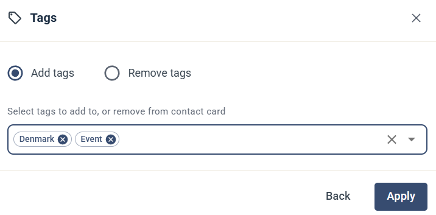

# Add / Remove tags

Steget Add / Remove tags lägger till taggar på kontakten eller tar bort taggar från kontakten.

## Inställningar

* Välj **Add tags** eller **Remove tags**.
* **Select tags to add to, or remove from contact card** — välj en eller flera taggar.

Klicka på **Apply** för att spara steget.

Läs mer om taggar i [Taggar](../../knowledge-base/contacts-lists/tags.md).
