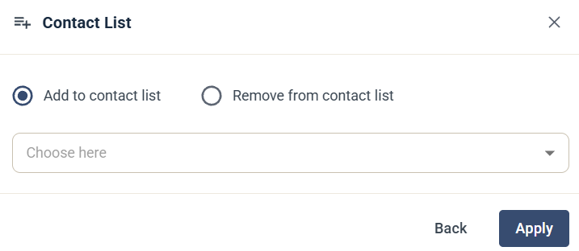

# Contact List

Steget Contact List lägger till kontakten i en kontaktlista eller tar bort den från en.

## Inställningar

* Välj **Add to contact list** eller **Remove from contact list**.
* Välj kontaktlistan.

Klicka på **Apply** för att spara steget.

Läs hur du skapar en kontaktlista i [Så här skapar du en ny kontaktlista](../../knowledge-base/getting-started/new-contact-list.md).
