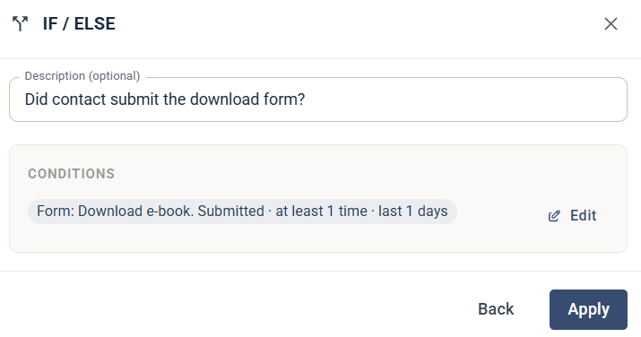

# If / Else

Steget If / Else delar upp din Journey i två förgreningar utifrån villkor. Kontakter som uppfyller villkoren följer förgreningen **yes** och övriga följer förgreningen **no**.

## Inställningar

* **Description (optional)** — en kort text som visas på steget i Journey-byggaren, så att du snabbt ser vad steget kontrollerar.
* **Conditions** — klicka på **Set conditions** för att välja kriterier. Villkoren du anger visas i steget. Klicka på **Edit** för att ändra dem.

Klicka på **Apply** för att spara steget.

## Bygg förgreningarna

När du har lagt till steget delas din Journey i en förgrening **yes** och en förgrening **no**. Lägg till steg i varje förgrening för att bestämma vad som händer med kontakterna i den.


Lägg alltid till ett väntesteg före ett If / Else-steg, annars utvärderas det omedelbart. Det är särskilt viktigt när du utvärderar interaktioner från ett tidigare steg, till exempel att ett e-postmeddelande öppnats.


Lägg till ett [Wait](journey-step-wait.md)-steg före If / Else-steget om kontakten först ska hinna agera.
