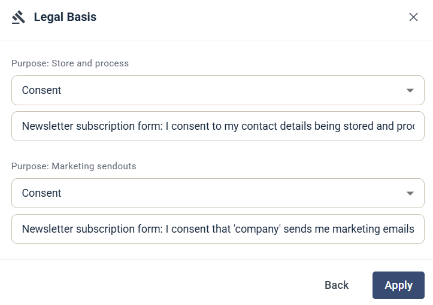

# Legal Basis

Steget Legal Basis anger den rättsliga grunden för kontakten. Du anger den för två ändamål: att lagra och behandla kontaktens uppgifter och att skicka marknadsföring till kontakten.

## Inställningar

* **Purpose: Store and process** — den rättsliga grunden för att lagra och behandla kontaktens uppgifter.
* **Purpose: Marketing sendouts** — den rättsliga grunden för att skicka marknadsföring till kontakten.

Välj den rättsliga grunden för varje ändamål, till exempel **Consent**, och ange en text som beskriver den, till exempel samtyckestexten från ditt formulär.

Klicka på **Apply** för att spara steget.
