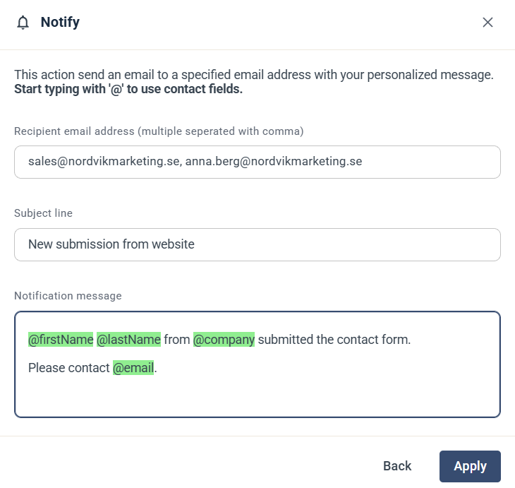

# Notify stakeholder

Steget Notify stakeholder skickar ett e-postmeddelande med ditt eget meddelande till en eller flera e-postadresser. Använd det för att meddela en kollega, till exempel när en kontakt skickar in ett formulär.

## Inställningar

* **Recipient email address** — adressen som meddelandet skickas till. Skilj flera adresser åt med kommatecken.
* **Subject line** — ämnesraden i e-postmeddelandet.
* **Notification message** — texten i e-postmeddelandet.

## Använd kontaktfält

Skriv `@` i något av de tre fälten för att infoga ett kontaktfält, till exempel kontaktens namn, företag eller e-postadress. Fältet fylls i med uppgifterna för den kontakt som når steget.

Eftersom det även fungerar i **Recipient email address** kan meddelandet gå till någon som finns sparad på kontakten. Om kontaktkortet till exempel innehåller e-postadressen till kontaktens key account manager kan du infoga det fältet, så att meddelandet går till rätt person för varje kontakt.

Om du vill avisera någon via e-post eller SMS direkt från en kampanj, utan en Journey, använder du [Send notification-automationen](../../knowledge-base/campaigns/campaign-automation-send-notification.md).

Klicka på **Apply** för att spara steget.

Det här steget är inte samma sak som de notiser eMarketeer skickar till dig om ditt konto och dina uppgifter. Läs om dem i [Notissystemet](../notification-system.md).
