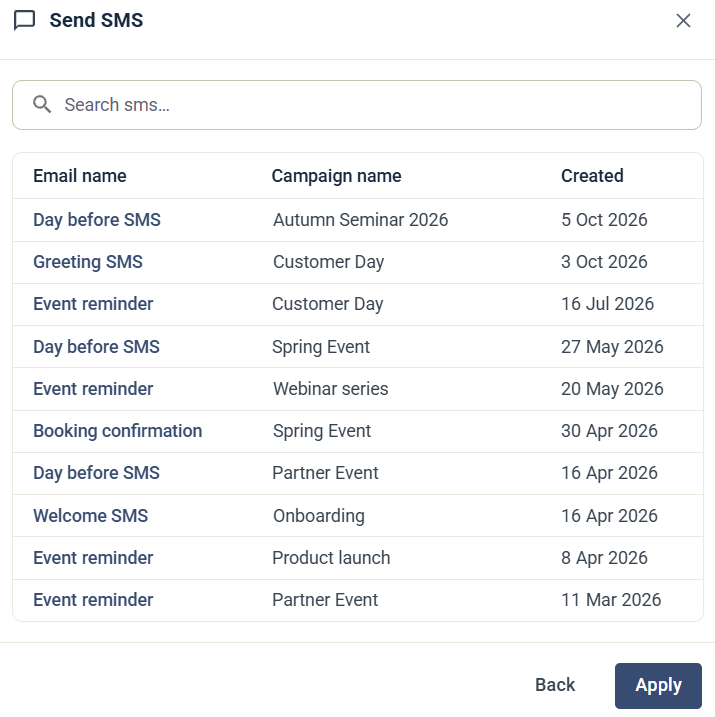
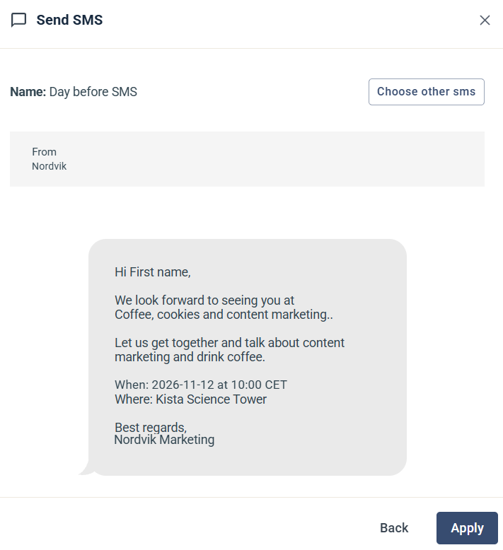

# Send SMS / Text message

Steget Send SMS / Text message skickar ett textmeddelande till kontakten. SMS:et måste redan finnas i en kampanj: du kan inte skapa ett nytt SMS inifrån en Journey.

## Välj SMS

När du lägger till steget öppnas en lista med dina textmeddelanden. Den visar namnet på varje meddelande, kampanjen det hör till och när det skapades. Sök på namn om listan är lång och klicka på det SMS du vill använda.

## Inställningar

När du har valt ett SMS visar steget dess namn, avsändaren och en förhandsvisning av meddelandet. Klicka på **Choose other sms** för att välja ett annat meddelande.

Klicka på **Apply** för att spara steget.

## Bra att veta

* Du kan lägga till steget innan SMS:et är klart, som en platshållare. En Journey med ofärdiga steg kan sparas men inte aktiveras.
* Rapporten för SMS:et finns i den kampanj där du byggde det.
