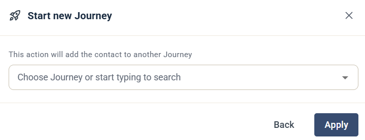

# Start New Journey

Steget Start New Journey lägger till kontakten i en annan Journey.

## Inställningar

* **Journey** — välj den Journey som kontakten ska läggas till i, eller börja skriva för att söka efter den.

Klicka på **Apply** för att spara steget.
