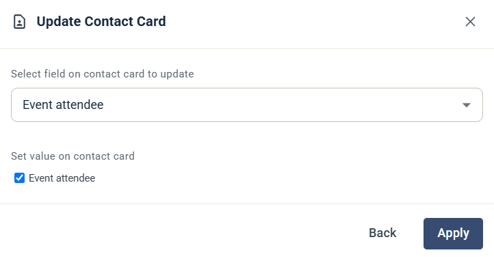

# Update Contact Card

Steget Update Contact Card uppdaterar ett fält på kontaktkortet.

## Inställningar

* **Select field on contact card to update** — välj fältet.
* **Set value on contact card** — ange det värde som fältet får. Hur du anger det beror på fältet, till exempel en kryssruta för ett kryssrutefält.

Klicka på **Apply** för att spara steget.
