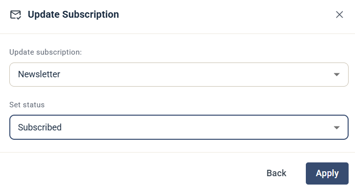

# Update Subscription

Steget Update Subscription lägger till eller tar bort kontaktens prenumeration på en av dina [prenumerationer](../../knowledge-base/account-admin/subscriptions.md).

## Inställningar

* **Update subscription** — välj prenumerationen, till exempel ett nyhetsbrev.
* **Set status** — välj den status som kontakten får, till exempel **Subscribed**.

Klicka på **Apply** för att spara steget.

Mer information om prenumerationer finns i [Prenumerationer](../../knowledge-base/account-admin/subscriptions.md).
