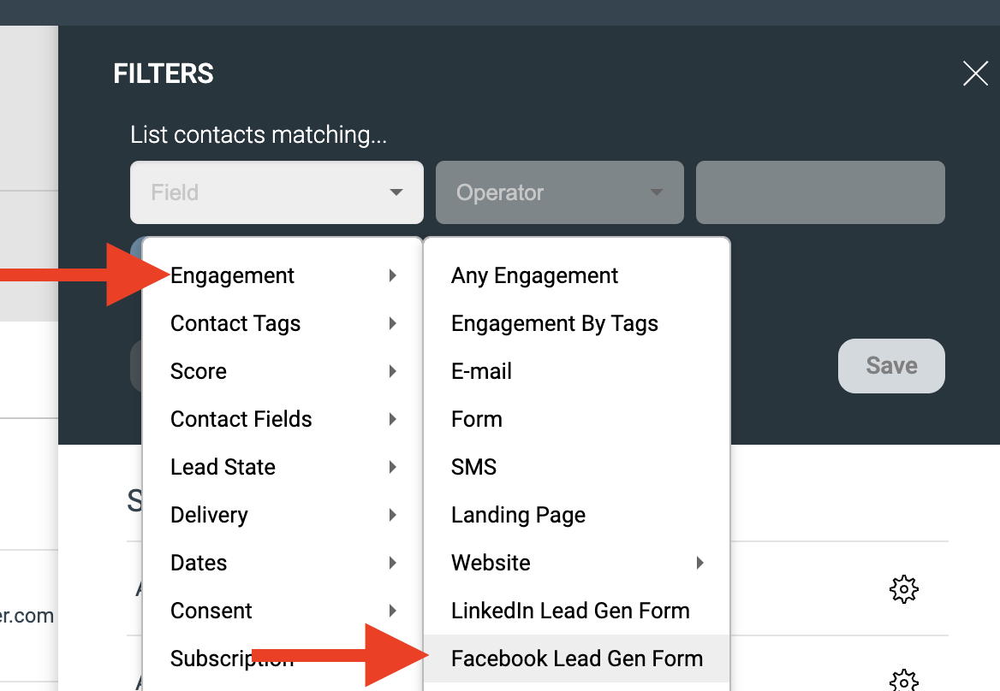

# Facebook Lead Forms

När du annonserar på Facebook kan du koppla en Call to Action till dina annonser för att samla in registreringar, leads och anmälningar. eMarketeers Facebook-kopplare skickar varje inskick från Lead Forms direkt in i eMarketeer.

## Krav

* En Facebook-affärsenhet med åtkomst till en eller flera sidor.
* En personlig Facebook-profil med åtkomst till den affärsenheten.

[Läs mer om att skapa Lead Forms på Facebook här](https://www.facebook.com/business/help/397336587121938?id=735435806665862).

## Vad kopplingen gör

När kopplingen är aktiv kan inskick:

* Skapa och uppdatera kontakter.
* Sätta lead score.
* Trigga Journeys.
* Skicka leads till sälj.

## Kom igång med Facebook Lead Forms

Se först till att du har en eller flera Businesses på Facebook.

Som administratör i eMarketeer, klicka på "Settings", "Plugins and integrations" och "Facebook". Klicka på "Connect to Facebook" för att starta anslutningen.

I Facebook-popupen, logga in med din personliga profil för att identifiera dig.

Välj sedan vilka businesses du vill ta emot leads från. Du kan välja vilken business du har åtkomst till.

Klicka på "Continue". Från de valda businesses väljer du de sidor du vill ansluta. Du kan välja alla sidor eller specifika.

Slutligen, godkänn eMarketeers behörigheter och spara anslutningen.

Du är nu ansluten.

eMarketeer listar de businesses som det har åtkomst till. Ditt sista steg är att kontrollera vilka businesses du vill ta emot leads från. Du kan aktivera eller inaktivera varje när som helst på den här sidan.

## Ta emot leads

För att skicka leads till eMarketeer behöver du skapa annonser i ditt Meta Business-konto. [Läs mer på Facebook](https://www.facebook.com/business/help/375478503258484?id=735435806665862).

När dina leadannonser är publicerade, [använd det här verktyget](https://developers.facebook.com/tools/lead-ads-testing/) för att testa-skicka dina formulär utan att publicera annonserna.

När något inskick anländer, riktigt eller test, skickas det automatiskt till eMarketeer. Du hittar dessa kontakter under Contacts i Engagement-filtret.

## Bearbeta inkommande leads från Facebook

När leads börjar komma in och du ser ditt test i Engagement-filtret kan du bearbeta dem. Du kan:

* Sätta lead score.
* Starta Journeys.
* Skapa leads på Lead Board.

## Felsökning

### Meta Lead Ads Testing-verktyget ger ett fel och inga leads kommer fram till eMarketeer

När du skapar ett [test-lead](https://developers.facebook.com/tools/lead-ads-testing/) ska statuskolumnen visa "Success". Om den visar "Failed" med "CRM access"-felet nedan behöver du ge eMarketeer åtkomst till dina leads.

Så här löser du det:

1. Logga in på [https://business.facebook.com](https://business.facebook.com) och välj det affärskonto du vill ha leads från.
2. I vänstermenyn, öppna Settings (kugghjulet), sedan "Integrations" och sedan "Lead Access".
3. Välj den sida du vill få leads från.
4. Öppna fliken "CRM" (bredvid "People" och "Partners").
5. Om "eMarketeer" inte finns i listan, klicka på "Assign CRM" och lägg till det.

eMarketeer har nu åtkomst till dina leads. Försök med Meta Lead Ads Testing-verktyget igen så ska det fungera.
