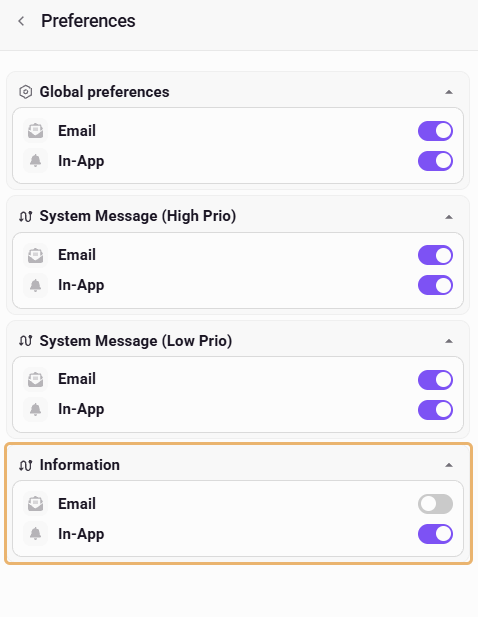

# Notissystemet

eMarketeer meddelar dig om problem i ditt konto och om uppgifter du har startat, både i notiscentret och via e-post.

Notiserna är grupperade i tre kategorier: akuta problem, statusuppdateringar och resultat av uppgifter du har startat. För varje kategori väljer du om du får dem via e-post, i notiscentret eller båda.


Det här är eMarketeers egna notiser om ditt konto och dina uppgifter. Aviseringar om kontakter som du själv ställer in, med kampanjautomatiseringen [Send notification](../knowledge-base/campaigns/campaign-automation-send-notification.md) eller Journey-steget [Notify stakeholder](journeys/journey-step-notify-stakeholder.md), ställs in i kampanjen eller Journeyn, inte här.


## Notiscentret

Klicka på klockikonen i den övre menyraden för att öppna **Inbox**. Där listas dina notiser, de senaste först. Många notiser har en knapp som tar dig till rätt sida, till exempel **View report** efter en kontaktimport.

## Notiskategorier

Varje notis tillhör en av tre kategorier. Du kan slå på eller av notiser via e-post och in-app för varje kategori.

### System Message (High Prio)

Problem som gör att något slutar fungera. De skickas till alla användare i kontot.

| Notis | När den skickas |
|---|---|
| LinkedIn integration issue detected | LinkedIn-integrationen slutar fungera. Notisen innehåller orsaken. |
| Facebook connection expired, Facebook integration issue, Facebook page access expired, Facebook webhook authentication failed | Facebook-anslutningen går ut, integrationen slutar fungera, sidåtkomsten går ut eller webhook-autentiseringen misslyckas. |
| Domain Verification Failed – Email Sending Not Working | Den dagliga kontrollen visar att DKIM- eller SPF-posten för en av dina [e-postdomäner](../knowledge-base/email-deliverability/authorize-email-domain.md) inte fungerar. |

### System Message (Low Prio)

Statusuppdateringar och rekommendationer. Notiser om integrationer och e-postdomäner går till alla användare i kontot. Notiser om importer och exporter går bara till användaren som startade importen eller exporten.

| Notis | När den skickas |
|---|---|
| LinkedIn integration recovered | LinkedIn-integrationen fungerar igen. |
| Facebook connection restored | Facebook-anslutningen fungerar igen. |
| Domain Configuration Recommendation | En e-postdomän saknar bara sin DMARC- eller MAIL FROM-post. |
| Email delivery issue | Du skickar från en e-postdomän som inte är verifierad för utskick. Skickas en gång per domän. |
| Contact import completed, Contact import failed, CRM import completed | En [kontaktimport](../knowledge-base/contacts-lists/import-contacts-from-excel.md) eller en import från ditt CRM blir klar eller misslyckas. |
| Contact export completed | En kontaktexport är klar att ladda ned. |

### Information

Resultat av uppgifter du har startat. Notiserna har ingen knapp och går bara till dig.

| Notis | När den skickas |
|---|---|
| Export to SuperOffice completed (visar namnet på ditt CRM) | En export av kontakter till ditt CRM blir klar. |
| CRM export completed, CRM export failed | En CRM-export blir klar med kontakter som inte matchades, eller misslyckas. |
| Bulk action completed, Bulk action failed | En [massåtgärd](../knowledge-base/contacts-lists/bulk-actions-tool.md) på kontakter blir klar eller misslyckas. |
| Campaign copy completed | En kampanj som du har kopierat är klar. |

## Slå på eller av notiser

Alla notiser är påslagna som standard, både via e-post och in-app. Så här ändrar du det:

1. Klicka på klockikonen i den övre menyraden.
2. Klicka på sexhörningsikonen i **Inbox**-huvudet för att öppna **Preferences**.
3. Slå av eller på **Email** eller **In-App** under kategorin.

Om du till exempel vill sluta få mejl när en massåtgärd är klar slår du av **Email** under **Information**. Notiserna visas fortfarande i Inbox.

**Global preferences** stänger av en kanal helt, för alla kategorier. Om du slår av **Email** där slutar alla notismejl att skickas.
