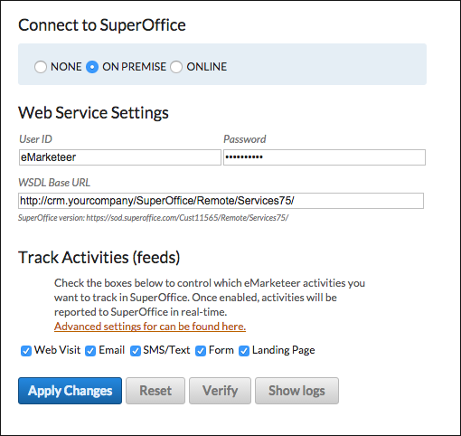

# On premise: aktivera integrationen

Detta är det sista steget i SuperOffice on-premise-integrationen. Din NetServer måste redan vara åtkomlig från eMarketeer och du behöver en SuperOffice-användare dedikerad till integrationen.

Om du inte har slutfört dessa förutsättningar, [följ dessa instruktioner](/documentation/on-premise-netserver-url-and-user-creation/).

## Aktivera integrationen

När SuperOffice är klart slutför du resten av uppsättningen i eMarketeer.

1. Logga in i eMarketeer och gå till **Account** > **Plugins and integrations**.
2. Klicka på **Super Office** för att öppna sidan med integrationsinställningar.

3. Välj alternativknappen **On premise**.
4. Fyll i formuläret med användarnamn, lösenord och WSDL-bas-URL som pekar mot katalogen med SVC-filer för din NetServer.
5. Klicka på **Apply changes** för att starta integrationen.

Under integrationsprocessen installerar eMarketeer objekt i din SuperOffice-instans. [Läs mer om dessa åtgärder](https://help.emarketeer.com/hc/en-us/articles/205695665).

När integrationen slutförs korrekt är båda systemen redo att användas.
