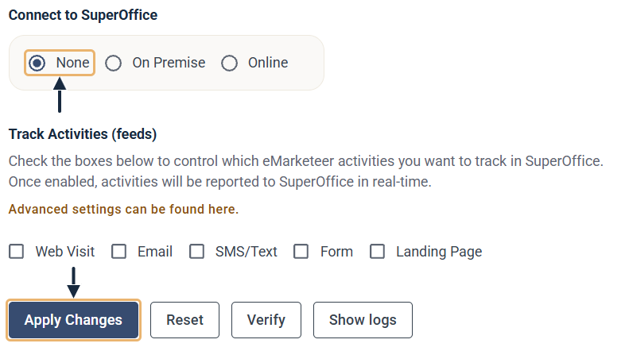

# Återställ en SuperOffice-integration

## Återställ integrationen

1. Logga in på ditt eMarketeer-konto.
2. Klicka på kugghjulsikonen uppe till höger, välj **Account Settings**, öppna **Integrations** och klicka på **Manage** på kortet **Superoffice CRM**.
3.  Sätt integrationen till **None** och klicka på **Apply Changes** för att spara ändringen.

    

4. Integrationen är nu inaktiverad. Aktivera den igen genom att välja **Online** eller **On Premise** och klicka på **Apply Changes** igen.
5. Logga in på SuperOffice inloggningsskärm och vänta tills processen är klar.

Din integration är återställd och aktiv igen.
